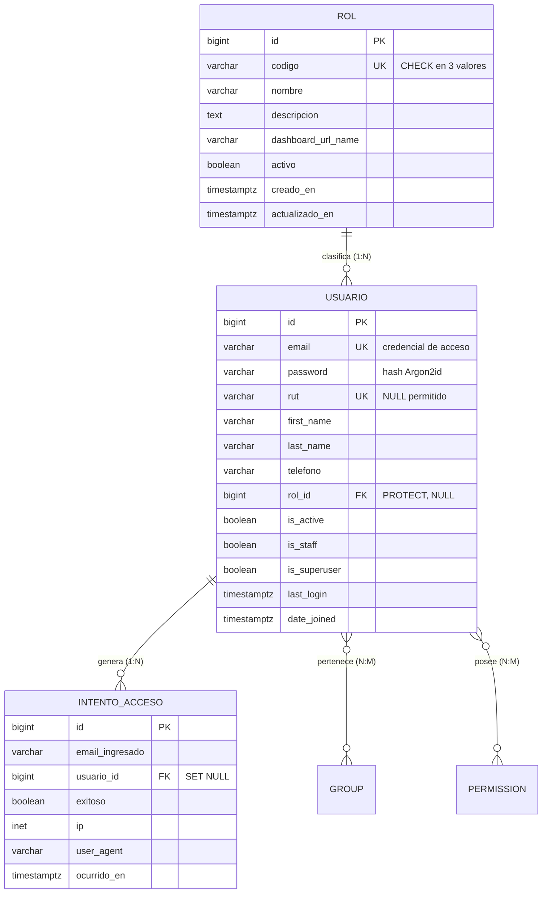

# HU-01 · Inicio de sesión seguro con control de acceso por rol

**Proyecto:** OPSO — Operativo Social
**Historia de usuario:** *Como usuario, quiero iniciar sesión de forma segura para acceder al sistema según mi rol.*
**Stack:** Python 3.14 · Django 6.0 · PostgreSQL 18 · HTML/CSS/Bootstrap 5.3
**Estado:** implementada y verificada con 47 pruebas automáticas (`python manage.py test` → OK)

---

## Índice

1. [Modelo de usuarios: ¿AbstractUser, AbstractBaseUser o User?](#1-modelo-de-usuarios)
2. [Modelo de roles](#2-modelo-de-roles)
3. [Base de datos PostgreSQL y diagrama entidad-relación](#3-base-de-datos-postgresql)
4. [Configuración de autenticación](#4-configuración-de-autenticación)
5. [Formularios](#5-formularios)
6. [Vistas](#6-vistas)
7. [Templates](#7-templates)
8. [Seguridad](#8-seguridad)
9. [Control de acceso y redirección por rol](#9-control-de-acceso-y-redirección-por-rol)
10. [Decoradores, mixins o middleware](#10-decoradores-mixins-o-middleware)
11. [Migraciones](#11-migraciones)
12. [Estructura del proyecto](#12-estructura-del-proyecto)
13. [Flujo completo](#13-flujo-completo)
14. [Explicación para la defensa](#14-explicación-para-la-defensa)
15. [Posibles preguntas del profesor](#15-posibles-preguntas-del-profesor)
16. [Conclusión técnica](#16-conclusión-técnica)
17. [Explicación para entender la implementación](#17-explicación-para-entender-la-implementación)

---

## 1. Modelo de usuarios

### Las tres alternativas

| Alternativa | Qué es | Ventajas | Desventajas |
|---|---|---|---|
| **`User` por defecto** | El modelo que Django trae listo. | Cero trabajo. Funciona de inmediato. | No se le pueden agregar campos (rol, RUT, teléfono). Obliga a iniciar sesión con `username`. Cambiarlo después es **muy costoso**: hay que migrar datos y reescribir claves foráneas. |
| **`AbstractUser`** | Clase padre del `User` anterior. Se hereda de ella y se agregan o quitan campos. | Conserva todo lo que ya funciona: hash de contraseñas, permisos, grupos, panel de administración, `login_required`. Permite agregar campos y cambiar el identificador de acceso. | Trae campos que quizá no se usen (`is_staff`, `groups`). |
| **`AbstractBaseUser`** | Solo la base mínima: contraseña y `last_login`. Todo lo demás se escribe a mano. | Control absoluto del esquema. | Hay que reimplementar el sistema de permisos completo. Mucho más código propio = mucha más superficie de error en la parte más delicada del sistema. |

### Decisión: `AbstractUser`

```python
class Usuario(AbstractUser):
    username = None                                    # se elimina
    email = models.EmailField(unique=True)             # nuevo identificador
    rut = models.CharField(max_length=12, unique=True, null=True, blank=True)
    telefono = models.CharField(max_length=20, blank=True)
    rol = models.ForeignKey(Rol, on_delete=models.PROTECT, null=True, blank=True)

    USERNAME_FIELD = "email"
    REQUIRED_FIELDS = ["first_name", "last_name"]
    objects = UsuarioManager()
```

**Justificación (tres razones):**

1. **Seguridad por reutilización.** El código de hash de contraseñas y de permisos de Django lo han auditado miles de personas durante casi veinte años. Reescribirlo con `AbstractBaseUser` significaría cambiar código probado por código nuevo justamente en la parte donde un error es más grave.
2. **OPSO necesita campos propios.** El sistema debe saber el **rol** de cada persona y su **RUT** (identificador real del personal en terreno en Chile). El `User` por defecto no lo permite.
3. **El identificador natural en OPSO es el correo institucional.** Es un dato que la organización ya administra y que no se duplica. Un `username` adicional sería un dato redundante que el usuario tendría que memorizar.

**Regla de oro que se aplicó:** el modelo de usuario personalizado se define **antes de la primera migración**. Cambiar `AUTH_USER_MODEL` con la base de datos ya poblada es uno de los problemas más difíciles de resolver en Django, porque todas las claves foráneas del proyecto apuntan a esa tabla.

> **Defensa — ¿por qué no usaste el User por defecto?**
> Porque OPSO necesita guardar el rol y el RUT de cada usuario, y necesita que el acceso sea con correo electrónico. El `User` por defecto no permite ninguna de las dos cosas, y modificarlo una vez que el sistema tiene datos es prácticamente inviable. `AbstractUser` da esa flexibilidad sin perder la seguridad ya probada de Django.

---

## 2. Modelo de roles

### Alternativas evaluadas

| Enfoque | Descripción | Por qué se descartó / eligió |
|---|---|---|
| Campo de texto con opciones (`CharField(choices=...)`) en `Usuario` | El rol es un texto dentro de la tabla de usuarios. | Simple, pero cada rol nuevo obliga a modificar el código y generar una migración. No admite datos propios del rol (descripción, panel de destino, activo/inactivo). |
| Solo `Group` + `Permission` de Django | Usar el sistema de grupos nativo. | Muy potente para permisos finos (`puede_editar_ficha`), pero un grupo no tiene semántica de negocio: no puede responder "¿a qué panel va este perfil?". |
| **Tabla `Rol` propia con clave foránea** ← elegido | El rol es una entidad con su propia tabla. | Es la que se implementó. |

### Implementación

```python
class RolCodigo(models.TextChoices):
    ADMINISTRADOR = "ADMINISTRADOR", "Administrador"
    SUPERVISOR    = "SUPERVISOR",    "Supervisor"
    CENSISTA      = "CENSISTA",      "Censista"

class Rol(models.Model):
    codigo             = models.CharField(max_length=20, choices=RolCodigo.choices, unique=True)
    nombre             = models.CharField(max_length=60)
    descripcion        = models.TextField(blank=True)
    dashboard_url_name = models.CharField(max_length=100)   # p. ej. "dashboards:supervisor"
    activo             = models.BooleanField(default=True)
```

### Por qué se decidió así — cinco argumentos

1. **Un rol es una entidad, no un adjetivo.** Tiene nombre visible, descripción, panel de destino y estado. Todo eso no cabe en un campo de texto.
2. **Integridad garantizada por la base de datos.** La clave foránea hace **imposible** que exista un usuario con un rol inexistente. No depende de que el programador recuerde validarlo.
3. **Extensible sin tocar el código.** Si OPSO incorpora el rol "Coordinador Regional", se agrega **una fila**. No hay que modificar modelos, ni generar migraciones, ni volver a desplegar.
4. **La relación rol → panel vive en los datos.** El campo `dashboard_url_name` elimina el clásico `if/elif` de la vista de login. La lógica de redirección no crece cuando crecen los roles.
5. **Se puede desactivar un rol completo** (`activo = False`) para suspender el acceso de todo un perfil sin borrar cuentas ni tocar el código.

**Se complementa, no se reemplaza, el sistema de permisos de Django.** `Rol` responde *"¿qué perfil de trabajo es esta persona?"* (grano gruESO, define el panel). `Group`/`Permission` de Django quedan disponibles para permisos finos por operación (`add_ficha`, `change_ficha`) en las historias de usuario siguientes. Son dos capas complementarias, y el modelo `Usuario` hereda ambas.

**Uso de `TextChoices`:** los códigos se declaran como constantes de Python. El código escribe `RolCodigo.SUPERVISOR` y no la cadena `"SUPERVISOR"`, con lo que un error de tipeo se detecta al escribir, no en producción. Además una `CheckConstraint` replica la validación en PostgreSQL:

```python
models.CheckConstraint(condition=models.Q(codigo__in=RolCodigo.values), name="rol_codigo_valido")
```

> **Defensa — ¿por qué el rol es una tabla aparte?**
> Porque un rol tiene información propia y porque así la base de datos garantiza la integridad: no puede existir un usuario con un rol que no existe. Además el sistema queda abierto a nuevos roles sin modificar el código, lo que era un requisito razonable para un sistema que va a crecer.

---

## 3. Base de datos PostgreSQL

### Tablas creadas

La migración `0001_initial` genera **cinco** tablas: tres propias y dos intermedias heredadas del sistema de permisos de Django.

#### 3.1 `usuarios_rol` — catálogo de roles

| Columna | Tipo SQL | Restricciones | Descripción |
|---|---|---|---|
| `id` | `bigint` | **PK**, `GENERATED BY DEFAULT AS IDENTITY` | Clave primaria subrogada |
| `codigo` | `varchar(20)` | **UNIQUE**, `CHECK` | Identificador interno del rol |
| `nombre` | `varchar(60)` | `NOT NULL` | Nombre visible |
| `descripcion` | `text` | — | Alcance del rol |
| `dashboard_url_name` | `varchar(100)` | `NOT NULL` | Nombre de la URL del panel |
| `activo` | `boolean` | `NOT NULL DEFAULT true` | Habilitado o suspendido |
| `creado_en` | `timestamptz` | `NOT NULL` | Auditoría |
| `actualizado_en` | `timestamptz` | `NOT NULL` | Auditoría |

**Restricciones:** `PRIMARY KEY (id)`, `UNIQUE (codigo)`, `CHECK (codigo IN ('ADMINISTRADOR','SUPERVISOR','CENSISTA'))`.

#### 3.2 `usuarios_usuario` — usuarios del sistema

| Columna | Tipo SQL | Restricciones | Descripción |
|---|---|---|---|
| `id` | `bigint` | **PK** | Clave primaria |
| `password` | `varchar(128)` | `NOT NULL` | **Hash** Argon2id (jamás la contraseña) |
| `last_login` | `timestamptz` | `NULL` | Último ingreso |
| `is_superuser` | `boolean` | `NOT NULL` | Permisos totales |
| `first_name` / `last_name` | `varchar(150)` | — | Nombre y apellido |
| `is_staff` | `boolean` | `NOT NULL` | Puede entrar a `/admin/` |
| `is_active` | `boolean` | `NOT NULL DEFAULT true` | Cuenta habilitada |
| `date_joined` | `timestamptz` | `NOT NULL` | Fecha de creación |
| `email` | `varchar(254)` | **UNIQUE**, `NOT NULL` | Credencial de acceso |
| `rut` | `varchar(12)` | **UNIQUE**, `NULL` | RUT normalizado `12345678-9` |
| `telefono` | `varchar(20)` | — | Contacto |
| `rol_id` | `bigint` | **FK** → `usuarios_rol(id)`, `NULL` | Rol asignado |
| `creado_en` / `actualizado_en` | `timestamptz` | `NOT NULL` | Auditoría |

**Restricciones:** `PRIMARY KEY (id)`, `UNIQUE (email)`, `UNIQUE (rut)`, `FOREIGN KEY (rol_id) REFERENCES usuarios_rol(id) ON DELETE RESTRICT` (por `on_delete=PROTECT`).
**Índices:** `idx_usuario_rol_activo (rol_id, is_active)` para los listados filtrados por perfil.

#### 3.3 `usuarios_intento_acceso` — bitácora de accesos

| Columna | Tipo SQL | Restricciones | Descripción |
|---|---|---|---|
| `id` | `bigint` | **PK** | Clave primaria |
| `email_ingresado` | `varchar(254)` | `NOT NULL`, indexado | Lo que se escribió (puede no existir) |
| `usuario_id` | `bigint` | **FK** → `usuarios_usuario(id)`, `NULL` | Cuenta asociada si existe |
| `exitoso` | `boolean` | `NOT NULL` | Resultado |
| `ip` | `inet` | `NULL` | Origen de la petición |
| `user_agent` | `varchar(300)` | — | Navegador y sistema operativo |
| `ocurrido_en` | `timestamptz` | `NOT NULL`, indexado | Momento del intento |

**Restricciones:** `FOREIGN KEY (usuario_id) REFERENCES usuarios_usuario(id) ON DELETE SET NULL` — si se elimina una cuenta, la bitácora **no** se borra (una bitácora que desaparece no sirve como evidencia).
**Índices:** `idx_intento_email_exito (email_ingresado, exitoso, ocurrido_en)`, que es exactamente la consulta del bloqueo por fuerza bruta.

#### 3.4 y 3.5 Tablas intermedias heredadas

`usuarios_usuario_groups` y `usuarios_usuario_user_permissions` implementan las relaciones **muchos a muchos** entre usuarios, grupos y permisos de Django. Cada una tiene una clave primaria propia, dos claves foráneas y una restricción `UNIQUE` sobre el par, para que no se registre dos veces la misma asignación.

Además, `django.contrib.sessions` crea **`django_session`** (`session_key` como PK, `session_data`, `expire_date`): es donde vive la sesión del usuario del lado del servidor.

### Diagrama entidad-relación



Versión en texto (para el informe impreso):

```
        ┌────────────────────────────┐
        │       usuarios_rol         │
        ├────────────────────────────┤
        │ PK  id            bigint   │
        │ UK  codigo        varchar  │◄── CHECK: 3 valores permitidos
        │     nombre        varchar  │
        │     descripcion   text     │
        │     dashboard_url_name     │
        │     activo        boolean  │
        └─────────────┬──────────────┘
                      │ 1
                      │
                      │ N        (ON DELETE RESTRICT)
        ┌─────────────▼──────────────┐
        │     usuarios_usuario       │
        ├────────────────────────────┤
        │ PK  id            bigint   │
        │ UK  email         varchar  │◄── credencial de acceso
        │     password      varchar  │◄── hash Argon2id, nunca texto plano
        │ UK  rut           varchar  │
        │     first_name / last_name │
        │     is_active / is_staff   │
        │ FK  rol_id ───────────────►│ usuarios_rol.id
        └─────────────┬──────────────┘
                      │ 1
                      │
                      │ N        (ON DELETE SET NULL)
        ┌─────────────▼──────────────┐
        │  usuarios_intento_acceso   │
        ├────────────────────────────┤
        │ PK  id            bigint   │
        │     email_ingresado        │
        │ FK  usuario_id             │
        │     exitoso       boolean  │
        │     ip            inet     │
        │     ocurrido_en   timestamp│
        └────────────────────────────┘

   Relaciones N:M con el sistema de permisos de Django:
   usuarios_usuario ──< usuarios_usuario_groups >── auth_group
   usuarios_usuario ──< usuarios_usuario_user_permissions >── auth_permission
```

### Cardinalidades

| Relación | Cardinalidad | Lectura |
|---|---|---|
| `Rol` → `Usuario` | 1 : N | Un rol lo tienen muchos usuarios; cada usuario tiene un solo rol. |
| `Usuario` → `IntentoAcceso` | 1 : N | Un usuario genera muchos intentos de acceso. |
| `Usuario` ↔ `Group` | N : M | Reservado para permisos finos futuros. |

### Sobre las claves primarias

Se usan **claves subrogadas** (`BigAutoField`, un entero autoincremental) y no claves naturales como el correo o el RUT. Razones:

- Un correo **puede cambiar** (una persona se cambia de institución). Si fuera la clave primaria, habría que actualizar todas las filas que la referencian.
- Un entero de 64 bits ocupa 8 bytes; un correo ocupa hasta 254. Los índices y las claves foráneas son mucho más eficientes con enteros.
- El RUT puede ser `NULL` (personal externo), y una clave primaria no admite nulos.

> **Defensa — ¿por qué PostgreSQL?**
> Cuatro razones concretas: (1) respeta **ACID** con integridad referencial real, indispensable con datos de familias; (2) es el motor **recomendado oficialmente** por Django y el único con soporte completo de sus tipos avanzados (`JSONField`, búsqueda de texto completo, `inet` para las IP de la bitácora); (3) maneja bien la **concurrencia** con control multiversión, lo que importa cuando varios censistas registran fichas al mismo tiempo; (4) es **software libre**, sin costo de licencia, apropiado para un proyecto social.

---

## 4. Configuración de autenticación

En `config/settings.py`:

```python
LOGIN_URL           = "usuarios:login"           # ¿Dónde se inicia sesión?
LOGIN_REDIRECT_URL  = "dashboards:redirigir"     # ¿A dónde va después de entrar?
LOGOUT_REDIRECT_URL = "usuarios:login"           # ¿A dónde va después de salir?
```

| Constante | Qué hace exactamente | Quién la usa |
|---|---|---|
| **`LOGIN_URL`** | Es la dirección a la que Django envía a quien intenta abrir una página protegida sin sesión. Al redirigir agrega `?next=/la/pagina/pedida` para poder devolverlo allí después. | `login_required`, `LoginRequiredMixin` y `LoginRequiredMiddleware`. |
| **`LOGIN_REDIRECT_URL`** | Destino por defecto tras un inicio de sesión exitoso, **cuando no hay `?next=`**. | `LoginView.get_default_redirect_url()`. |
| **`LOGOUT_REDIRECT_URL`** | Destino tras cerrar sesión. Se envía al login para que la próxima persona que use el equipo encuentre la pantalla de acceso. | `LogoutView`. |

**Detalle de diseño relevante:** `LOGIN_REDIRECT_URL` admite **una sola** dirección, pero OPSO necesita **tres** destinos distintos. La solución fue apuntarla a un **despachador** (`/dashboard/`): una vista que consulta el rol y reenvía. Así la constante no queda amarrada a ningún rol y sigue siendo válida cuando se agregue un cuarto perfil.

Se usan **nombres de URL** (`"usuarios:login"`) en lugar de rutas escritas a mano (`"/login/"`). Si mañana la dirección cambia a `/acceso/`, solo se edita `urls.py`: ni las plantillas ni las vistas ni la configuración se tocan.

---

## 5. Formularios

`usuarios/forms.py` → `LoginForm`, que hereda de `AuthenticationForm`.

### ¿Qué hace un formulario de Django?

Tres tareas distintas:

1. **Dibujar** los campos como HTML.
2. **Limpiar y validar** los datos recibidos. *Nunca* se confía en el navegador: la petición puede llegar desde `curl`, Postman o un script.
3. **Reportar los errores** de forma ordenada para que la plantilla los muestre.

### Qué se hereda y qué se agrega

**Lo que ya hacía `AuthenticationForm`** (y por eso no se reescribió):

- Llamar a `authenticate()`, que compara el hash de la contraseña.
- Rechazar cuentas con `is_active = False`.
- Dejar el usuario validado disponible en `get_user()` para que la vista cree la sesión.

**Lo que agrega `LoginForm`:**

```python
class LoginForm(AuthenticationForm):
    username = forms.EmailField(label="Correo electrónico", widget=forms.EmailInput(attrs={
        "class": "form-control form-control-lg",
        "autocomplete": "email",      # el gestor de contraseñas reconoce el campo
        "autofocus": True,
    }))
    password = forms.CharField(label="Contraseña", strip=False, widget=forms.PasswordInput(...))
    recordarme = forms.BooleanField(required=False, initial=False)
```

Cuatro decisiones puntuales, cada una con su motivo:

| Decisión | Motivo |
|---|---|
| El campo se sigue llamando `username` | Es el nombre que `AuthenticationForm` espera internamente, aunque contenga un correo. Renombrarlo obligaría a reescribir la lógica heredada sin ninguna ganancia. |
| `strip=False` en la contraseña | Por defecto Django recorta los espacios. Un espacio puede ser parte legítima de la contraseña y quitarlo impediría el ingreso. |
| Mensaje de error **genérico** | *"El correo electrónico o la contraseña son incorrectos"*, idéntico para un correo inexistente y para una clave equivocada. Si dijera "ese correo no está registrado", un atacante podría averiguar qué correos existen (**enumeración de usuarios**). |
| **Sin** `minlength` en el campo contraseña | Las reglas de longitud se aplican al **crear** la contraseña, no al usarla. Si se validara aquí, un usuario con una clave antigua más corta quedaría sin poder entrar. |

### Los dos ganchos de validación

```python
def clean(self):
    email = self.cleaned_data.get("username")
    if email and esta_bloqueado(email):        # 1º: ¿está bloqueado por intentos?
        raise ValidationError(...)
    return super().clean()                     # 2º: recién ahora se verifica la clave

def confirm_login_allowed(self, user):
    super().confirm_login_allowed(user)        # revisa is_active
    if user.rol_id and not user.rol.activo and not user.is_superuser:
        raise ValidationError(...)             # regla propia de OPSO
```

El orden en `clean()` **no es casual**: verificar el bloqueo **antes** de comprobar la contraseña evita que un atacante bloqueado consuma tiempo de CPU calculando hashes Argon2 (que son lentos a propósito).

---

## 6. Vistas

`usuarios/views.py` y `dashboards/views.py`. Se usan **vistas basadas en clases** heredando de las vistas oficiales de Django.

### 6.1 `LoginOPSOView` — paso a paso

```python
@method_decorator(login_not_required, name="dispatch")
class LoginOPSOView(LoginView):
    template_name = "usuarios/login.html"
    authentication_form = LoginForm
    redirect_authenticated_user = True
```

**Paso 1 — GET `/login/`.** `LoginView` crea un `LoginForm` vacío y renderiza la plantilla. Si el usuario ya tiene sesión, `redirect_authenticated_user = True` lo envía directo a su panel en vez de mostrarle el formulario otra vez.

**Paso 2 — POST `/login/`.** Antes de que la vista se ejecute, `CsrfViewMiddleware` valida el token. Si no coincide → **403** y la vista nunca corre.

**Paso 3 — validación.** La vista instancia `LoginForm(request, data=request.POST)` y llama a `form.is_valid()`, que ejecuta `clean_username()`, `clean()`, `authenticate()` y `confirm_login_allowed()`.

**Paso 4a — formulario inválido → `form_invalid()`.**

```python
def form_invalid(self, form):
    restantes = intentos_restantes(form.data.get("username", ""))
    if 0 < restantes <= 2:
        messages.warning(self.request, f"Te queda(n) {restantes} intento(s)...")
    return super().form_invalid(form)
```

Se vuelve a mostrar el formulario con los errores. El aviso de intentos restantes ayuda al usuario legítimo que se equivocó, sin revelar si el correo existe.

**Paso 4b — formulario válido → `form_valid()`.**

```python
def form_valid(self, form):
    respuesta = super().form_valid(form)          # ← aquí nace la sesión
    if not form.cleaned_data.get("recordarme"):
        self.request.session.set_expiry(0)        # muere al cerrar el navegador
    messages.success(self.request, f"Bienvenido/a, ...")
    return respuesta
```

`super().form_valid(form)` invoca `django.contrib.auth.login(request, user)`, que hace tres cosas:

1. **Rota el identificador de sesión** (genera uno nuevo y descarta el anterior) → neutraliza el ataque de **fijación de sesión**.
2. Guarda `_auth_user_id` y el backend usado dentro de la sesión del servidor.
3. Emite la señal `user_logged_in`, que la auditoría escucha para registrar el acceso.

**Paso 5 — destino.**

```python
def get_success_url(self):
    return self.get_redirect_url() or self.request.user.get_dashboard_url()
```

`get_redirect_url()` devuelve el `?next=` **solo si apunta a este mismo sitio**; Django lo verifica con `url_has_allowed_host_and_scheme()`. Sin esa validación, un enlace como `/login/?next=https://sitio-falso.cl` permitiría un **open redirect**: la víctima ve el dominio real de OPSO, se autentica y termina en una copia fraudulenta. Hay una prueba automática que cubre este caso.

### 6.2 `LogoutOPSOView`

```python
class LogoutOPSOView(LogoutView):
    next_page = reverse_lazy("usuarios:login")

    def post(self, request, *args, **kwargs):
        estaba_autenticado = request.user.is_authenticated
        respuesta = super().post(request, *args, **kwargs)   # auth.logout()
        if estaba_autenticado:
            messages.info(request, "Cerraste sesión correctamente.")
        return respuesta
```

Dos detalles importantes:

- **Solo acepta POST.** Desde Django 5 el cierre de sesión por GET está prohibido, porque bastaba con que un tercero incrustara `` en cualquier página para desconectar al usuario. Con POST + token CSRF eso es imposible. Una prueba verifica que un GET responda **405**.
- **El mensaje se agrega DESPUÉS del logout.** Los mensajes flash viven en la sesión, y `logout()` la destruye. Si se agregara antes, se borraría junto con ella y el usuario nunca lo vería.

### 6.3 `RedirigirSegunRolView` — el despachador

```python
class RedirigirSegunRolView(RolRequeridoMixin, RedirectView):
    permanent = False                                  # HTTP 302, no 301
    def test_func(self):
        return self.request.user.is_authenticated
    def get_redirect_url(self, *args, **kwargs):
        return self.request.user.get_dashboard_url()
```

`permanent = False` es deliberado: la respuesta **depende de quién pregunta**, así que el navegador no debe cachearla. Un 301 (permanente) haría que un censista quedara con `/dashboard/censista/` en caché y un administrador en el mismo equipo terminara redirigido allí.

### 6.4 Los tres paneles

```python
class DashboardAdministradorView(RolRequeridoMixin, TemplateView):
    template_name = "dashboards/administrador.html"
    roles_permitidos = (RolCodigo.ADMINISTRADOR,)
```

Una línea declarativa por vista: `roles_permitidos`. Toda la lógica de autorización está en el mixin, escrita una sola vez.

---

## 7. Templates

```
templates/
├── base.html                       # estructura común de las pantallas internas
├── 403.html                        # página de acceso denegado
├── usuarios/
│   ├── login.html                  # ← pantalla de inicio de sesión
│   └── sin_rol.html                # cuenta sin rol asignado
└── dashboards/
    ├── administrador.html
    ├── supervisor.html
    └── censista.html
```

### `login.html`

Diseño de **dos columnas** que conserva la identidad visual del prototipo OPSO: panel institucional azul a la izquierda (se oculta bajo 992 px con `d-none d-lg-flex`) y el formulario a la derecha.

Incluye lo solicitado:

| Elemento | Implementación |
|---|---|
| Campo usuario | `{{ form.username }}` con icono de sobre e `inputmode="email"` |
| Campo contraseña | `{{ form.password }}` con icono de candado y botón de mostrar/ocultar |
| **Mensajes de error** | Tres niveles: `{{ form.non_field_errors }}` (credenciales inválidas, cuenta bloqueada), errores por campo, y `{{ messages }}` del sistema (sesión cerrada por inactividad, intentos restantes) |
| Diseño profesional con Bootstrap | Bootstrap 5.3 + `static/css/opso.css` con los tokens de color del prototipo |
| Accesibilidad | `<label for>` en cada campo, `aria-live="assertive"` en los errores, `aria-pressed` en el botón del ojo, contraste AA, `prefers-reduced-motion` |

**Bootstrap se sirve desde el propio proyecto** (`static/vendor/bootstrap/`) y no desde un CDN. Motivo práctico y defendible: **la aplicación funciona sin conexión a internet**, lo que importa tanto en el terreno rural como en la sala de la defensa.

**Progressive enhancement:** el JavaScript solo agrega comodidades (mostrar la contraseña, evitar el doble envío). Si el navegador no ejecuta JS, el formulario funciona igual, porque la validación real ocurre en el servidor.

### `base.html`

La herencia de plantillas (`` / ``) evita repetir el `<head>` y la barra de navegación en cada página.

El menú se arma según el rol (``), pero con una salvedad que conviene mencionar en la defensa: **ocultar un enlace no es seguridad**, porque la URL se puede escribir a mano. Es solo comodidad para el usuario. La seguridad real está en las vistas, con el mixin de rol — y hay pruebas automáticas que lo demuestran.

---

## 8. Seguridad

### 8.1 Protección CSRF

**Qué ataque evita.** CSRF (*Cross-Site Request Forgery*) es engañar al navegador de una víctima **ya autenticada** para que envíe una petición que ella no quiso. Un sitio malicioso publica un formulario oculto que apunta a OPSO; como el navegador adjunta automáticamente la cookie de sesión, para el servidor la petición parece legítima.

**Cómo se implementa.** `CsrfViewMiddleware` está activo y cada formulario incluye ``, que inserta un `<input type="hidden">` con un valor secreto. Django compara el token del formulario con el de la cookie. **El sitio atacante no puede leer la cookie de OPSO** (política del mismo origen), así que no puede fabricar un token válido.

**Por qué aumenta la seguridad:** obliga a que toda operación que cambie el estado del sistema pruebe que **se originó dentro de OPSO**, no solo que el navegador tenga una sesión válida.

*Verificado por:* `test_post_sin_token_csrf_es_rechazado` → 403.

### 8.2 Hash automático de contraseñas

**Qué se guarda realmente:**

```
argon2$argon2id$v=19$m=102400,t=2,p=8$c29tZS1zYWx0$hash-resultante
└─────┘ └───────┘ └──────────────────┘ └──────────┘ └────────────┘
algoritmo variante  parámetros de costo     sal          hash
```

**Tres propiedades que hacen esto seguro:**

1. **Es irreversible.** Un hash no es cifrado: no existe operación inversa. Ni el administrador ni el desarrollador pueden leer la contraseña de nadie.
2. **La sal es aleatoria y distinta por usuario.** Dos personas con la misma contraseña tienen hashes diferentes, lo que inutiliza las *rainbow tables* y evita que se pueda deducir quién comparte contraseña.
3. **Es lento a propósito.** Argon2id consume memoria y CPU deliberadamente. Verificar una contraseña legítima cuesta milisegundos (imperceptible), pero probar millones de candidatas se vuelve inviable.

**Configuración:**

```python
PASSWORD_HASHERS = [
    "django.contrib.auth.hashers.Argon2PasswordHasher",   # ← el usado para las nuevas
    "django.contrib.auth.hashers.PBKDF2PasswordHasher",   # ← compatibilidad hacia atrás
    ...
]
```

Argon2id ganó el *Password Hashing Competition* y es el algoritmo recomendado actualmente. Los siguientes de la lista permiten verificar hashes antiguos y **re-hashearlos automáticamente** al siguiente ingreso del usuario.

El hash se aplica en `set_password()`, que se llama desde el manager, el admin y el comando `createsuperuser`. **No hay ninguna ruta en el código por la que una contraseña llegue en texto plano a la base de datos.**

Se suman cuatro validadores de robustez (`AUTH_PASSWORD_VALIDATORS`): mínimo 10 caracteres, no parecida a los datos del usuario, no estar entre las 20.000 más comunes, no ser puramente numérica.

*Verificado por:* `test_la_contrasena_no_se_guarda_en_texto_plano`, `test_dos_usuarios_con_la_misma_clave_tienen_hash_distinto`.

### 8.3 Validación de credenciales

Cadena completa:

```
LoginForm.clean_username()   → normaliza el correo (minúsculas, sin espacios)
LoginForm.clean()            → ¿la cuenta está bloqueada por intentos fallidos?
authenticate()               → ModelBackend busca el usuario y llama a check_password()
check_password()             → recalcula el hash con la misma sal y compara
confirm_login_allowed()      → ¿is_active? ¿el rol está activo?
```

Un detalle fino y muy defendible: cuando el correo **no existe**, `ModelBackend` ejecuta de todos modos un cálculo de hash falso (`set_password` sobre un usuario vacío). Así el tiempo de respuesta es el mismo exista o no la cuenta, lo que cierra un **ataque de temporización** (medir el tiempo de respuesta para deducir qué correos están registrados).

**Extra propio de OPSO — bloqueo por fuerza bruta.** Tras 5 intentos fallidos en 15 minutos (configurable), el correo queda bloqueado temporalmente. El contador se reinicia con un ingreso exitoso, de modo que un usuario que se equivocó tres veces y luego entró bien no arrastra penalización.

*Verificado por:* `test_tras_n_intentos_fallidos_la_cuenta_queda_bloqueada`, `test_un_ingreso_exitoso_reinicia_el_contador`, `test_el_mensaje_de_error_no_revela_si_el_correo_existe`.

### 8.4 Manejo de sesiones

HTTP no tiene memoria: cada petición es independiente. La sesión es el mecanismo que permite "recordar" quién es el usuario entre una petición y la siguiente.

**Cómo funciona en OPSO:**

1. Al autenticarse, Django crea una fila en `django_session` con los datos (`_auth_user_id`) y una `session_key` aleatoria.
2. Al navegador **solo** se le envía esa clave, en la cookie `sessionid`. **Los datos nunca salen del servidor.**
3. En cada petición, `SessionMiddleware` lee la cookie, busca la fila y `AuthenticationMiddleware` reconstruye `request.user`.

**Configuración de endurecimiento:**

| Ajuste | Valor | Qué protege |
|---|---|---|
| `SESSION_COOKIE_HTTPONLY` | `True` | JavaScript no puede leer la cookie → un XSS no puede robar la sesión |
| `SESSION_COOKIE_SECURE` | `True` en producción | La cookie solo viaja por HTTPS → no se puede interceptar en una red WiFi abierta |
| `SESSION_COOKIE_SAMESITE` | `"Lax"` | La cookie no se envía en peticiones iniciadas por otro sitio → refuerzo anti-CSRF |
| `SESSION_COOKIE_AGE` | 8 horas | Una jornada de terreno; después caduca |
| `SESSION_SAVE_EVERY_REQUEST` | `True` | La sesión se mantiene viva mientras se trabaja y caduca al dejar de usarla |
| `session.set_expiry(0)` | si no marca "recordarme" | La sesión muere al cerrar el navegador (clave en equipos compartidos) |
| Rotación de la clave al autenticarse | automática | Anula la **fijación de sesión** |
| Cierre por inactividad | 30 min | Un equipo desatendido con datos de familias en pantalla se cierra solo |

*Verificado por:* `test_al_ingresar_se_crea_la_sesion`, `test_el_identificador_de_sesion_cambia_al_autenticarse`, `test_sin_recordarme_la_sesion_expira_al_cerrar_el_navegador`, `test_cerrar_sesion_destruye_la_sesion`.

### 8.5 Protección de vistas con `login_required`

En lugar de decorar cada vista una por una, se activó **`LoginRequiredMiddleware`** (disponible desde Django 5.1): **todas** las vistas exigen sesión por defecto, y las públicas deben declararse explícitamente con `@login_not_required`.

**Por qué es mejor:** invierte el riesgo. Con el enfoque tradicional, olvidar un decorador deja una vista **desprotegida** y nadie se da cuenta. Con este enfoque, el olvido deja una vista **inaccesible** — un error visible de inmediato, que no compromete datos. Es *seguro por defecto* (*fail-safe*).

En OPSO solo `/login/` y `/logout/` están marcadas como públicas.

*Verificado por:* `test_visitante_anonimo_es_enviado_al_login`.

### 8.6 Control de permisos por rol

Dos capas complementarias:

```python
class RolRequeridoMixin(LoginRequiredMixin, UserPassesTestMixin):
    roles_permitidos = ()
    permitir_administrador = True

    def test_func(self):
        usuario = self.request.user
        if self.permitir_administrador and usuario.es_administrador:
            return True
        return usuario.tiene_rol(*self.roles_permitidos)
```

Cada panel declara su regla en una línea. Un censista que escriba `/dashboard/admin/` a mano recibe un aviso y vuelve a su propio panel.

**Por qué aumenta la seguridad:** aplica el **privilegio mínimo**. Cada persona accede solo a lo que su función requiere, así que un error humano o una cuenta comprometida tienen un alcance limitado. Con datos de familias vulnerables no es un detalle menor: reduce la exposición innecesaria de información personal.

*Verificado por:* `test_censista_no_puede_abrir_el_panel_del_administrador`, `test_supervisor_no_puede_abrir_el_panel_del_censista`, `test_cada_rol_accede_a_su_propio_panel`.

### 8.7 Medidas adicionales incorporadas

| Medida | Implementación | Ataque que mitiga |
|---|---|---|
| Secretos fuera del código | `.env` + `python-decouple`, `.env` en `.gitignore` | Filtración de credenciales al publicar el repositorio |
| `ALLOWED_HOSTS` | Lista blanca de dominios | Envenenamiento del encabezado `Host` |
| `X_FRAME_OPTIONS = "DENY"` | `XFrameOptionsMiddleware` | Clickjacking |
| `SECURE_CONTENT_TYPE_NOSNIFF` | Encabezado `nosniff` | Ejecución de contenido mal interpretado (MIME sniffing) |
| HSTS + `SECURE_SSL_REDIRECT` | Activos en producción | Interceptación de tráfico (*man in the middle*) |
| Escapado automático de plantillas | Django escapa toda variable por defecto | XSS |
| ORM con consultas parametrizadas | Nunca se concatena SQL | Inyección SQL |
| Bitácora de accesos | Modelo `IntentoAcceso` + señales | Falta de trazabilidad ante un incidente |
| Usuario de BD con privilegio mínimo | `opso_user`, no `postgres` | Escalada de daño si se filtran las credenciales de la BD |
| `statement_timeout = 10s` | `OPTIONS` de la conexión | Denegación de servicio por consulta pesada |

---

## 9. Control de acceso y redirección por rol

### Requisito

| Rol | Destino |
|---|---|
| Administrador | `/dashboard/admin/` |
| Supervisor | `/dashboard/supervisor/` |
| Censista | `/dashboard/censista/` |

### Cómo funciona la lógica

**Enfoque descartado** — el clásico condicional en la vista:

```python
# ❌ Cada rol nuevo obliga a editar y volver a desplegar el código
if user.rol.codigo == "ADMINISTRADOR":
    return redirect("/dashboard/admin/")
elif user.rol.codigo == "SUPERVISOR":
    ...
```

**Enfoque implementado** — la relación rol → panel está **guardada en la base de datos**:

```python
# usuarios/models.py
def get_dashboard_url(self):
    if self.rol_id and self.rol.activo and self.rol.dashboard_url_name:
        try:
            return reverse(self.rol.dashboard_url_name)   # "dashboards:supervisor" → "/dashboard/supervisor/"
        except NoReverseMatch:
            pass                       # el nombre guardado ya no existe: no rompemos el login
    if self.is_superuser:
        return reverse("dashboards:administrador")
    return reverse("usuarios:sin_rol")                    # cuenta válida sin rol
```

La tabla `usuarios_rol` queda así (la siembra la migración `0002`):

| codigo | dashboard_url_name |
|---|---|
| `ADMINISTRADOR` | `dashboards:administrador` |
| `SUPERVISOR` | `dashboards:supervisor` |
| `CENSISTA` | `dashboards:censista` |

**Ventajas concretas:**

1. **Sin condicionales que crecen.** Un cuarto rol es una fila nueva, no código nuevo.
2. **Una sola fuente de verdad.** El despachador, el login y el mixin usan todos `get_dashboard_url()`.
3. **Degradación elegante.** Si el nombre de URL guardado no existe, el `try/except NoReverseMatch` impide que el inicio de sesión se caiga: cae a un respaldo seguro.

### Los dos caminos hacia el panel

```
Camino A — inicio de sesión directo:
  POST /login/ → LoginOPSOView.get_success_url() → get_dashboard_url() → 302 /dashboard/censista/

Camino B — cualquier punto del sistema:
  GET /dashboard/ → RedirigirSegunRolView → get_dashboard_url() → 302 /dashboard/censista/
```

El camino B es el que usa `LOGIN_REDIRECT_URL` y es al que apunta el logo de la barra superior.

### Y si un rol intenta entrar donde no le corresponde

```
Censista autenticado escribe /dashboard/admin/
   ↓
LoginRequiredMiddleware: tiene sesión ✓
   ↓
RolRequeridoMixin.test_func(): ¿es administrador? no. ¿tiene rol ADMINISTRADOR? no → False
   ↓
handle_no_permission(): mensaje de error + 302 a /dashboard/censista/
```

Se eligió redirigir a su propio panel en lugar de mostrar un 403 seco, porque es mejor experiencia de uso. Existe una salvaguarda: si el destino coincide con la URL pedida, se lanza `PermissionDenied` (403) para evitar un bucle infinito de redirecciones.

---

## 10. Decoradores, mixins o middleware

### Comparación

| Mecanismo | Alcance | Cuándo es la herramienta correcta | Limitación |
|---|---|---|---|
| **Decorador** (`@login_required`) | Una vista función | Vistas escritas como función; reglas puntuales | No se aplica directo a una clase (requiere `method_decorator`) |
| **Mixin** (`LoginRequiredMixin`) | Una vista clase | Vistas basadas en clases; reglas declarativas y heredables | Solo sirve para CBV |
| **Middleware** | **Todas** las peticiones | Reglas transversales sin excepción | No conoce el detalle de cada vista; una regla por rol allí sería un `if` gigante e imposible de mantener |

### Decisión: estrategia por capas

> **Middleware** para lo transversal · **Mixins** para el rol en CBV · **Decoradores** para vistas función

Cada mecanismo se usa donde es óptimo:

**1. Middleware — la exigencia de sesión y la inactividad.**

```python
"django.contrib.auth.middleware.LoginRequiredMiddleware",       # de Django
"usuarios.middleware.CierreSesionPorInactividadMiddleware",     # propio
```

*Por qué acá:* "toda página exige sesión" y "toda pantalla se cierra por inactividad" son reglas **sin excepciones por vista**. Justamente lo que un middleware hace bien. Y en el caso de la sesión, resuelve el problema de olvidar un decorador: lo que se olvida queda cerrado, no abierto.

**2. Mixins — el control de rol (mecanismo principal).**

```python
class DashboardSupervisorView(RolRequeridoMixin, TemplateView):
    roles_permitidos = (RolCodigo.SUPERVISOR,)
```

*Por qué acá — cuatro razones:*

- **Es declarativo.** Se lee la primera línea de la clase y se sabe quién entra.
- **Se escribe una vez.** La lógica de autorización está en `RolRequeridoMixin`, no repartida.
- **Es heredable.** Se pueden crear especializaciones (`class SoloSupervisores(RolRequeridoMixin)`).
- **Compone bien.** Encaja con el resto de los mixins de Django (`UserPassesTestMixin`, `LoginRequiredMixin`) y se integra en el ciclo `dispatch()`.

**3. Decoradores — disponibles para vistas función.** Se implementó `@rol_requerido(...)` en `usuarios/decorators.py` para las vistas simples que las siguientes historias de usuario puedan necesitar (por ejemplo, un endpoint que devuelve JSON).

**Por qué NO se usó middleware para el control de rol:** un middleware no sabe qué vista se va a ejecutar sin inspeccionar rutas. Implementar los permisos por rol allí obligaría a mantener un mapa URL → roles con expresiones regulares, separado de las vistas. Cuando la regla vive **junto a la vista que protege**, es imposible que ambas se desincronicen.

---

## 11. Migraciones

### Qué es una migración

Una migración es un **archivo de Python versionado** que describe un cambio en el esquema de la base de datos. Django las traduce al SQL de cada motor y registra en la tabla `django_migrations` cuáles ya se aplicaron.

**Por qué no se escribe el SQL a mano:**

| Con migraciones | Con SQL manual |
|---|---|
| El esquema queda versionado en Git, con historial | Los cambios viven en la cabeza de alguien |
| `migrate` reproduce la base exacta en cualquier equipo | Hay que recordar y repetir cada paso |
| Reversibles (`migrate usuarios 0001`) | Deshacer se improvisa |
| Django crea la base de prueba aplicándolas | Habría que mantener un script paralelo |

### `0001_initial.py` — migración de ESQUEMA (DDL)

Generada con `python manage.py makemigrations usuarios`. Operaciones:

| Operación | SQL equivalente |
|---|---|
| `CreateModel(name="Rol")` | `CREATE TABLE usuarios_rol (...)` + `UNIQUE (codigo)` + `CHECK (codigo IN (...))` |
| `CreateModel(name="Usuario")` | `CREATE TABLE usuarios_usuario (...)` + `UNIQUE (email)` + `UNIQUE (rut)` + `FOREIGN KEY (rol_id) → usuarios_rol(id) ON DELETE RESTRICT` |
| *(implícito en el modelo)* | `CREATE TABLE usuarios_usuario_groups` y `usuarios_usuario_user_permissions` (relaciones N:M heredadas) |
| `CreateModel(name="IntentoAcceso")` | `CREATE TABLE usuarios_intento_acceso (...)` + `FOREIGN KEY (usuario_id) → usuarios_usuario(id) ON DELETE SET NULL` |
| `AddIndex(...)` | `CREATE INDEX idx_usuario_rol_activo ON usuarios_usuario (rol_id, is_active)` |

`dependencies = [("auth", "0012_...")]` indica que primero deben existir las tablas de grupos y permisos, porque `Usuario` se relaciona con ellas.

### `0002_roles_iniciales.py` — migración de DATOS (DML)

Escrita a mano. Inserta los tres roles:

```python
def crear_roles(apps, schema_editor):
    Rol = apps.get_model("usuarios", "Rol")     # ← versión histórica del modelo
    for datos in ROLES_INICIALES:
        Rol.objects.update_or_create(codigo=datos["codigo"], defaults=datos)

operations = [migrations.RunPython(crear_roles, eliminar_roles)]
```

Tres decisiones técnicas que conviene poder explicar:

1. **`apps.get_model()` en vez de `from ..models import Rol`.** Una migración debe seguir funcionando dentro de cinco años, aunque el modelo haya cambiado. `apps.get_model()` entrega el modelo **tal como era en este punto de la historia**: la migración es una fotografía, no un espejo.
2. **`update_or_create` la hace idempotente.** Se puede volver a aplicar sin duplicar filas ni fallar por la restricción `UNIQUE`.
3. **Tiene función inversa** (`eliminar_roles`), así que `python manage.py migrate usuarios 0001` revierte el cambio. Solo borra los roles sin usuarios asignados, porque la clave foránea es `PROTECT`.

**Por qué sembrar los roles con una migración y no a mano en pgAdmin:** reproducibilidad. Cualquier persona clona el repositorio, ejecuta `migrate` y obtiene exactamente la misma base de datos, sin pasos manuales que se puedan olvidar. Y como Django crea la base de prueba aplicando las migraciones, los roles también existen al correr los tests.

### Comandos

```bash
python manage.py makemigrations          # detecta cambios en los modelos y escribe el archivo
python manage.py migrate                 # aplica lo pendiente a PostgreSQL
python manage.py showmigrations          # qué está aplicado y qué no
python manage.py sqlmigrate usuarios 0001  # muestra el SQL, sin ejecutarlo ← útil en la defensa
python manage.py migrate usuarios 0001   # revierte la 0002
```

`sqlmigrate` es particularmente útil para mostrar en la defensa el SQL exacto que Django generó.

---

## 12. Estructura del proyecto

```
stock-flow-main/
│
├── .venv/                              # entorno virtual (no se versiona)
├── OPSO/                               # prototipo HTML estático original (referencia de diseño)
│
└── backend/                            # ← PROYECTO DJANGO
    │
    ├── manage.py                       # "control remoto" del proyecto
    ├── requirements.txt                # dependencias con versión fija
    ├── .env                            # secretos reales (NO se versiona)
    ├── .env.example                    # plantilla de configuración (sí se versiona)
    │
    ├── config/                         # CONFIGURACIÓN DEL PROYECTO
    │   ├── __init__.py
    │   ├── settings.py                 # BD, apps, middleware, seguridad, sesiones
    │   ├── urls.py                     # enrutador raíz
    │   ├── wsgi.py                     # entrada para el servidor de producción
    │   └── asgi.py                     # entrada asíncrona
    │
    ├── usuarios/                       # APP: autenticación, roles y auditoría
    │   ├── __init__.py
    │   ├── apps.py                     # conecta las señales en ready()
    │   ├── models.py                   # Rol, Usuario, IntentoAcceso
    │   ├── managers.py                 # UsuarioManager (crear usuario con correo)
    │   ├── validators.py               # validación de RUT chileno (módulo 11)
    │   ├── forms.py                    # LoginForm + formularios del admin
    │   ├── views.py                    # LoginOPSOView, LogoutOPSOView, SinRolView
    │   ├── urls.py                     # /login/, /logout/, /sin-rol/, /
    │   ├── mixins.py                   # RolRequeridoMixin (control de rol en CBV)
    │   ├── decorators.py               # @rol_requerido (control de rol en FBV)
    │   ├── middleware.py               # cierre de sesión por inactividad
    │   ├── seguridad.py                # IP, bitácora, bloqueo por fuerza bruta
    │   ├── signals.py                  # auditoría de login/logout
    │   ├── admin.py                    # gestión de usuarios y roles en /admin/
    │   ├── tests.py                    # 47 pruebas automáticas
    │   ├── migrations/
    │   │   ├── 0001_initial.py         # crea las tablas (esquema)
    │   │   └── 0002_roles_iniciales.py # inserta los 3 roles (datos)
    │   └── management/commands/
    │       └── crear_usuarios_demo.py  # crea un usuario por rol para la demo
    │
    ├── dashboards/                     # APP: paneles por rol
    │   ├── __init__.py
    │   ├── apps.py
    │   ├── views.py                    # despachador + 3 paneles
    │   └── urls.py                     # /dashboard/, /dashboard/admin/, ...
    │
    ├── templates/                      # PLANTILLAS HTML
    │   ├── base.html
    │   ├── 403.html
    │   ├── usuarios/
    │   │   ├── login.html
    │   │   └── sin_rol.html
    │   └── dashboards/
    │       ├── administrador.html
    │       ├── supervisor.html
    │       └── censista.html
    │
    ├── static/                         # ARCHIVOS ESTÁTICOS
    │   ├── css/opso.css
    │   └── vendor/bootstrap/           # Bootstrap local (funciona sin internet)
    │
    ├── scripts/
    │   └── crear_base_datos.sql        # creación de la BD y del usuario de PostgreSQL
    │
    └── docs/
        └── HU-01_inicio_de_sesion.md   # este documento
```

### Criterio de organización

**Separación por responsabilidad, no por tipo de archivo.** `usuarios` contiene *todo* lo relativo a la autenticación (modelo, formulario, vista, permisos, pruebas). `dashboards` contiene *todo* lo relativo a los paneles. Cada app es una unidad reutilizable y comprensible por separado.

**Por qué el proyecto se llama `config` y no `opso`.** Con `django-admin startproject opso` quedaría `opso/opso/settings.py`, ambiguo al leer los `import`. Llamarlo `config` hace evidente qué es cada carpeta: `config` es configuración, `usuarios` y `dashboards` son funcionalidad.

**Por qué `usuarios/seguridad.py` y `usuarios/signals.py` son archivos aparte.** Un archivo por responsabilidad. La lógica de bloqueo se puede probar sin levantar una vista, y la auditoría se puede modificar sin tocar el inicio de sesión.

---

## 13. Flujo completo

### Diagrama de flujo

```
┌──────────────────────────────────────────────────────────────────────┐
│  1. El usuario abre http://opso.cl/ en su navegador                  │
└───────────────────────────────┬──────────────────────────────────────┘
                                ▼
                  ┌─────────────────────────────┐
                  │ ¿Tiene cookie de sesión      │
                  │  válida?                     │
                  └──────┬───────────────┬──────┘
                      NO │               │ SÍ
                         ▼               └──────────────► (salta al paso 10)
┌──────────────────────────────────────────────────────────────────────┐
│  2. LoginRequiredMiddleware redirige:                                 │
│     302 → /login/?next=/                                              │
└───────────────────────────────┬──────────────────────────────────────┘
                                ▼
┌──────────────────────────────────────────────────────────────────────┐
│  3. GET /login/ → LoginOPSOView renderiza login.html                  │
│     El HTML incluye el token CSRF oculto                              │
└───────────────────────────────┬──────────────────────────────────────┘
                                ▼
┌──────────────────────────────────────────────────────────────────────┐
│  4. El usuario escribe su CORREO y su CONTRASEÑA                      │
│     y presiona "Ingresar al sistema"                                  │
└───────────────────────────────┬──────────────────────────────────────┘
                                ▼
┌──────────────────────────────────────────────────────────────────────┐
│  5. POST /login/  (los datos van en el CUERPO, no en la URL)          │
└───────────────────────────────┬──────────────────────────────────────┘
                                ▼
                  ┌─────────────────────────────┐
                  │ CsrfViewMiddleware:          │
                  │ ¿el token es válido?         │
                  └──────┬───────────────┬──────┘
                      NO │               │ SÍ
                         ▼               ▼
                    403 Prohibido    (continúa)
                                         │
                                         ▼
                  ┌─────────────────────────────┐
                  │ LoginForm.clean():           │
                  │ ¿la cuenta está bloqueada     │
                  │  por intentos fallidos?      │
                  └──────┬───────────────┬──────┘
                      SÍ │               │ NO
                         ▼               ▼
              "Bloqueada 15 min"     (continúa)
                                         │
                                         ▼
┌──────────────────────────────────────────────────────────────────────┐
│  6. authenticate() → DJANGO CONSULTA PostgreSQL                       │
│                                                                       │
│     SELECT * FROM usuarios_usuario WHERE UPPER(email) = UPPER('...')  │
│                                                                       │
│     (consulta parametrizada: inmune a inyección SQL)                  │
└───────────────────────────────┬──────────────────────────────────────┘
                                ▼
┌──────────────────────────────────────────────────────────────────────┐
│  7. VALIDA LA CONTRASEÑA — check_password()                           │
│                                                                       │
│     a) Lee del hash guardado: algoritmo + parámetros + SAL            │
│     b) Recalcula el hash de lo que se escribió, con LA MISMA SAL      │
│     c) Compara los dos hashes en tiempo constante                     │
│                                                                       │
│     La contraseña guardada NUNCA se descifra (es irreversible)         │
└──────┬────────────────────────────────────────────────┬──────────────┘
       │ no coincide                                    │ coincide
       ▼                                                ▼
┌───────────────────────────────┐    ┌─────────────────────────────────┐
│ señal user_login_failed        │    │ confirm_login_allowed():        │
│  → fila en la bitácora         │    │ ¿is_active? ¿rol activo?        │
│  → vuelve al formulario con    │    └──────┬────────────────┬────────┘
│    mensaje GENÉRICO            │        NO │                │ SÍ
└───────────────────────────────┘           ▼                ▼
                                     "Cuenta/rol         (continúa)
                                      desactivado"           │
                                                             ▼
┌──────────────────────────────────────────────────────────────────────┐
│  8. OBTIENE EL ROL                                                    │
│                                                                       │
│     SELECT * FROM usuarios_rol WHERE id = <rol_id del usuario>        │
│     → "SUPERVISOR", dashboard_url_name = "dashboards:supervisor"      │
└───────────────────────────────┬──────────────────────────────────────┘
                                ▼
┌──────────────────────────────────────────────────────────────────────┐
│  9. CREA LA SESIÓN — auth.login(request, user)                        │
│                                                                       │
│     a) Genera una session_key NUEVA (anti fijación de sesión)          │
│     b) INSERT INTO django_session (session_key, session_data, ...)     │
│     c) Set-Cookie: sessionid=<clave>; HttpOnly; Secure; SameSite=Lax   │
│     d) Emite la señal user_logged_in → fila en la bitácora             │
│     e) Si no marcó "recordarme": la sesión expira al cerrar el         │
│        navegador                                                       │
└───────────────────────────────┬──────────────────────────────────────┘
                                ▼
┌──────────────────────────────────────────────────────────────────────┐
│ 10. REDIRECCIONA SEGÚN PERMISOS — get_dashboard_url()                 │
│                                                                       │
│     reverse("dashboards:supervisor") → "/dashboard/supervisor/"        │
│     HTTP 302 Found + Location: /dashboard/supervisor/                  │
└───────────────────────────────┬──────────────────────────────────────┘
                                ▼
┌──────────────────────────────────────────────────────────────────────┐
│ 11. GET /dashboard/supervisor/  (el navegador sigue la redirección    │
│     y ahora SÍ envía la cookie de sesión)                             │
│                                                                       │
│     SessionMiddleware   → lee la cookie, carga la sesión de la BD     │
│     AuthenticationMiddleware → reconstruye request.user               │
│     RolRequeridoMixin   → ¿tiene el rol SUPERVISOR? SÍ                │
└───────────────────────────────┬──────────────────────────────────────┘
                                ▼
┌──────────────────────────────────────────────────────────────────────┐
│ 12. CARGA EL DASHBOARD CORRESPONDIENTE                                │
│     Renderiza dashboards/supervisor.html con los datos del usuario    │
│     → 200 OK. El usuario ya está trabajando en el sistema.            │
└──────────────────────────────────────────────────────────────────────┘
```

### Versión resumida (para la diapositiva)

```
Abre la aplicación → sin sesión → /login/
        ↓
Ingresa correo + contraseña → POST
        ↓
Valida token CSRF ✓
        ↓
¿Cuenta bloqueada por intentos? ✓
        ↓
Django consulta PostgreSQL (SELECT en usuarios_usuario)
        ↓
Valida contraseña (recalcula el hash con la sal y compara)
        ↓
Obtiene el rol (SELECT en usuarios_rol)
        ↓
Crea la sesión (INSERT en django_session + cookie firmada)
        ↓
Registra el acceso en la bitácora
        ↓
Redirecciona según permisos (302 al panel del rol)
        ↓
Carga el dashboard correspondiente
```

### En cada petición posterior

```
Petición → cookie sessionid → SELECT en django_session → request.user
    → ¿inactivo más de 30 min? → sí: cierra la sesión / no: actualiza la marca
    → ¿tiene sesión? (LoginRequiredMiddleware)
    → ¿tiene el rol correcto? (RolRequeridoMixin)
    → se ejecuta la vista
```

---

## 14. Explicación para la defensa

### ¿Por qué utilizaste Django?

Cuatro razones concretas:

1. **Trae el sistema de autenticación resuelto y auditado.** Hash de contraseñas, sesiones, permisos y protección CSRF vienen incluidos y llevan casi veinte años siendo revisados por la comunidad. Programar eso desde cero sería reintroducir errores de seguridad ya resueltos, en la parte más crítica del sistema.
2. **Filosofía "baterías incluidas".** ORM, panel de administración, migraciones, sistema de plantillas y motor de pruebas vienen en el mismo paquete. Para un proyecto de título con plazo acotado, eso significa dedicar el tiempo al problema real (el levantamiento de información de familias) y no a la infraestructura.
3. **Impone una arquitectura clara (MVT).** La separación entre modelo, vista y plantilla hace que el código sea explicable y mantenible por otra persona. En un proyecto que puede continuar después de la titulación, eso importa.
4. **Es Python.** El mismo lenguaje sirve después para el análisis de los datos del censo (pandas, generación de reportes), sin cambiar de tecnología.

### ¿Por qué PostgreSQL?

1. **Integridad referencial real.** Cumple ACID y hace respetar las claves foráneas y las restricciones `CHECK`. Con datos de familias, que la base impida estados inconsistentes es un requisito, no una comodidad.
2. **Es el motor recomendado oficialmente por Django** y el único con soporte completo de sus tipos avanzados: `JSONField`, búsqueda de texto completo (útil para buscar por nombre de familia) y el tipo `inet`, que la bitácora usa para las direcciones IP.
3. **Concurrencia sólida.** El control de concurrencia multiversión permite que varios censistas escriban al mismo tiempo sin bloquearse entre sí. SQLite, en cambio, bloquea el archivo completo al escribir.
4. **Software libre y sin costo de licencia**, apropiado para una iniciativa social, y con capacidad de crecer a decenas de miles de fichas sin cambiar de motor.

### ¿Por qué no guardar contraseñas en texto plano?

Cuatro razones, de la más práctica a la más ética:

1. **Si alguien accede a la base de datos, tiene todas las cuentas.** Guardadas como hash, aunque se filtre la tabla completa, las contraseñas siguen siendo inutilizables.
2. **Las personas reutilizan contraseñas.** Filtrar la de OPSO sería entregar también el acceso al correo personal o al banco de un censista. La responsabilidad va más allá del sistema.
3. **Nadie necesita conocerlas.** El sistema solo debe poder responder "¿es esta la contraseña correcta?", y para eso basta comparar hashes. Ni el administrador ni el desarrollador tienen por qué poder leerlas.
4. **Es una exigencia legal y ética.** Las contraseñas son datos personales y su resguardo es obligación del responsable del tratamiento (Ley N° 19.628 y Ley N° 21.719).

**Cómo funciona en una frase:** al crear la cuenta, Django transforma la contraseña con Argon2id en un texto irreversible; al iniciar sesión, repite la transformación con la misma sal y compara los resultados. La contraseña original nunca se guarda en ninguna parte.

### ¿Por qué usar sesiones?

**HTTP no tiene memoria.** Cada petición llega al servidor como si fuera la primera: no hay nada en el protocolo que diga "esta es la misma persona de hace un segundo". Sin sesiones, el usuario tendría que enviar su contraseña en **cada** clic.

La sesión resuelve eso: al autenticarse una vez, el servidor guarda los datos del usuario y le entrega al navegador **solo un identificador aleatorio**. En cada petición siguiente, ese identificador basta para reconocerlo.

**Por qué es más seguro que otras alternativas:**

- La contraseña viaja **una sola vez** por la red, no en cada petición.
- Los datos permanecen **en el servidor**; el navegador solo tiene una llave sin significado propio.
- Es **revocable**: al cerrar sesión, el servidor borra la fila de `django_session` y la llave queda inservible al instante.
- Es **caducable**: expira por tiempo (8 h), por inactividad (30 min) o al cerrar el navegador.

### ¿Por qué controlar los permisos?

Por el **principio de privilegio mínimo**: cada persona debe acceder únicamente a lo que su función requiere.

En OPSO esto tiene consecuencias concretas:

- Un censista no debe poder crear usuarios ni ver la información de familias de otros sectores. No por desconfianza, sino porque **la información personal de las familias no debe estar expuesta más allá de lo necesario**.
- Si una cuenta se ve comprometida, el daño queda limitado al alcance de ese rol.
- Reduce el error humano: no se puede borrar por accidente algo a lo que no se tiene acceso.
- Permite **trazabilidad**: si cada rol tiene un alcance definido, un cambio en el sistema se puede atribuir a un conjunto acotado de personas.

Y un punto técnico importante para la defensa: **el control se aplica en el servidor, no en la interfaz**. Ocultar un botón no es seguridad, porque la URL se puede escribir a mano. Por eso cada vista valida el rol, y hay pruebas automáticas que lo comprueban.

---

## 15. Posibles preguntas del profesor

**1. ¿Por qué eligió `AbstractUser` y no `AbstractBaseUser`?**
Porque OPSO necesitaba agregar campos (rol, RUT, teléfono) y cambiar el identificador de acceso al correo, pero **no** necesitaba rediseñar el sistema de permisos. `AbstractUser` permite lo primero conservando lo segundo. Con `AbstractBaseUser` habría tenido que reimplementar permisos y grupos: más código propio en la zona más delicada del sistema, sin ningún beneficio. Además, hacerlo antes de la primera migración fue clave: cambiar `AUTH_USER_MODEL` con la base ya poblada es extremadamente costoso.

**2. ¿Qué se guarda exactamente en la columna `password`?**
Una cadena con cuatro partes separadas por `$`: el algoritmo (`argon2`), la variante y sus parámetros de costo, la **sal** aleatoria y el hash resultante. No es cifrado: no existe operación inversa. Al iniciar sesión, Django lee la sal del hash guardado, recalcula el hash de la contraseña escrita y compara los resultados.

**3. ¿Qué es la "sal" y por qué es indispensable?**
Es un valor aleatorio distinto por usuario que se mezcla con la contraseña antes de calcular el hash. Sirve para dos cosas: impide usar tablas precalculadas de hashes conocidos (*rainbow tables*), y hace que dos personas con la misma contraseña tengan hashes distintos, de modo que no se puede deducir quién comparte contraseña. Hay una prueba automática que lo verifica.

**4. ¿Por qué Argon2 y no SHA-256?**
Porque SHA-256 está diseñado para ser **rápido**, y eso es exactamente lo que no se quiere aquí: una GPU puede calcular miles de millones de SHA-256 por segundo. Argon2id está diseñado para ser **lento y consumir memoria** a propósito. Verificar una contraseña legítima toma milisegundos, pero probar millones de candidatas se vuelve económicamente inviable. Argon2 ganó el *Password Hashing Competition* y es la recomendación actual.

**5. Explique un ataque CSRF y cómo lo previene su sistema.**
Un usuario autenticado en OPSO visita un sitio malicioso que contiene un formulario oculto apuntando a OPSO. Al enviarse, el navegador adjunta automáticamente la cookie de sesión y el servidor cree que la petición es legítima. Django lo previene con un token secreto que se incluye en cada formulario (``) y se compara con el de la cookie. El sitio atacante no puede leer la cookie de OPSO por la política del mismo origen, así que no puede fabricar un token válido. La prueba `test_post_sin_token_csrf_es_rechazado` verifica que un POST sin token responda 403.

**6. ¿Por qué el mensaje de error no dice si el correo existe?**
Para evitar la **enumeración de usuarios**. Si el sistema respondiera "ese correo no está registrado", un atacante podría probar miles de correos y armar una lista de cuentas válidas, reduciendo drásticamente el trabajo del siguiente ataque. Por eso el mensaje es idéntico en ambos casos, y hay una prueba que compara los dos errores para garantizar que no divergan. Django complementa esto ejecutando un cálculo de hash falso cuando el usuario no existe, para que el **tiempo** de respuesta tampoco delate nada.

**7. ¿Cómo sabe el sistema qué rol tiene el usuario en cada petición?**
La cookie contiene la `session_key`. `SessionMiddleware` la usa para leer la fila correspondiente de `django_session`, de donde obtiene `_auth_user_id`. `AuthenticationMiddleware` hace entonces un `SELECT` sobre `usuarios_usuario` y deja el objeto en `request.user`. Ese objeto tiene la clave foránea `rol_id`, y al consultar `user.rol.codigo` se obtiene el rol. Para evitar consultas repetidas se usa `select_related("rol")` donde corresponde.

**8. Si un censista escribe `/dashboard/admin/` en la barra de direcciones, ¿qué pasa?**
No entra. `RolRequeridoMixin.test_func()` comprueba su rol, devuelve `False`, y `handle_no_permission()` lo redirige a su propio panel con un mensaje de error. Lo importante es que la validación está en el **servidor**: no depende de que el enlace esté oculto en el menú. Está cubierto por la prueba `test_censista_no_puede_abrir_el_panel_del_administrador`.

**9. ¿Por qué el logout es un formulario POST y no un enlace?**
Porque con GET bastaba con que un tercero incrustara `` en cualquier página para desconectar al usuario sin su consentimiento. Es un CSRF de baja gravedad, pero real. Al exigir POST con token CSRF, el cierre de sesión solo puede originarse dentro de OPSO. Django lo impone desde la versión 5, y una prueba verifica que un GET responda 405.

**10. ¿Qué pasa si se pierde la contraseña de un usuario?**
No se puede recuperar: el hash es irreversible por diseño. Solo se puede **restablecer**, generando una contraseña nueva. Eso lo hace el administrador desde `/admin/`, y la recuperación autónoma por correo es la historia de usuario siguiente (Django incluye `PasswordResetView` con tokens de un solo uso y expiración).

**11. ¿Por qué usó mixins y no middleware para el control de rol?**
Un middleware se ejecuta en todas las peticiones, pero no sabe qué vista se va a ejecutar. Implementar los permisos por rol allí obligaría a mantener un mapa de URL con expresiones regulares, separado de las vistas y fácil de desincronizar. Con un mixin, la regla vive **junto a la vista que protege**: `roles_permitidos = (RolCodigo.SUPERVISOR,)`. Sí usé middleware para lo que es genuinamente transversal: la exigencia de sesión y el cierre por inactividad.

**12. ¿Qué ocurre exactamente cuando presiona "Iniciar sesión"?**
El navegador envía un POST con el correo, la contraseña y el token CSRF. `CsrfViewMiddleware` valida el token. El formulario normaliza el correo y revisa si la cuenta está bloqueada por intentos fallidos. Luego `authenticate()` hace un `SELECT` en PostgreSQL, y `check_password()` recalcula el hash con la sal guardada y lo compara. Si coincide, se verifica que la cuenta y el rol estén activos. Entonces `auth.login()` genera una `session_key` nueva, inserta la sesión en `django_session` y envía la cookie. Se registra el acceso en la bitácora y se responde un 302 hacia el panel del rol. El navegador sigue la redirección, ahora con la cookie, y recibe el dashboard.

**13. ¿Por qué la relación con el rol usa `on_delete=PROTECT`?**
Para que sea imposible borrar un rol que tenga usuarios asignados. Con `CASCADE` se borrarían los usuarios junto con el rol (catastrófico); con `SET_NULL` quedarían usuarios sin rol de forma silenciosa. `PROTECT` lanza un error explícito y obliga a reasignar primero. Está cubierto por `test_no_se_puede_borrar_un_rol_con_usuarios`.

**14. ¿Por qué la bitácora usa `SET_NULL` y no `PROTECT`?**
Porque los objetivos son distintos. La bitácora debe sobrevivir a la eliminación de una cuenta: si se borrara junto con el usuario, se perdería justamente la evidencia de lo que esa cuenta hizo. `SET_NULL` conserva el registro (con el correo, la IP y la fecha) y solo pierde el vínculo con la fila borrada.

**15. ¿Cómo protege el sistema contra ataques de fuerza bruta?**
Con tres capas. Primero, Argon2 hace cada verificación deliberadamente costosa. Segundo, el modelo `IntentoAcceso` registra cada intento y, tras 5 fallos en 15 minutos, `LoginForm.clean()` bloquea el correo temporalmente **antes** de calcular ningún hash. Tercero, los validadores de robustez impiden contraseñas triviales que serían las primeras en probarse. Un ingreso exitoso reinicia el contador, para no castigar al usuario legítimo que se equivocó.

**16. ¿Por qué guarda la sesión en la base de datos y no en cookies firmadas?**
Porque la sesión en base de datos es **revocable al instante**: al cerrar sesión, la fila se borra y la cookie queda inservible. Con cookies firmadas, el servidor no tiene forma de invalidar un token antes de que expire, así que una cookie robada seguiría siendo válida. En un sistema con datos personales de familias, poder cortar el acceso de inmediato es más importante que el ahorro de una consulta.

**17. ¿Cómo garantiza que el sistema realmente hace lo que usted describe?**
Con 47 pruebas automáticas ejecutables con `python manage.py test`. Cubren cada mecanismo descrito: que la contraseña no se guarde en texto plano, que cada rol sea redirigido a su panel, que un rol no acceda al panel de otro, que un POST sin token CSRF sea rechazado, que la sesión rote su identificador al autenticarse, que el bloqueo por fuerza bruta funcione y que el mensaje de error no revele si el correo existe. Es evidencia verificable, no una afirmación.

**18. ¿Qué haría distinto si el sistema pasara a producción?**
Cuatro cosas: `DEBUG = False` con HTTPS obligatorio y HSTS (ya está preparado por variable de entorno); servir los archivos estáticos desde Nginx en vez de Django; agregar segundo factor de autenticación para el rol Administrador; y respaldos automáticos de PostgreSQL con `pg_dump` y prueba periódica de restauración. También movería el bloqueo por intentos a Redis para no escribir en la base en cada intento fallido.

**19. ¿Por qué el correo como identificador y no el RUT?**
Porque el correo institucional es un dato que la organización ya administra, es único por definición y sirve además para la recuperación de contraseña. El RUT está en el modelo (validado con módulo 11 y con restricción `UNIQUE`) porque identifica a la persona en terreno, pero es opcional: puede haber personal externo o voluntarios sin RUT chileno, y un identificador de acceso no puede ser nulo.

**20. ¿Qué es una migración y por qué no escribió el SQL directamente?**
Una migración es un archivo de Python versionado que describe un cambio en el esquema; Django lo traduce al SQL de cada motor y registra lo aplicado en `django_migrations`. La ventaja es la reproducibilidad: cualquiera clona el repositorio, ejecuta `migrate` y obtiene la base exacta, sin pasos manuales. Además son reversibles y Django las usa para crear la base de datos de las pruebas. Con `python manage.py sqlmigrate usuarios 0001` se puede ver el SQL exacto que genera.

---

## 16. Conclusión técnica

En el marco del desarrollo del sistema OPSO (Operativo Social), se implementó la historia de usuario correspondiente al inicio de sesión seguro con control de acceso diferenciado por rol, constituyendo el módulo de autenticación y autorización sobre el cual se apoyará la totalidad de las funcionalidades posteriores de la plataforma.

La solución desarrollada comprende un modelo de usuario personalizado que hereda de `AbstractUser`, decisión adoptada por permitir la incorporación de atributos propios del dominio —rol, RUT y datos de contacto— y la sustitución del identificador de acceso por el correo electrónico institucional, preservando íntegramente los mecanismos de seguridad ya provistos y auditados por el framework. El sistema de roles se materializó mediante una entidad independiente relacionada por clave foránea, lo que traslada la garantía de integridad al motor de base de datos y habilita la incorporación de nuevos perfiles sin modificación del código fuente. Complementariamente, se incorporó una entidad de bitácora que registra la totalidad de los intentos de acceso, proporcionando trazabilidad y sustentando el mecanismo de bloqueo temporal ante ataques de fuerza bruta.

La elección de Django como framework de desarrollo se fundamenta en cuatro consideraciones técnicas. En primer lugar, provee un subsistema de autenticación maduro, extensamente auditado por la comunidad durante casi dos décadas, cuya reimplementación desde cero habría significado reintroducir vulnerabilidades ya resueltas en el componente más crítico del sistema. En segundo lugar, su enfoque de "baterías incluidas" —mapeador objeto-relacional, sistema de migraciones, panel de administración, motor de plantillas y entorno de pruebas integrado— permitió concentrar el esfuerzo de desarrollo en el problema sustantivo del proyecto. En tercer lugar, la arquitectura Modelo-Vista-Plantilla que impone favorece la mantenibilidad y la comprensión del código por terceros, aspecto relevante para la continuidad del sistema. Finalmente, su implementación en Python facilita la futura incorporación de procesos de análisis y explotación de los datos censales sin cambio de tecnología.

La adopción de PostgreSQL como sistema gestor de base de datos responde a la necesidad de garantizar la integridad y la consistencia de información personal sensible. Su cumplimiento estricto de las propiedades ACID, junto con la aplicación efectiva de restricciones de unicidad, claves foráneas y restricciones de verificación, impide la persistencia de estados inconsistentes. Su control de concurrencia multiversión permite la escritura simultánea por parte de múltiples censistas sin degradación del servicio, condición inviable en gestores basados en archivo. A ello se suma su condición de motor recomendado oficialmente por Django, el soporte de tipos de datos avanzados empleados en la solución y su naturaleza de software libre, coherente con la finalidad social de la iniciativa.

El sistema de autenticación implementado entrega beneficios verificables en materia de protección de la información. Las credenciales se almacenan exclusivamente como resúmenes criptográficos irreversibles generados mediante el algoritmo Argon2id, con sal aleatoria individual y parámetros de costo deliberadamente elevados, de modo que la contraseña en claro no persiste en ningún componente del sistema y su recuperación resulta computacionalmente inviable incluso ante una filtración completa de la base de datos. La gestión de sesiones mantiene la información del lado del servidor, transmitiendo al cliente únicamente un identificador aleatorio en una cookie con los atributos `HttpOnly`, `Secure` y `SameSite`, con rotación del identificador en el momento de la autenticación, caducidad por tiempo absoluto y por inactividad, y revocación inmediata al cierre de sesión. La totalidad de las operaciones de modificación de estado se encuentra protegida mediante tokens contra falsificación de peticiones entre sitios, y el acceso a las vistas opera bajo un esquema de denegación por omisión, en el cual los recursos públicos deben declararse explícitamente. El control de autorización por rol, aplicado invariablemente en el servidor, materializa el principio de privilegio mínimo, limitando la exposición de datos personales de las familias al ámbito estrictamente necesario para cada función y acotando el impacto de un eventual compromiso de credenciales. El conjunto de estos mecanismos fue verificado mediante cuarenta y siete pruebas automatizadas, que constituyen evidencia reproducible del comportamiento descrito.

En síntesis, esta funcionalidad aporta al proyecto OPSO el fundamento de confianza sobre el cual se sostiene la digitalización del proceso de levantamiento de información de familias. Establece la identidad verificada de cada usuario, condición necesaria para atribuir responsabilidad sobre los datos registrados; define los ámbitos de actuación de los perfiles Administrador, Supervisor y Censista, ordenando el flujo de trabajo del operativo; y garantiza que la información recopilada —de carácter personal y frecuentemente sensible, en tanto proviene de familias en situación de vulnerabilidad— sea accesible únicamente por quienes deben conocerla, en cumplimiento de la normativa chilena sobre protección de datos personales. La sustitución del registro en papel por una plataforma con control de acceso auditable no constituye, en consecuencia, una mejora meramente operativa, sino un incremento sustantivo en el estándar de resguardo de la información de las familias participantes.

---

## 17. Explicación para entender la implementación

Esta sección está escrita como una clase, con el mínimo de tecnicismos.

### 17.1 Una comparación para empezar

Imagina que OPSO es un **edificio de oficinas**:

| En el edificio | En OPSO |
|---|---|
| La recepción donde muestras tu credencial | `login.html` + `LoginOPSOView` |
| El registro de personal autorizado | Tabla `usuarios_usuario` en PostgreSQL |
| El recepcionista que revisa tu credencial | `authenticate()` y `check_password()` |
| La credencial temporal que te dan | La cookie de sesión |
| El libro de la portería | Tabla `usuarios_intento_acceso` |
| Los guardias en cada pasillo | `RolRequeridoMixin` |
| Tu piso asignado | Tu dashboard |

Con esa imagen en mente, vamos a los archivos.

### 17.2 Qué hace cada archivo y por qué existe

**`manage.py` — el control remoto**
Todo lo que le pides al proyecto pasa por aquí: `python manage.py runserver` lo enciende, `migrate` prepara la base de datos, `test` corre las pruebas. No contiene lógica propia; solo carga la configuración y ejecuta el comando pedido.

**`config/settings.py` — la ficha técnica**
Todas las decisiones del proyecto en un solo lugar: qué base de datos usar, cuánto dura una sesión, qué algoritmo cifra las contraseñas, a dónde ir al iniciar sesión. Cuando quieras cambiar un comportamiento global, empieza buscando aquí.

**`config/urls.py` y `usuarios/urls.py` — el índice de direcciones**
Cuando llega la dirección `/login/`, Django necesita saber qué código ejecutar. Estos archivos son esa tabla: *dirección → función encargada*.

**`usuarios/models.py` — el plano de la base de datos**
Aquí describes en Python qué información guarda el sistema y Django construye las tablas. Un `models.CharField` se convierte en una columna de texto; un `ForeignKey` se convierte en una relación entre tablas. **Nunca escribes SQL.**

**`usuarios/forms.py` — el portero que revisa los papeles**
Recibe lo que la persona escribió y verifica que sirva: ¿el correo tiene forma de correo?, ¿la cuenta está bloqueada?, ¿la contraseña coincide? Existe separado de la vista porque validar y decidir qué mostrar son dos trabajos distintos.

**`usuarios/views.py` — quien toma las decisiones**
Recibe la petición, le pide al formulario que valide, y decide: *"te dejo entrar y te mando a tu panel"* o *"vuelve al formulario, aquí está el error"*.

**`templates/usuarios/login.html` — lo que la persona ve**
El HTML de la pantalla. Tiene "huecos" (`{{ form.username }}`, `{{ messages }}`) que Django rellena antes de enviar la página.

**`usuarios/mixins.py` — el guardia de pasillo**
Contiene la regla *"solo entra quien tenga este rol"*, escrita **una sola vez**. Cada panel la usa con una línea: `roles_permitidos = (RolCodigo.SUPERVISOR,)`.

**`usuarios/middleware.py` — el vigilante nocturno**
Revisa **todas** las peticiones y cierra la sesión si nadie tocó el teclado en 30 minutos.

**`usuarios/signals.py` — el libro de la portería**
Se "suscribe" a dos avisos que Django emite —"alguien entró" y "alguien falló al entrar"— y anota cada uno en la bitácora. Está separado para que la vista de login no cargue con esa tarea: si mañana agregas otra forma de entrar al sistema, la bitácora sigue funcionando sola.

**`usuarios/migrations/` — el historial de la base de datos**
Cada archivo es un cambio: `0001` crea las tablas, `0002` inserta los tres roles. Es como los commits de Git, pero de la base de datos.

### 17.3 Cómo se comunican entre sí

```
NAVEGADOR
   │  "quiero /login/"
   ▼
urls.py ──── "eso lo atiende LoginOPSOView" ────► views.py
                                                     │
                              "valídame estos datos" │
                                                     ▼
                                                  forms.py
                                                     │
                                    "¿existe este correo?"
                                                     ▼
                                                 models.py
                                                     │
                                                     ▼
                                              PostgreSQL
                                                     │
                                     (respuesta hacia arriba)
                                                     ▼
                                                  views.py
                                                     │
                            "dibuja esto" o "redirige allá"
                                                     ▼
                                              login.html
                                                     │
                                                     ▼
                                                NAVEGADOR
```

La regla es simple: **el navegador nunca habla directamente con la base de datos.** Cada capa habla solo con su vecina. Así, si cambias de PostgreSQL a otro motor, solo se toca la configuración; el resto del sistema no lo nota.

### 17.4 Qué sucede cuando presionas "Iniciar sesión"

Paso a paso, con lo que ocurre en cada momento:

**Paso 1.** Escribes `censista@opso.cl` y tu contraseña, y haces clic.

**Paso 2.** El navegador arma un paquete con tres cosas: el correo, la contraseña y un **token secreto** que Django había escondido en la página. El paquete viaja en el **cuerpo** de la petición, no en la dirección. Por eso la contraseña nunca aparece en la barra del navegador ni queda en el historial.

**Paso 3.** Django recibe el paquete y **primero** revisa el token secreto. Si falta o no coincide, corta ahí mismo con un error 403. Esto impide que otro sitio web envíe formularios a OPSO en tu nombre.

**Paso 4.** El formulario ordena el correo: le quita espacios y lo pasa a minúsculas. Así `Censista@OPSO.CL` y `censista@opso.cl` son la misma cuenta.

**Paso 5.** Antes de mirar la contraseña, Django cuenta cuántas veces falló ese correo en los últimos 15 minutos. Si van 5 o más, ni siquiera revisa la clave: responde que la cuenta está bloqueada. Es una defensa contra un programa que pruebe miles de contraseñas.

**Paso 6.** Ahora sí, Django busca el correo en la base de datos.

**Paso 7.** Compara la contraseña (te lo explico en detalle en 17.6). Si no coincide: anota el fallo en la bitácora y te devuelve al formulario con un mensaje.

**Paso 8.** Si coincide, revisa dos cosas más: ¿la cuenta está activa? ¿el rol está activo? Si alguna falla, no entras.

**Paso 9.** Django mira tu rol —Censista— y consulta a qué panel corresponde: `/dashboard/censista/`.

**Paso 10.** Crea tu sesión (te lo explico en 17.8) y te entrega la "credencial temporal" en una cookie.

**Paso 11.** Te responde: *"no te devuelvo una página, ve a `/dashboard/censista/`"* (eso es un **302**). El navegador obedece automáticamente.

**Paso 12.** El navegador pide `/dashboard/censista/`, ahora mostrando su credencial. Django la reconoce, confirma que tu rol es Censista, y te muestra tu panel.

Todo esto ocurre en menos de un segundo.

### 17.5 Cómo Django consulta PostgreSQL

**Tú escribes esto en Python:**

```python
usuario = Usuario.objects.get(email="censista@opso.cl")
```

**Django lo traduce a esto y lo envía a PostgreSQL:**

```sql
SELECT id, email, password, rol_id, is_active, ...
FROM usuarios_usuario
WHERE email = 'censista@opso.cl';
```

Ese traductor se llama **ORM** (Mapeador Objeto-Relacional). Te da tres cosas:

1. **Escribes Python, no SQL.** Menos código y menos errores.
2. **Protección automática contra inyección SQL.** Y esta es la parte importante. Si alguien escribiera en el campo de correo:

   ```
   ' OR 1=1; DROP TABLE usuarios_usuario; --
   ```

   con SQL escrito a mano (pegando texto), esa frase se convertiría en instrucciones y borraría la tabla. El ORM **nunca pega el texto en la consulta**: envía la consulta y los datos por separado, y le dice a PostgreSQL *"esto es un dato, trátalo como texto"*. Así, ese intento se busca literalmente como si fuera un correo, no se encuentra, y no pasa nada más.
3. **Portabilidad.** El mismo código Python funciona con PostgreSQL, MySQL o SQLite.

**Truco para tu defensa:** con `python manage.py sqlmigrate usuarios 0001` puedes mostrar en pantalla el SQL exacto que Django generó. Es una demostración muy efectiva de que sabes qué está pasando por debajo.

### 17.6 Cómo se guarda y se comprueba la contraseña

**Lo que NO se hace:**

```
password: "Censo2026#Opso"     ← esto NUNCA se guarda
```

**Lo que sí se guarda:**

```
argon2$argon2id$v=19$m=102400,t=2,p=8$aG9sYXNhbA$K7xR2mQp9...
```

**Cómo se llega a eso — al crear la cuenta:**

1. Django genera un texto aleatorio, la **sal**: por ejemplo `aG9sYXNhbA`.
2. Mezcla tu contraseña con la sal.
3. Pasa la mezcla por Argon2id, una operación **lenta a propósito**, que devuelve un texto sin sentido aparente.
4. Guarda todo junto: algoritmo + configuración + sal + resultado. **La contraseña original se descarta.**

**Cómo se comprueba — al iniciar sesión:**

1. Django lee lo guardado y **extrae la sal**.
2. Toma lo que acabas de escribir y repite exactamente el mismo proceso, con **esa misma sal**.
3. Compara los dos resultados. Iguales → contraseña correcta.

**La idea clave:** Django **nunca descifra** la contraseña guardada, porque no se puede. Solo repite la misma receta y compara los resultados. Es como reconocer un pastel: no puedes deshacerlo para ver los ingredientes, pero si usas la misma receta y sale idéntico, sabes que los ingredientes eran los mismos.

**Por qué la sal importa.** Sin sal, dos personas con la contraseña `123456` tendrían el mismo texto guardado, y un atacante con una lista de resultados conocidos las identificaría al instante. Con una sal distinta por persona, los resultados son diferentes y esa lista no sirve.

**Por qué la lentitud es buena.** Argon2 tarda unos 50 milisegundos. Tú no lo notas. Pero un atacante que quiera probar mil millones de contraseñas necesitaría más de un año y medio de cómputo continuo. Ese es todo el truco.

### 17.7 Cómo sabe el sistema qué permisos tienes

Tres pasos:

**Paso 1 — al crear tu cuenta, el administrador te asigna un rol.** En la tabla de usuarios queda apuntado el número del rol:

```
usuarios_usuario:  | id | email             | rol_id |
                   | 42 | censista@opso.cl  |   3    |
                                                 │
usuarios_rol:      | id | codigo   | dashboard_url_name    |
                   |  3 | CENSISTA | dashboards:censista   |
```

**Paso 2 — al iniciar sesión, Django sigue esa flecha** y descubre que eres Censista y que tu panel es `/dashboard/censista/`.

**Paso 3 — en cada página que pidas, un guardia revisa tu rol.** Cada panel declara quién puede entrar:

```python
class DashboardAdministradorView(RolRequeridoMixin, TemplateView):
    roles_permitidos = (RolCodigo.ADMINISTRADOR,)     # ← solo administradores
```

Cuando pides una página, antes de ejecutar nada Django pregunta: *"¿el rol de esta persona está en la lista?"*. Si no está, no entras.

**Lo más importante de esta sección:** el menú te oculta los enlaces que no puedes usar, pero **eso no es la seguridad**. Si escribes la dirección a mano, igual te detiene el guardia del Paso 3. Ocultar un botón es comodidad; el control real está en el servidor. Si te preguntan esto en la defensa, es exactamente lo que hay que responder.

### 17.8 Cómo se mantiene la sesión iniciada

**El problema:** internet no tiene memoria. Cada vez que pides una página, es como si llegaras por primera vez. Sin sesiones, tendrías que escribir tu contraseña en cada clic.

**La solución, con una analogía:** es como el guardarropa de un teatro.

1. Entregas tu abrigo (te autenticas).
2. Te dan un **número**: el 47 (la cookie de sesión).
3. El abrigo **se queda en el guardarropa** (los datos se quedan en el servidor).
4. Cada vez que necesitas algo, muestras el número 47 y el encargado sabe quién eres.
5. Al salir, devuelves el número y queda anulado (cierras sesión).

**Cómo se ve técnicamente:**

En la base de datos, tabla `django_session`:

```
| session_key                      | session_data          | expire_date         |
| 7f3a9c2e8b1d4f6a...              | {"_auth_user_id":"42"}| 2026-07-26 18:30:00 |
```

En tu navegador, una cookie:

```
sessionid = 7f3a9c2e8b1d4f6a...
```

**Fíjate en lo importante:** el navegador **solo** tiene ese número aleatorio. No tiene tu correo, ni tu rol, ni tu contraseña. Si alguien lo lee, obtiene un número que el servidor puede anular al instante.

**Qué pasa en cada petición:**

```
Pides /dashboard/censista/
   → el navegador envía la cookie sessionid=7f3a9c2e...
   → Django busca esa clave en django_session
   → encuentra _auth_user_id = 42
   → busca el usuario 42 en la tabla de usuarios
   → deja ese usuario disponible como request.user
   → ahora el sistema sabe quién eres y cuál es tu rol
```

**Las cuatro protecciones que tiene esa cookie:**

| Protección | Qué significa en simple |
|---|---|
| `HttpOnly` | El JavaScript de la página no puede leerla. Si alguien lograra inyectar código malicioso, no podría robar tu sesión. |
| `Secure` | Solo viaja por conexión cifrada (HTTPS). Nadie en la misma red WiFi puede leerla. |
| `SameSite=Lax` | No se envía cuando la petición viene de otro sitio web. |
| Caducidad | Muere a las 8 horas, a los 30 minutos sin actividad, o al cerrar el navegador si no marcaste "recordarme". |

**Y un detalle fino que vale la pena mencionar en la defensa:** cuando te autenticas, Django **descarta el número anterior y te da uno nuevo**. ¿Por qué? Porque existe un ataque en el que alguien te hace usar un número que él ya conoce; si el número no cambiara al autenticarte, ese atacante quedaría dentro de tu sesión. Al cambiarlo, su número queda inservible. Se llama **protección contra fijación de sesión**, y hay una prueba automática que lo verifica.

### 17.9 Los cinco conceptos que debes poder explicar sin dudar

Si tuvieras que quedarte con cinco ideas de todo esto:

1. **La contraseña nunca se guarda.** Se guarda un resultado irreversible calculado a partir de ella. Verificar es repetir el cálculo y comparar.
2. **La sesión vive en el servidor.** El navegador solo tiene un número aleatorio que el servidor puede anular cuando quiera.
3. **El token CSRF prueba que la petición nació dentro de OPSO**, no solo que el navegador tenga una sesión abierta.
4. **El control de permisos está en el servidor.** Ocultar un enlace es comodidad; la seguridad es la validación de la vista.
5. **El ORM protege contra inyección SQL** porque envía la consulta y los datos por separado; el dato nunca se convierte en instrucción.

---

## Apéndice A · Cómo poner en marcha el proyecto

```bash
# 1. Crear la base de datos en PostgreSQL (una sola vez).
#    Edita antes la contraseña dentro del script.
"C:\Program Files\PostgreSQL\18\bin\psql.exe" -U postgres -f backend/scripts/crear_base_datos.sql

# 2. Entorno virtual e instalación de dependencias
python -m venv .venv
.venv\Scripts\activate
pip install -r backend/requirements.txt

# 3. Configuración: copiar la plantilla y completar DB_PASSWORD
cd backend
copy .env.example .env
python -c "from django.core.management.utils import get_random_secret_key as k; print(k())"
#   → pegar el resultado en DJANGO_SECRET_KEY dentro de .env

# 4. Crear las tablas y sembrar los roles
python manage.py migrate

# 5. Superusuario (acceso a /admin/)
python manage.py createsuperuser

# 6. Usuarios de demostración: uno por rol
python manage.py crear_usuarios_demo

# 7. Levantar el servidor
python manage.py runserver
#   → http://127.0.0.1:8000/login/
```

### Cuentas de demostración

| Rol | Correo | Contraseña | Destino tras iniciar sesión |
|---|---|---|---|
| Administrador | `admin@opso.cl` | `Censo2026#Opso` | `/dashboard/admin/` |
| Supervisor | `supervisor@opso.cl` | `Censo2026#Opso` | `/dashboard/supervisor/` |
| Censista | `censista@opso.cl` | `Censo2026#Opso` | `/dashboard/censista/` |

### Comandos útiles para la defensa

```bash
python manage.py test                       # 47 pruebas → OK
python manage.py test -v 2                  # muestra el nombre de cada prueba
python manage.py sqlmigrate usuarios 0001   # el SQL exacto que se ejecutó
python manage.py showmigrations             # estado de las migraciones
python manage.py check --deploy             # revisión de seguridad para producción
python manage.py shell                      # consola interactiva
```

Demostración rápida en `python manage.py shell` (muy efectiva ante el profesor):

```python
from usuarios.models import Usuario
u = Usuario.objects.get(email="censista@opso.cl")
print(u.password)                       # el hash: no se parece en nada a la contraseña
print(u.check_password("Censo2026#Opso"))  # True  — sin descifrar nada
print(u.check_password("otra-clave"))      # False
print(u.rol.nombre, "→", u.get_dashboard_url())
```
