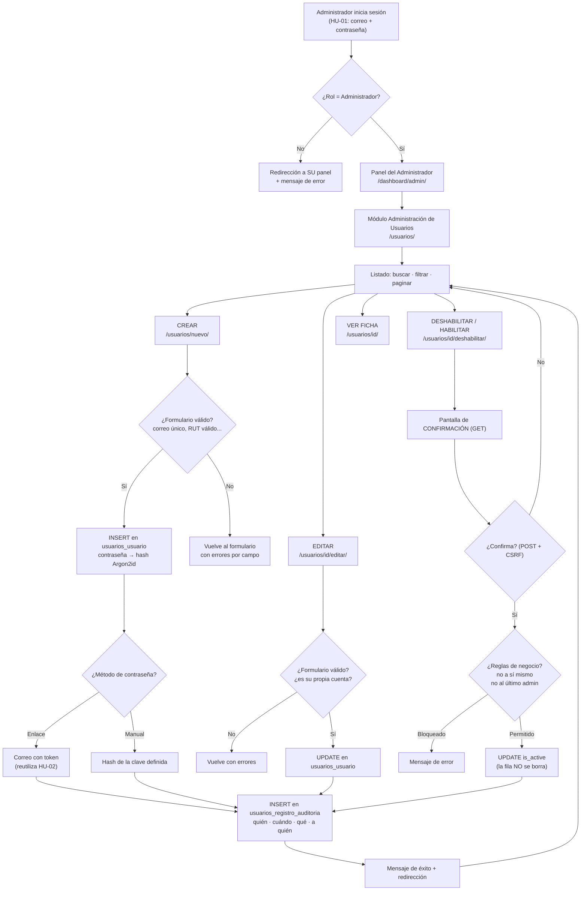

# HU-03 · Administración de usuarios

**Proyecto:** OPSO — Operativo Social
**Historia de usuario:** *Como administrador, quiero crear, editar y deshabilitar usuarios para administrar el acceso al sistema.*
**Stack:** Python 3.14 · Django 6.0 · PostgreSQL 18 · HTML/CSS/Bootstrap 5.3
**Estado:** implementada y verificada con **69 pruebas automáticas** propias (149 en total en el proyecto → `python manage.py test` → OK)

> Esta historia **no reimplementa nada** de las anteriores. Reutiliza el modelo
> `Usuario`, el catálogo `Rol`, el `RolRequeridoMixin`, el hashing Argon2id, la
> bitácora de accesos y toda la maquinaria de tokens de la HU-02. Lo nuevo es
> únicamente la **interfaz de administración** y la **bitácora de auditoría**.

---

## Índice

1. [Explicación inicial: ¿por qué solo el administrador?](#1-explicación-inicial)
2. [Flujo funcional y diagrama](#2-flujo-funcional)
3. [Modelo de datos: análisis del modelo existente](#3-modelo-de-datos)
4. [Base de datos PostgreSQL y diagrama entidad-relación](#4-base-de-datos-postgresql)
5. [CRUD de usuarios](#5-crud-de-usuarios)
6. [Formularios y validaciones](#6-formularios-y-validaciones)
7. [Vistas](#7-vistas)
8. [URLs](#8-urls)
9. [Templates e interfaz](#9-templates-e-interfaz)
10. [Seguridad](#10-seguridad)
11. [Auditoría](#11-auditoría)
12. [Migraciones](#12-migraciones)
13. [Archivos modificados](#13-archivos-modificados)
14. [Pruebas](#14-pruebas)
15. [Buenas prácticas](#15-buenas-prácticas)
16. [Explicación para la defensa](#16-explicación-para-la-defensa)
17. [Posibles preguntas del profesor](#17-posibles-preguntas-del-profesor)
18. [Conclusión técnica](#18-conclusión-técnica)
19. [Explicación para entender la implementación](#19-explicación-para-entender-la-implementación)

---

## 1. Explicación inicial

### 1.1 ¿Por qué solamente un administrador debe administrar usuarios?

Porque **crear una cuenta es crear una llave del sistema**, y las llaves de un
edificio no las reparte cualquiera que trabaje en él: las reparte quien es
responsable de la seguridad.

Cuatro razones concretas:

| Razón | Explicación sencilla |
|---|---|
| **Los usuarios son la puerta de entrada** | En OPSO cada cuenta da acceso a datos personales de familias (nombres, direcciones, situación socioeconómica). Quien crea cuentas decide, en la práctica, quién puede ver esos datos. |
| **Separación de funciones** | El censista levanta información; el supervisor la valida; el administrador gestiona el sistema. Si el censista pudiera crear cuentas, podría crearse una segunda cuenta de supervisor y aprobar sus propias fichas. Esa es la definición de un conflicto de intereses. |
| **Responsabilidad identificable** | Si mañana aparece una cuenta que no debería existir, tiene que haber **una sola** persona a quien preguntarle. Con diez personas capaces de crear cuentas, nadie responde. |
| **Mínimo privilegio** | Es un principio de seguridad: cada usuario recibe **solo** los permisos que su trabajo exige, y ni uno más. Un censista no necesita crear cuentas para hacer su trabajo; por lo tanto, no debe poder hacerlo. |

### 1.2 ¿Qué riesgos existirían si cualquier usuario pudiera crear cuentas?

1. **Escalada de privilegios.** Un censista se crearía una cuenta con rol
   Administrador y tendría el sistema completo. Es el riesgo más grave y el más
   fácil de explotar: bastaría con elegir otra opción en un desplegable.
2. **Cuentas fantasma.** Aparecerían usuarios que nadie autorizó y que nadie
   puede desactivar porque nadie sabe que existen. Son la vía preferida para
   mantener un acceso permanente tras dejar la organización.
3. **Filtración de datos personales.** Cualquiera podría crear una cuenta para
   un tercero ajeno al operativo y darle acceso a los datos de las familias.
   Eso incumple la Ley N.° 19.628 y la Ley N.° 21.719 de protección de datos
   personales, con responsabilidad para la institución.
4. **Auditoría inútil.** La bitácora diría "el usuario X modificó la ficha 42",
   pero si cualquiera puede fabricar usuarios, no se puede afirmar que X sea una
   persona real y autorizada. **La trazabilidad depende de que el control de las
   cuentas sea confiable.**
5. **Datos sucios e inconsistentes.** Sin un responsable único aparecerían
   correos duplicados con distinta escritura, RUT mal escritos y roles mal
   asignados. La base de datos deja de ser confiable como fuente de verdad.

### 1.3 ¿Por qué es mejor deshabilitar usuarios en lugar de eliminarlos?

La respuesta corta: **porque los datos de un usuario no le pertenecen solo a
él; están entrelazados con el trabajo del operativo.**

Imagina una biblioteca. Si un socio se va, no se queman las fichas de los libros
que pidió prestados: se marca su carnet como "no vigente". Los préstamos
históricos siguen existiendo porque son parte de la historia de la biblioteca,
no solo del socio.

En términos técnicos:

| Motivo | Qué pasaría al eliminar físicamente |
|---|---|
| **Integridad referencial** | Las fichas del censo apuntan a quién las levantó. Al borrar al censista, o se borran las fichas en cascada (pérdida de datos irreparable) o quedan huérfanas apuntando a un id inexistente. |
| **Trazabilidad** | La bitácora de accesos y la de auditoría hacen referencia a esa persona. Sin la cuenta, los registros se vuelven ilegibles: "alguien entró el 12 de marzo". |
| **Reversibilidad** | Deshabilitar es reversible con un clic. Un `DELETE` es definitivo: si fue un error, solo se recupera desde un respaldo (si existe y si es reciente). |
| **Rendimiento y seguridad** | Reutilizar un id liberado puede hacer que registros antiguos apunten "sin darse cuenta" a una persona nueva. Con `is_active=False` el id nunca se reutiliza. |
| **Obligación legal y contable** | Un operativo social debe poder demostrar años después quién recogió cada dato. Borrar la cuenta destruye esa evidencia. |

La técnica se llama **borrado lógico** (o *soft delete*): la fila permanece en
la tabla y una columna indica que ya no está vigente. Django lo trae de fábrica
en el campo `is_active`, y su propia documentación lo dice explícitamente:
*"Unselect this instead of deleting accounts"* (desmarque esto en lugar de
eliminar cuentas).

### 1.4 ¿Qué ventajas tiene mantener el historial de usuarios?

1. **Responder preguntas después de que ocurren.** "¿Quién le dio rol de
   supervisor a esta persona en marzo?" solo se puede responder si quedó
   escrito. La memoria de las personas no es evidencia.
2. **Detectar abusos y errores.** Un patrón como "se creó una cuenta a las 3 de
   la mañana desde una IP desconocida" es invisible sin historial y evidente con
   él.
3. **Continuidad del proyecto.** Cuando cambia el administrador, el historial es
   lo que le permite entender el estado actual del sistema sin preguntarle a
   nadie.
4. **Defensa institucional.** Ante un reclamo ("mis datos fueron mal
   registrados"), el historial permite reconstruir exactamente qué pasó, quién
   participó y cuándo.
5. **Estadísticas de gestión.** Cuántos censistas se dieron de alta por semana,
   cuántas cuentas se deshabilitaron al cerrar el operativo. Son datos de
   gestión que salen gratis de una bitácora bien diseñada.

---

## 2. Flujo funcional

### 2.1 Diagrama del flujo completo



### 2.2 El mismo flujo en palabras

1. El administrador **inicia sesión** con el mecanismo de la HU-01.
2. `RolRequeridoMixin` comprueba su rol. Si no es Administrador, no entra
   (aunque escriba la URL a mano).
3. Ve el **listado** de usuarios con buscador, filtros y paginación.
4. Puede **crear** una cuenta. El formulario valida; si algo falla, vuelve con
   los errores señalados campo por campo.
5. Puede **editar** los datos, incluido el **rol** (con la excepción de su
   propia cuenta).
6. Puede **deshabilitar o habilitar** el acceso. Antes hay una **pantalla de
   confirmación** que explica exactamente qué va a pasar.
7. Cada cambio se **guarda en PostgreSQL** dentro de una transacción.
8. El sistema **registra la modificación** en `usuarios_registro_auditoria`, en
   la misma transacción: si falla el registro, el cambio se revierte.

---

## 3. Modelo de datos

### 3.1 Análisis del modelo existente: ¿hace falta modificarlo?

El modelo `Usuario` de la HU-01 ya cubría **casi todo** lo que pide esta
historia. Este es el análisis campo por campo:

| Campo pedido por la HU | ¿Existía? | Nombre real | Origen |
|---|---|---|---|
| nombre | ✅ Sí | `first_name` | Heredado de `AbstractUser` |
| apellido | ✅ Sí | `last_name` | Heredado de `AbstractUser` |
| correo electrónico | ✅ Sí | `email` (único, `USERNAME_FIELD`) | Definido en la HU-01 |
| nombre de usuario | ❌ **No** | `nombre_usuario` | **Agregado en esta HU** |
| rol | ✅ Sí | `rol` (FK a `usuarios_rol`) | Definido en la HU-01 |
| estado (Activo/Inactivo) | ✅ Sí | `is_active` | Heredado de `AbstractUser` |
| fecha de creación | ✅ Sí | `creado_en` (`auto_now_add`) | Definido en la HU-01 |
| fecha de modificación | ✅ Sí | `actualizado_en` (`auto_now`) | Definido en la HU-01 |
| último acceso | ✅ Sí | `last_login` | Heredado de `AbstractUser` |

**Conclusión: solo faltaba un campo.** Esto no es casualidad, es la ventaja de
haber elegido `AbstractUser` en la HU-01 en lugar de escribir un modelo propio
desde cero: los campos de gestión de cuentas (`is_active`, `last_login`,
`date_joined`) ya venían resueltos y probados por Django.

### 3.2 El campo agregado: `nombre_usuario`

```python
nombre_usuario = models.CharField(
    "nombre de usuario",
    max_length=30,
    unique=True,
    null=True,    # NULL en la base de datos
    blank=True,   # opcional en los formularios
    validators=[validar_nombre_usuario],
    help_text=(
        "Identificador corto para listados y planillas (ej.: msoto). "
        "NO se usa para iniciar sesión: la credencial es el correo."
    ),
)
```

**Aquí hay una decisión de diseño que hay que saber defender.** En la HU-01 se
eliminó el campo `username` de Django (`username = None`) para que el
identificador de acceso fuera el correo. ¿No es contradictorio agregar ahora un
"nombre de usuario"?

No, porque **no es una credencial**. Son dos cosas distintas:

| | `email` | `nombre_usuario` |
|---|---|---|
| ¿Sirve para iniciar sesión? | **Sí** (`USERNAME_FIELD = "email"`) | **No** |
| ¿Es obligatorio? | Sí | No (se propone automáticamente) |
| ¿Para qué sirve? | Autenticar e identificar la casilla de recuperación | Etiqueta corta y legible en listados, planillas y conversaciones de terreno |
| Ejemplo | `marta.soto@opso.cl` | `msoto` |

**¿Por qué no convertirlo en una segunda credencial?** Porque tener dos formas
de iniciar sesión duplica la superficie de ataque: dos campos que hay que
validar, dos que hay que contar en el bloqueo por intentos fallidos, dos que
pueden estar duplicados en distinta escritura. Un solo camino de autenticación
es más fácil de proteger y de auditar. Es el principio de **simplicidad como
propiedad de seguridad**.

**Detalles técnicos del campo, y por qué:**

- `null=True` en lugar de `blank=True` a secas: la columna es `UNIQUE`. En SQL,
  **varios `NULL` no violan la unicidad** (porque `NULL ≠ NULL`), pero varias
  cadenas vacías `''` sí lo harían. Por eso `Usuario.save()` normaliza el vacío
  a `None`:
  ```python
  self.nombre_usuario = limpiar_nombre_usuario(self.nombre_usuario)  # "" -> None
  ```
- `max_length=30`: suficiente para `inicial + apellido` y corto para dictarlo
  por teléfono.
- El validador exige minúsculas, números, punto, guion y guion bajo, empezando
  por letra o número. Sin acentos ni espacios: en terreno se dicta por radio o
  por teléfono y no debe depender de la configuración del teclado.
- Si el administrador lo deja vacío, el sistema **propone uno**
  (`Usuario.objects.generar_nombre_usuario()`): `Marta Soto → msoto`, y si está
  ocupado, `msoto2`. Crear cincuenta cuentas no debería obligar a inventar
  cincuenta identificadores a mano.

### 3.3 Modelo nuevo: `RegistroAuditoria`

Es la única tabla nueva. Responde las cuatro preguntas de toda auditoría:

```python
class RegistroAuditoria(models.Model):
    administrador           = FK(Usuario, SET_NULL)  # ¿QUIÉN?
    administrador_email     = CharField(254)         # copia fija del correo
    accion                  = CharField(choices=AccionAuditoria)  # ¿QUÉ?
    usuario_afectado        = FK(Usuario, SET_NULL)  # ¿A QUIÉN?
    usuario_afectado_email  = CharField(254)
    detalle                 = TextField()            # qué cambió exactamente
    ip                      = GenericIPAddressField()
    user_agent              = CharField(300)
    ocurrido_en             = DateTimeField(default=timezone.now)  # ¿CUÁNDO?
```

Justificación de cada campo:

| Campo | Por qué está |
|---|---|
| `administrador` (FK) | Permite navegar a la ficha de quien hizo el cambio y consultar "todo lo que hizo esta persona". |
| `administrador_email` | **Desnormalización deliberada.** La FK es `SET_NULL`: si algún día se eliminara físicamente una cuenta (por ejemplo, por una solicitud legal de eliminación de datos), la fila de auditoría sobreviviría pero perdería la referencia. La copia del correo mantiene el registro legible. **En una bitácora, la trazabilidad vale más que la normalización perfecta.** |
| `accion` | Catálogo cerrado (`TextChoices`) y con índice. Permite consultas como "todas las deshabilitaciones del semestre" sin leer texto libre. |
| `usuario_afectado` + `usuario_afectado_email` | Misma lógica que el administrador. |
| `detalle` | Texto generado automáticamente comparando el antes y el después: `Rol: «Censista» → «Supervisor»`. Es lo que convierte la bitácora en algo útil y no en una lista de "alguien editó algo". |
| `ip` y `user_agent` | Contexto forense. "Se creó una cuenta desde una IP que no es la de la oficina" es una señal de alerta que sin este dato es invisible. |
| `ocurrido_en` | Con `db_index=True`: el ordenamiento por fecha descendente es la consulta más frecuente. |

**¿Por qué no reutilizar `django_admin_log`?** Porque esa tabla solo registra lo
que ocurre dentro de `/admin/`. OPSO administra usuarios desde su **propia**
interfaz, así que necesita su propia bitácora; además, `django_admin_log` no
guarda la IP.

### 3.4 Campos que deliberadamente NO se agregaron

| Campo descartado | Por qué no |
|---|---|
| `creado_por` en `Usuario` | Sería duplicar información: la bitácora ya responde "quién creó esta cuenta", y con más detalle (fecha, IP). Un dato guardado en dos lugares tarde o temprano se contradice. |
| `fecha_baja` / `dado_de_baja_por` | Idem: la bitácora ya lo registra, y además registra **todas** las bajas y altas, no solo la última. |
| `password_temporal` | Guardar una contraseña recuperable, aunque sea temporal, contradice todo el diseño de seguridad. |

---

## 4. Base de datos PostgreSQL

### 4.1 Tablas que intervienen

| Tabla | Rol en esta HU | ¿Nueva? |
|---|---|---|
| `usuarios_rol` | Catálogo de roles. Se **lee** para poblar el desplegable. | No (HU-01) |
| `usuarios_usuario` | Tabla principal. Se hace `INSERT` (crear) y `UPDATE` (editar, deshabilitar). **Nunca `DELETE`.** | No (HU-01), + 1 columna |
| `usuarios_registro_auditoria` | Bitácora administrativa. Solo `INSERT`. | **Sí** |
| `usuarios_intento_acceso` | Se **lee** en la ficha del usuario para mostrar sus últimos accesos. | No (HU-01) |
| `django_session` | La sesión del administrador que opera. | No (Django) |

### 4.2 Diagrama entidad-relación actualizado

```
        ┌──────────────────────────────────┐
        │          usuarios_rol            │
        ├──────────────────────────────────┤
        │ PK  id                  bigint   │
        │ UK  codigo              varchar  │◄── CHECK: 3 valores permitidos
        │     nombre              varchar  │
        │     descripcion         text     │
        │     dashboard_url_name  varchar  │
        │     activo              boolean  │
        │     creado_en           timestamptz
        │     actualizado_en      timestamptz
        └────────────────┬─────────────────┘
                         │ 1
                         │
                         │ N     (ON DELETE RESTRICT / PROTECT)
        ┌────────────────▼─────────────────┐
        │        usuarios_usuario          │
        ├──────────────────────────────────┤
        │ PK  id                  bigint   │
        │ UK  email               varchar  │◄── credencial de acceso
        │     password            varchar  │◄── hash Argon2id, nunca texto plano
        │ UK  nombre_usuario      varchar  │◄── NUEVO (HU-03), NULL permitido
        │ UK  rut                 varchar  │
        │     first_name          varchar  │
        │     last_name           varchar  │
        │     telefono            varchar  │
        │ FK  rol_id              bigint   │
        │     is_active           boolean  │◄── BORRADO LÓGICO (HU-03)
        │     is_staff            boolean  │
        │     is_superuser        boolean  │
        │     last_login          timestamptz  ◄── último acceso
        │     date_joined         timestamptz
        │     creado_en           timestamptz
        │     actualizado_en      timestamptz
        └────┬──────────────────────┬──────┘
             │ 1                    │ 1
             │                      │
             │ N                    │ N   (ON DELETE SET NULL)
   ┌─────────▼──────────┐   ┌───────▼──────────────────────────┐
   │usuarios_intento_   │   │ usuarios_registro_auditoria      │
   │      acceso        │   ├──────────────────────────────────┤
   ├────────────────────┤   │ PK  id                  bigint   │
   │ PK  id      bigint │   │ FK  administrador_id    bigint   │──┐
   │     email_ingresado│   │     administrador_email varchar  │  │ 2 FK
   │ FK  usuario_id     │   │     accion              varchar  │  │ a la
   │     exitoso boolean│   │ FK  usuario_afectado_id bigint   │──┘ MISMA
   │     ip      inet   │   │     usuario_afectado_...varchar  │    tabla
   │     ocurrido_en    │   │     detalle             text     │
   └────────────────────┘   │     ip                  inet     │
       (HU-01)              │     user_agent          varchar  │
                            │     ocurrido_en         timestamptz
                            └──────────────────────────────────┘
                                        (HU-03, NUEVA)
```

### 4.3 Claves primarias

Todas las tablas usan `id bigint GENERATED BY DEFAULT AS IDENTITY` (el
`BigAutoField` de Django, configurado en `DEFAULT_AUTO_FIELD`).

**¿Por qué un id numérico y no el RUT o el correo como clave primaria?**

1. Un correo **cambia** (una persona se cambia de institución). Si fuera la
   clave primaria, habría que actualizar en cascada todas las tablas que la
   referencian.
2. El RUT puede no existir (una persona extranjera sin RUT chileno) y aparece en
   URLs y logs si es la clave: es un dato personal que no debe circular.
3. Un entero de 64 bits ocupa 8 bytes; un correo, hasta 254. Cada clave foránea
   del sistema pagaría esa diferencia en espacio y en velocidad de los `JOIN`.

Se llama **clave subrogada** (*surrogate key*): un identificador sin significado
de negocio, precisamente para que ningún cambio del negocio lo afecte.

### 4.4 Claves foráneas y su comportamiento al borrar

| Tabla | Clave foránea | `ON DELETE` | Por qué |
|---|---|---|---|
| `usuarios_usuario` | `rol_id → usuarios_rol.id` | **`PROTECT`** (`RESTRICT`) | Impide borrar un rol que tenga usuarios asignados. Si se permitiera, quedarían cuentas sin rol y sin permisos definidos. Para retirar un rol se usa `activo=False`, no un `DELETE`. |
| `usuarios_registro_auditoria` | `administrador_id → usuarios_usuario.id` | **`SET_NULL`** | La bitácora debe sobrevivir a la eliminación de una cuenta. Con `CASCADE` se borraría la evidencia justo cuando más se necesita. |
| `usuarios_registro_auditoria` | `usuario_afectado_id → usuarios_usuario.id` | **`SET_NULL`** | Igual. Y por eso se guarda la copia del correo en texto. |
| `usuarios_intento_acceso` | `usuario_id → usuarios_usuario.id` | **`SET_NULL`** | Igual criterio (HU-01). |

**Regla general del diseño:** en las tablas de datos se usa `PROTECT` (que la
base de datos impida el destrozo); en las tablas de bitácora se usa `SET_NULL`
(que la evidencia sobreviva).

### 4.5 Restricciones (constraints)

| Tipo | Dónde | Qué garantiza |
|---|---|---|
| `PRIMARY KEY` | `id` de cada tabla | Identificación única de cada fila. |
| `UNIQUE` | `usuarios_usuario.email` | No puede haber dos cuentas con el mismo correo: es la credencial. |
| `UNIQUE` | `usuarios_usuario.nombre_usuario` | No puede haber dos alias iguales (los `NULL` no cuentan). |
| `UNIQUE` | `usuarios_usuario.rut` | Una persona, una cuenta. |
| `UNIQUE` | `usuarios_rol.codigo` | No puede haber dos roles `SUPERVISOR`. |
| `CHECK` | `usuarios_rol.codigo IN (...)` | Aunque alguien inserte con SQL directo, PostgreSQL rechaza un código inválido. |
| `NOT NULL` | `email`, `password`, `is_active`, `accion`, `ocurrido_en`… | Datos sin los que la fila no tiene sentido. |
| `FOREIGN KEY` | Ver 4.4 | Imposible que exista un usuario con un rol que no existe. |

**Punto importante para la defensa:** estas restricciones viven **en la base de
datos**, no solo en el código Python. Aunque alguien se conectara con `psql` y
ejecutara un `INSERT` a mano, PostgreSQL las haría cumplir. La validación de
Django es la primera línea (mensajes claros al usuario); la de PostgreSQL es la
última (garantía absoluta). Se necesitan las dos.

### 4.6 Índices creados en esta HU

```sql
-- Listado de administración: se filtra por estado y se ordena por nombre
CREATE INDEX idx_usuario_estado_nombre
    ON usuarios_usuario (is_active, first_name, last_name);

-- Historial de la ficha de un usuario, del más nuevo al más antiguo
CREATE INDEX idx_auditoria_afectado
    ON usuarios_registro_auditoria (usuario_afectado_id, ocurrido_en DESC);
```

Un índice es como el índice alfabético de un libro: sin él, PostgreSQL debe
recorrer la tabla completa (*sequential scan*) para cada consulta. Con 20
usuarios no se nota; con 2.000 censistas y una tabla de auditoría de decenas de
miles de filas, sí.

---

## 5. CRUD de usuarios

### 5.1 Crear usuario

Formulario: `CrearUsuarioForm` en [`usuarios/forms_gestion.py`](../usuarios/forms_gestion.py).
Vista: `UsuarioCreateView`. URL: `/usuarios/nuevo/`.

Campos que pide: **nombre, apellido, correo, nombre de usuario, RUT, teléfono,
rol y estado**, más la elección del método de contraseña.

#### La pregunta central: ¿contraseña generada o definida por la persona?

Se implementaron **las dos** opciones, y la recomendada viene seleccionada por
defecto. Esta es la comparación que sustenta la recomendación:

| Criterio | A) Enviar enlace por correo ✅ **recomendada** | B) El administrador define una clave inicial |
|---|---|---|
| ¿Quién conoce la contraseña? | **Solo la persona.** Nunca existe en texto en ninguna parte. | El administrador y la persona. |
| Auditoría creíble | **Sí.** Si el registro dice "esta acción la hizo Marta", es cierto: nadie más pudo autenticarse como ella. | **Débil.** Marta podría alegar "el administrador conocía mi clave, pudo ser él". |
| Canal de transmisión | El token viaja al correo del titular. | La clave se dicta por teléfono, WhatsApp o papel: canales inseguros que dejan copias. |
| Verificación del correo | **Implícita.** Si logra entrar, su correo funciona y es suyo. | Ninguna. Un correo mal escrito se descubre semanas después. |
| Fuerza de la contraseña | La elige la persona y la validan `AUTH_PASSWORD_VALIDATORS`. | Suele acabar en `Opso2026` para las 50 cuentas, porque hay que dictarla. |
| Cambio obligatorio inicial | No hace falta: nunca hubo una clave provisional. | Debería forzarse, y en la práctica nunca se hace. |
| Cuándo usar B | — | Solo cuando el correo institucional aún no existe o en una capacitación presencial sin conexión. |

**Recomendación defendida: la opción A.** Su ventaja decisiva no es la
comodidad, es que **el sistema nunca tiene conocimiento del secreto**, y eso es
lo que hace que la auditoría signifique algo.

Y lo más importante desde el punto de vista de la arquitectura: la opción A **no
requirió criptografía nueva**. Reutiliza exactamente el mecanismo de la HU-02:

```python
# usuarios/seguridad.py
"token": default_token_generator.make_token(usuario),   # el mismo generador
"uid":   urlsafe_base64_encode(force_bytes(usuario.pk)),
# y el enlace apunta a 'usuarios:password_reset_confirm', LA MISMA vista
```

Lo único distinto es el texto del correo (`invitacion.txt` / `invitacion.html`
en lugar de `recuperacion.*`).

#### Un detalle fino: la contraseña aleatoria

Al elegir la opción A, ¿qué contraseña tiene la cuenta mientras la persona no
usa el enlace? La respuesta obvia sería `set_unusable_password()`, pero **no
funciona**: `PasswordResetForm.get_users()` de Django descarta las cuentas sin
contraseña utilizable, así que el enlace nunca se enviaría.

La solución implementada:

```python
usuario.set_password(generar_clave_aleatoria())   # get_random_string(50)
```

Una contraseña de 50 caracteres aleatorios generada con `secrets` (el generador
criptográficamente seguro de Python). La cuenta es técnicamente válida —así el
flujo de recuperación la acepta— pero **nadie la conoce y es imposible
adivinarla**.

### 5.2 Editar usuario

Formulario: `EditarUsuarioForm`. Vista: `UsuarioUpdateView`. URL: `/usuarios/<pk>/editar/`.

Permite modificar: **nombre, apellido, correo, nombre de usuario, RUT, teléfono,
rol y estado**.

#### ¿Qué datos NO deberían modificarse, y por qué?

| Campo | Por qué no se edita aquí |
|---|---|
| `password` | **No hay nada que editar:** en la base de datos hay un hash irreversible, no una contraseña. Cambiarla es otra operación, con su propio flujo por correo, que además avisa al titular. Si el administrador pudiera escribir la contraseña de otro, podría suplantarlo y la auditoría dejaría de valer. |
| `last_login` | Es un **hecho** que registra el sistema. Si se pudiera editar, un administrador podría borrar la evidencia de un acceso. |
| `date_joined`, `creado_en`, `actualizado_en` | Igual: son hechos, no opiniones. Están en `readonly_fields` del admin y no aparecen en el formulario. |
| `is_staff`, `is_superuser` | Son permisos **técnicos** sobre `/admin/`, no roles del negocio. Se administran solo desde `/admin/` y solo por un superusuario. Si estuvieran en este formulario, un administrador común podría convertirse en superusuario: **escalada de privilegios**. |
| `id` | La clave primaria nunca se edita: es la identidad de la fila. |
| **Su propio `rol`** | Regla de negocio: nadie debe poder quitarse los permisos a sí mismo por error y quedar fuera del sistema. |
| **Su propio `is_active`** | Igual: sería desconectarse en el acto y sin vuelta. |

#### Cómo se implementa la protección de "su propia cuenta"

```python
if editando_su_propia_cuenta:
    for nombre in ("rol", "is_active"):
        self.fields[nombre].disabled = True
```

**`disabled = True` hace dos cosas, y la segunda es la importante:**

1. En el HTML, el campo aparece bloqueado (comodidad visual).
2. **Django ignora el valor que llegue del navegador y usa el valor inicial de
   la base de datos.**

Por eso la protección **no se puede burlar** enviando el formulario con `curl`,
con Postman o editando el HTML con las herramientas del navegador. No es una
defensa cosmética: es real, y hay una prueba automática que lo demuestra
(`test_no_puede_cambiar_su_propio_rol`).

### 5.3 Deshabilitar usuario

Vista: `CambiarEstadoUsuarioView`. URLs: `/usuarios/<pk>/deshabilitar/` y
`/usuarios/<pk>/habilitar/`.

```python
usuario.is_active = False
usuario.save(update_fields=["is_active", "actualizado_en"])
```

**No hay ni un `DELETE` en todo el módulo.** Ninguna vista lo permite; se puede
verificar con `grep -r "\.delete()" usuarios/views_gestion.py` → sin resultados.

#### ¿Por qué esta práctica es recomendable?

Ya se explicó en el punto 1.3, y hay tres detalles técnicos que conviene añadir:

1. **Django ya lo hace cumplir.** No hay que escribir código extra: el backend
   `ModelBackend.user_can_authenticate()` rechaza a los usuarios con
   `is_active=False`, así que un usuario deshabilitado no puede iniciar sesión
   **ni siquiera con la contraseña correcta**.
2. **También queda fuera de la recuperación.** `PasswordResetForm.get_users()`
   filtra por `is_active=True`, así que no puede "recuperar" su cuenta para
   volver a entrar. Es coherente: si estuviera permitido, la deshabilitación no
   servaría de nada.
3. **Y su sesión abierta muere.** Si estaba conectado,
   `ModelBackend.get_user()` deja de devolverlo en la petición siguiente, así
   que la sesión se vuelve anónima. No hay que "expulsarlo" a mano.

Estas tres propiedades salen gratis por haber reutilizado el sistema de
autenticación de Django en lugar de escribir uno propio.

#### La confirmación en dos pasos

```
GET  /usuarios/5/deshabilitar/  → muestra la pantalla de confirmación
POST /usuarios/5/deshabilitar/  → ejecuta el cambio (con token CSRF)
```

**¿Por qué separar GET y POST?** Porque las peticiones `GET` deben ser seguras e
idempotentes: solo leer. Si se pudiera deshabilitar con un `GET`, bastaría con
que alguien insertara en cualquier página web:

```html

```

El navegador del administrador, con su sesión abierta, ejecutaría la acción sin
que él lo notara. Ese ataque se llama **CSRF** (falsificación de petición entre
sitios) y exigir `POST` + token lo hace imposible.

De paso, el `GET` sirve como **pantalla de confirmación**, que es el otro
requisito. Se implementó como página completa y no como `confirm()` de
JavaScript para que funcione igual si el JavaScript está bloqueado, y porque en
una página cabe explicar con detalle qué va a pasar y qué **no** va a pasar.

---

## 6. Formularios y validaciones

### 6.1 ¿Por qué `ModelForm` y no `Form`?

| | `forms.Form` | `forms.ModelForm` ✅ |
|---|---|---|
| Declaración de campos | A mano, uno por uno | **Derivados del modelo** |
| Etiquetas y ayudas | A mano | Del `verbose_name` y `help_text` del modelo |
| Validación de tipos y largos | A mano | Del modelo (`max_length`, `EmailField`, `validators=[validar_rut]`) |
| Guardar en la base de datos | Copiar campo por campo | `form.save()` |
| Riesgo de desincronización | **Alto:** cambiar el modelo y olvidar el formulario | **Nulo:** hay una sola fuente de verdad |

La regla se define **una vez, en el modelo**, y no puede quedar desincronizada
entre la base de datos y el formulario. Ejemplo concreto: el validador del RUT
(`validators=[validar_rut]`) está declarado en el modelo, y el formulario lo
aplica sin una línea de código adicional.

`FiltroUsuariosForm` sí es un `Form` normal, y con razón: **no crea ni modifica
nada**, solo limpia los parámetros que llegan por la URL.

### 6.2 ¿Cómo funcionan las validaciones? El orden exacto

Cuando llega un `POST`, Django ejecuta esta secuencia:

```
1. form.is_valid()
       ↓
2. Por cada campo: to_python()  → convierte el texto del navegador al tipo Python
                   validate()   → obligatorio, tipo correcto
                   run_validators() → validadores del modelo (validar_rut, etc.)
       ↓
3. Por cada campo: clean_<nombre>()   ← NUESTRAS reglas de un solo campo
       ↓
4. clean()                            ← NUESTRAS reglas que cruzan varios campos
       ↓
5. _post_clean()  → copia cleaned_data a la instancia + valida el modelo
                     (aquí validamos la ROBUSTEZ de la contraseña)
       ↓
6. Si no hubo errores → form.save() → INSERT/UPDATE en PostgreSQL
   Si hubo errores    → se vuelve a mostrar la plantilla con form.errors
```

### 6.3 Las validaciones implementadas

#### a) Correo duplicado — y por qué no basta con `unique=True`

```python
def clean_email(self):
    email = (self.cleaned_data.get("email") or "").strip().lower()
    duplicados = Usuario.objects.filter(email__iexact=email)
    if self.instance.pk:                      # al EDITAR, excluirse a sí mismo
        duplicados = duplicados.exclude(pk=self.instance.pk)
    if duplicados.exists():
        raise ValidationError("Ya existe una cuenta registrada con este correo electrónico.")
    return email
```

Hay **dos** motivos para escribir esto a mano:

1. **PostgreSQL distingue mayúsculas.** Para la base de datos,
   `Ana@opso.cl` y `ana@opso.cl` son **distintos** y los dos pasarían la
   restricción `UNIQUE`. Pero `Usuario.save()` guarda el correo en minúsculas,
   así que al grabar el segundo se produciría un `IntegrityError`: **una página
   de error 500 en vez de un mensaje claro**. `__iexact` (que en PostgreSQL se
   traduce a `ILIKE`) hace la comparación insensible a mayúsculas.
2. **Al editar hay que excluirse.** Sin el `exclude(pk=...)`, el usuario
   chocaría con su propio correo y no podría guardar nunca.

Hay una prueba específica para el primer caso:
`test_rechaza_un_correo_duplicado_escrito_con_mayusculas`.

#### b) Usuario duplicado

La misma estrategia con `nombre_usuario__iexact`, previa normalización a
minúsculas con `limpiar_nombre_usuario()`.

#### c) Campos obligatorios

```python
self.fields["first_name"].required = True
self.fields["last_name"].required = True
```

En `AbstractUser` estos campos son `blank=True` (opcionales). En OPSO son
obligatorios porque identifican a la persona en el listado y en las fichas.

**¿Por qué exigirlo en el formulario y no en el modelo?** Porque cambiar el
modelo a `blank=False` invalidaría las cuentas técnicas ya creadas con
`createsuperuser` (que no pide apellido). Se aplica la regla donde corresponde:
es una regla de **este formulario de administración**, no una restricción
absoluta de la tabla.

#### d) Longitud mínima de la contraseña

No se escribió nada: la aplican los `AUTH_PASSWORD_VALIDATORS` ya configurados
en `settings.py` desde la HU-01:

| Validador | Qué rechaza |
|---|---|
| `MinimumLengthValidator` (min_length=10) | Contraseñas de menos de 10 caracteres |
| `CommonPasswordValidator` | Las 20.000 contraseñas más usadas (`password123`) |
| `NumericPasswordValidator` | Contraseñas solo numéricas (`12345678901`) |
| `UserAttributeSimilarityValidator` | Contraseñas parecidas al correo o al nombre de la persona |

Aquí hay un detalle técnico que vale la pena saber explicar:

```python
def _post_clean(self):
    super()._post_clean()
    password = self.cleaned_data.get("password1")
    if password and self.cleaned_data.get("metodo_clave") == self.MANUAL:
        try:
            password_validation.validate_password(password, self.instance)
        except ValidationError as error:
            self.add_error("password1", error)
```

**¿Por qué en `_post_clean()` y no en `clean()`?** Porque
`UserAttributeSimilarityValidator` necesita comparar la contraseña con el correo
y el nombre de la persona, y para eso necesita el objeto `Usuario` **ya
poblado**. Eso solo ocurre en `_post_clean()`, cuando el `ModelForm` ya copió
`cleaned_data` a `self.instance`. Es exactamente la estrategia que usa
`BaseUserCreationForm` de Django: se reutiliza el patrón en lugar de improvisar
otro.

#### e) Formato del correo

Lo aplica `EmailField` (del modelo, heredado por el `ModelForm`), que usa el
`EmailValidator` de Django. **No se escribió una expresión regular propia**: las
reglas de los correos electrónicos (RFC 5322) son sorprendentemente complejas y
las expresiones regulares caseras rechazan direcciones válidas.

#### f) Reglas que cruzan varios campos (`clean()`)

```python
def clean(self):
    datos = super().clean()
    if datos.get("metodo_clave") == self.MANUAL:
        if not datos.get("password1"):
            self.add_error("password1", "Escribe la contraseña inicial o elige...")
        elif datos["password1"] != datos.get("password2"):
            self.add_error("password2", "Las dos contraseñas no coinciden.")
    return datos
```

`add_error(campo, mensaje)` asocia el error a un campo concreto, así aparece
**justo debajo de él** y no en un bloque genérico arriba de la página.

#### g) Regla de negocio: nunca quedarse sin administradores

```python
if self.instance.es_ultimo_administrador_activo():
    if not queda_activo:
        self.add_error("is_active", "Es el único administrador activo del sistema...")
    elif not sigue_siendo_admin:
        self.add_error("rol", "Es el único administrador activo del sistema...")
```

Sin esta regla, el sistema podría quedar "cerrado por dentro": nadie podría
crear usuarios ni reactivar cuentas desde la aplicación, y habría que intervenir
la base de datos a mano.

> **Nota honesta sobre esta regla.** Por la interfaz web es muy difícil llegar a
> activarla, porque quien administra **es** un administrador activo, así que
> nunca hay "un único administrador" distinto de él mismo (y desactivarse a sí
> mismo ya está bloqueado por otra regla anterior). Se mantiene igual como
> **segunda barrera**: protege ante manipulación directa de la base de datos,
> ante un comando de gestión futuro y ante cambios de código que hoy no existen.
> Sus pruebas atacan el modelo y el formulario directamente, en vez de simular
> una petición HTTP imposible. Reconocer esto es más sólido que afirmar una
> protección que no se puede demostrar.

---

## 7. Vistas

Todas están en [`usuarios/views_gestion.py`](../usuarios/views_gestion.py) y
todas heredan de `SoloAdministradorMixin`.

| Vista | URL | Clase base de Django | Qué hace |
|---|---|---|---|
| `UsuarioListView` | `/usuarios/` | `ListView` | Lista los usuarios. Construye la consulta según búsqueda y filtros, la ordena de forma estable y la pagina de 10 en 10. Entrega también los contadores globales. |
| `UsuarioCreateView` | `/usuarios/nuevo/` | `CreateView` | GET: formulario vacío + descripción de cada rol. POST: valida, guarda dentro de una transacción, registra la auditoría y —si corresponde— envía el enlace de contraseña. |
| `UsuarioUpdateView` | `/usuarios/<pk>/editar/` | `UpdateView` | Carga el usuario por su clave primaria (404 si no existe), aplica la regla de acceso por objeto, y al guardar calcula qué cambió para registrar acciones de auditoría separadas (editar / cambiar rol / habilitar / deshabilitar). |
| `UsuarioDetailView` | `/usuarios/<pk>/` | `DetailView` | Ficha completa: datos, últimos 10 accesos y últimos 15 registros de auditoría de esa cuenta. |
| `CambiarEstadoUsuarioView` | `/usuarios/<pk>/deshabilitar/` y `/habilitar/` | `View` | GET: pantalla de confirmación. POST: valida las reglas de negocio y hace el borrado lógico. Una sola clase atiende las dos operaciones: el atributo `activar` (definido en `urls.py`) decide el sentido. |
| `EnviarEnlaceContrasenaView` | `/usuarios/<pk>/enviar-enlace/` | `View` (solo POST) | Reenvía el enlace de contraseña. **No cambia la contraseña**: enviar un enlace es inofensivo, restablecer una clave dejaría fuera a quien estaba trabajando. |
| `AuditoriaListView` | `/usuarios/auditoria/` | `ListView` | Bitácora completa, paginada de 20 en 20. Solo lectura. |

### 7.1 ¿Por qué vistas basadas en clases (CBV) y no funciones?

Porque este módulo es un CRUD clásico y las clases genéricas de Django ya
resuelven, correctamente y sin código propio:

- `ListView`: consulta, ordenamiento, paginación y contexto de la plantilla.
- `CreateView`: GET muestra el formulario; POST valida, guarda y redirige.
- `UpdateView`: igual, cargando el objeto por su clave primaria y devolviendo
  **404** si no existe (en vez de reventar con una excepción).
- `DetailView`: carga un objeto y lo entrega a la plantilla.

Lo único que se escribió es lo específico de OPSO: el control de acceso, los
filtros, la auditoría y las reglas de negocio. Un CRUD escrito a mano con
funciones tendría el triple de líneas y cada una sería una oportunidad de
introducir un error.

### 7.2 Tres detalles técnicos que conviene poder explicar

**a) Ordenamiento estable en la paginación**

```python
return consulta.order_by("first_name", "last_name", "id")
```

Si dos personas se llaman igual, PostgreSQL puede devolverlas en distinto orden
en cada consulta. Al paginar, una misma fila podría aparecer en dos páginas o en
ninguna. Añadir `id` produce un **orden total** (sin empates posibles) y la
paginación se vuelve determinista.

**b) La transacción y el correo**

```python
with transaction.atomic():
    respuesta = super().form_valid(form)   # INSERT del usuario
    registrar_accion(...)                  # INSERT de la auditoría
# el correo se envía FUERA de la transacción
```

Usuario y auditoría se guardan **juntos o ninguno**: un usuario creado sin
rastro en la bitácora sería un agujero en la trazabilidad. El correo, en cambio,
se envía después, por dos razones: mantener una transacción abierta mientras se
espera a un servidor SMTP bloquea filas de PostgreSQL sin necesidad, y un correo
ya enviado no se puede "deshacer" si la transacción se revirtiera.

**c) `select_related` y el problema N+1**

```python
RegistroAuditoria.objects.select_related("administrador", "usuario_afectado")
```

Sin esto, mostrar 20 registros de auditoría produciría **41 consultas**: 1 para
la lista y 2 por fila (administrador y usuario afectado). Con `select_related`,
Django hace un `JOIN` y resuelve todo en **1 sola consulta**.

---

## 8. URLs

Definidas en [`usuarios/urls.py`](../usuarios/urls.py) bajo el namespace
`usuarios:`.

| Ruta | Nombre | Verbos | Función |
|---|---|---|---|
| `/usuarios/` | `usuarios:lista` | GET | Listado con búsqueda, filtros y paginación. Punto de entrada del módulo. |
| `/usuarios/nuevo/` | `usuarios:crear` | GET, POST | Formulario de creación (GET) y creación efectiva (POST). |
| `/usuarios/auditoria/` | `usuarios:auditoria` | GET | Bitácora completa de acciones administrativas. |
| `/usuarios/<int:pk>/` | `usuarios:detalle` | GET | Ficha del usuario con su historial. |
| `/usuarios/<int:pk>/editar/` | `usuarios:editar` | GET, POST | Formulario de edición y guardado. |
| `/usuarios/<int:pk>/deshabilitar/` | `usuarios:deshabilitar` | GET, POST | Confirmación (GET) y baja lógica (POST). |
| `/usuarios/<int:pk>/habilitar/` | `usuarios:habilitar` | GET, POST | Confirmación (GET) y reactivación (POST). |
| `/usuarios/<int:pk>/enviar-enlace/` | `usuarios:enviar_enlace` | **POST** | Reenvío del enlace de contraseña. Solo POST porque envía un correo. |

### 8.1 Decisiones de diseño de las URLs

**a) Prefijo común `/usuarios/`.** No es solo orden: permite proteger el módulo
completo de una vez en el servidor web o en un firewall de aplicación, sin tener
que enumerar cada dirección.

**b) `<int:pk>` y no `<str:pk>`.** El conversor `int` es una validación gratuita:
`/usuarios/abc/editar/` no llega nunca a la vista, responde 404 en el
enrutador. Menos código que puede fallar.

**c) Se usa el `id` y no el correo en la URL.** El correo es un dato personal y
las URLs terminan en los logs del servidor, en el historial del navegador y en
el encabezado `Referer`. El `id` no revela nada.

**d) Una clase, dos rutas.**

```python
path("usuarios/<int:pk>/deshabilitar/",
     views_gestion.CambiarEstadoUsuarioView.as_view(activar=False), name="deshabilitar"),
path("usuarios/<int:pk>/habilitar/",
     views_gestion.CambiarEstadoUsuarioView.as_view(activar=True), name="habilitar"),
```

`as_view(activar=...)` fija el atributo de la clase para esa ruta. Así **una
sola** clase atiende las dos operaciones opuestas sin duplicar su lógica de
validación ni de auditoría.

**e) Nombres, no direcciones.** Las plantillas escriben
``, nunca `/usuarios/5/editar/`. Si mañana
la ruta cambia a `/cuentas/5/modificar/`, no hay que tocar ninguna plantilla.

---

## 9. Templates e interfaz

### 9.1 Archivos creados

| Plantilla | Para qué |
|---|---|
| `usuarios/gestion/usuarios_list.html` | Listado: contadores, buscador, filtros, tabla y paginación. |
| `usuarios/gestion/usuario_create.html` | Formulario de creación + panel lateral con la descripción de cada rol. |
| `usuarios/gestion/usuario_edit.html` | Formulario de edición + panel con lo que **no** se edita y por qué. |
| `usuarios/gestion/usuario_detail.html` | Ficha con datos, historial administrativo y últimos accesos. |
| `usuarios/gestion/usuario_confirmar_estado.html` | Pantalla de confirmación de habilitar/deshabilitar. |
| `usuarios/gestion/auditoria_list.html` | Bitácora completa. |
| `usuarios/gestion/_campo.html` | **Fragmento reutilizable:** dibuja un campo con etiqueta, ayuda y errores. |
| `usuarios/gestion/_datos_personales.html` | **Fragmento compartido** por crear y editar: los campos comunes. |
| `usuarios/correo/invitacion.txt` / `.html` | Correo de activación de la cuenta. |

Todas extienden `base.html`, que ya trae la barra superior, el menú por rol, los
mensajes flash y el pie.

### 9.2 ¿Por qué fragmentos (`_campo.html`, `_datos_personales.html`)?

Los formularios de este módulo tienen entre 8 y 11 campos. Sin el fragmento
`_campo.html` habría que repetir la etiqueta, el asterisco de obligatorio, el
texto de ayuda y el bucle de errores unas **40 veces**. Con él, se escribe una
vez y cada campo es una línea:

```django

```

Y si mañana se decide mostrar los errores con un icono, se cambia **un** archivo.

`_datos_personales.html` va un paso más allá: crear y editar comparten los mismos
campos, así que están definidos una sola vez. Si se agrega el campo "sector
asignado", aparece en los dos formularios sin riesgo de que uno quede
desactualizado.

### 9.3 La tabla del listado

Columnas: **Nombre · Usuario · Correo · Rol · Estado · Último acceso · Acciones**,
tal como pide la historia de usuario.

Detalles de la interfaz que resuelven problemas reales:

| Elemento | Qué problema resuelve |
|---|---|
| Insignia **"tú"** en la propia fila | Evita que el administrador se confunda y se intente deshabilitar. |
| Insignia **"super"** | Advierte que es una cuenta técnica con acceso total. |
| Insignia **"rol inactivo"** | Explica por qué una cuenta activa no puede entrar. Sin esto, el diagnóstico es un misterio. |
| Estado con color (verde/gris) | Se lee de un vistazo, sin tener que leer palabra por palabra. |
| "Nunca ha ingresado" en vez de vacío | Un guion o una celda vacía obliga a preguntarse si es un error del sistema. |
| El botón cambia según el estado | Nunca aparecen "Habilitar" y "Deshabilitar" a la vez: no hay forma de equivocarse. |
| Estado vacío distinto según el contexto | Sin filtros: "crea el primero". Con filtros: "no hay coincidencias, quitar filtros". |

### 9.4 ¿Cómo mejoran la experiencia el buscador, los filtros y la paginación?

| Función | Sin ella | Con ella |
|---|---|---|
| **Buscar** | Recorrer 2.000 filas a ojo o usar `Ctrl+F` sobre una sola página. | Se escribe "Soto" y aparece la persona. Busca por nombre, apellido, correo, nombre de usuario y RUT a la vez. |
| **Filtrar por rol** | Imposible responder "¿cuántos supervisores hay?". | Una consulta de gestión resuelta en dos clics. |
| **Filtrar por estado** | Las cuentas deshabilitadas se mezclan con las activas y estorban. | "Solo inactivos" permite revisar las bajas al cerrar el operativo. |
| **Paginar** | El servidor trae 2.000 filas a memoria y el navegador dibuja 2.000 `<tr>`: la página tarda segundos. | PostgreSQL devuelve 10 filas (`LIMIT 10 OFFSET n`). La página carga igual de rápido con 20 usuarios que con 20.000. |

Detalle importante: los enlaces de paginación **arrastran los filtros vigentes**.

```django
<a href="?page={{ page_obj.next_page_number }}&{{ parametros }}">
```

`parametros` es el *querystring* sin el número de página. Sin esto, al pasar a la
página 2 se perdería la búsqueda y el administrador vería una lista distinta —un
error clásico y muy irritante.

### 9.5 El único JavaScript del módulo

Muestra u oculta los campos de contraseña según la opción elegida al crear un
usuario. Son 12 líneas y es **puramente cosmético**: si el JavaScript no cargara,
los campos quedan visibles y el formulario sigue funcionando, porque la regla
real ("si eliges definirla, escríbela") la valida el servidor en
`CrearUsuarioForm.clean()`.

Este es el criterio general del proyecto: **el JavaScript mejora la experiencia,
nunca sostiene una regla de negocio ni una validación de seguridad.** Todo lo
que se valida en el navegador se valida otra vez en el servidor, porque el
navegador está bajo el control del usuario y el servidor no.

---

## 10. Seguridad

### 10.1 Los mecanismos implementados

| # | Mecanismo | Dónde | Por qué mejora la seguridad |
|---|---|---|---|
| 1 | **Sesión obligatoria** | `LoginRequiredMiddleware` (settings) + `LoginRequiredMixin` | "Seguro por defecto": **todas** las vistas exigen sesión y las públicas deben declararse explícitamente. Una vista nueva no puede quedar desprotegida por olvido del programador. |
| 2 | **Control de permisos por rol** | `SoloAdministradorMixin` → `RolRequeridoMixin` (HU-01) | La autorización se declara una vez en la clase base del módulo. Es **imposible** agregar una vista aquí y olvidar protegerla. |
| 3 | **Solo administradores** | `roles_permitidos = (RolCodigo.ADMINISTRADOR,)` | Mínimo privilegio: censistas y supervisores no acceden ni escribiendo la URL. |
| 4 | **Protección CSRF** | `` en todo POST + `CsrfViewMiddleware` | Impide que otro sitio ejecute acciones con la sesión del administrador. Sin el token, Django responde 403. |
| 5 | **Validación en el servidor** | `forms_gestion.py` | La validación del navegador se puede saltar (deshabilitando JS, con `curl` o Postman). La del servidor es la única que protege de verdad. |
| 6 | **Confirmación antes de deshabilitar** | Pantalla `GET` + `POST` | Evita el error humano irreversible-por-descuido y separa correctamente los verbos HTTP. |
| 7 | **Protección contra modificación por URL** | `get_object()` + reglas por objeto | Ser administrador no basta: la acción concreta sobre **esa** cuenta también debe estar permitida. |
| 8 | **Mensajes de éxito y error** | `django.contrib.messages` | Feedback inmediato. Un administrador que no sabe si su acción funcionó la repite, y las acciones repetidas causan incidentes. |
| 9 | **Contraseñas con Argon2id** | `PASSWORD_HASHERS` (HU-01) | Nunca se guarda ni se muestra una contraseña. El administrador no puede ver la de nadie. |
| 10 | **Transacciones atómicas** | `transaction.atomic()` | Ningún cambio queda sin su registro de auditoría. |
| 11 | **Bitácora inalterable** | `RegistroAuditoria` sin vistas de edición ni borrado | La evidencia que el sospechoso puede borrar no es evidencia. |
| 12 | **Anti-bloqueo total** | `es_ultimo_administrador_activo()` + "no a ti mismo" | El sistema no puede quedar sin nadie capaz de administrarlo. |
| 13 | **Anti-escalada de privilegios** | `is_staff` / `is_superuser` fuera del formulario; `verificar_superusuario()` | Un administrador común no puede convertirse en superusuario ni tocar la cuenta de uno. |

### 10.2 Las tres capas del control de acceso

No hay una sola defensa, hay tres, y cada una atrapa lo que la anterior no ve:

```
Capa 1 · LoginRequiredMiddleware  →  ¿hay sesión iniciada?
             ↓  sí
Capa 2 · RolRequeridoMixin        →  ¿el rol es Administrador?
             ↓  sí
Capa 3 · Reglas por objeto        →  ¿puede hacer ESTO con ESTA cuenta?
             ↓  sí                     · ¿es su propia cuenta?
          Se ejecuta la acción         · ¿la otra es superusuario?
                                       · ¿es el último administrador?
```

La **capa 3** es la que impide la "modificación por URL". Un administrador que
escriba `/usuarios/1/editar/` a mano pasa las capas 1 y 2 sin problema; lo que lo
detiene es la regla por objeto:

```python
def get_object(self, queryset=None):
    usuario = super().get_object(queryset)
    self.verificar_superusuario(usuario)   # 403 si no corresponde
    return usuario
```

### 10.3 Lo que NO es seguridad (y conviene aclararlo en la defensa)

**Ocultar un enlace del menú no es seguridad.** En `base.html`, el enlace
"Usuarios" solo se muestra a los administradores, pero eso es **comodidad**: la
URL se puede escribir a mano. La seguridad real está en las vistas. El propio
comentario de la plantilla lo dice:

```django
{# Ojo: ocultar un enlace no es seguridad (la URL se puede escribir a mano).
   La seguridad real está en las vistas, con el mixin de rol. #}
```

Hay una prueba automática que lo demuestra
(`test_censista_no_puede_deshabilitar_por_url`): un censista que envía el `POST`
directamente no cambia nada.

---

## 11. Auditoría

### 11.1 Qué se registra

Cada fila de `usuarios_registro_auditoria` responde las cuatro preguntas:

| Pregunta | Campos |
|---|---|
| **¿Quién?** | `administrador` + `administrador_email` |
| **¿Cuándo?** | `ocurrido_en` |
| **¿Qué hizo?** | `accion` + `detalle` |
| **¿A quién?** | `usuario_afectado` + `usuario_afectado_email` |
| *(contexto)* | `ip`, `user_agent` |

Acciones registradas (`AccionAuditoria`):

| Valor | Etiqueta | Cuándo se registra |
|---|---|---|
| `CREAR` | Creó la cuenta | Al crear un usuario |
| `EDITAR` | Editó los datos | Al cambiar nombre, correo, RUT, teléfono o nombre de usuario |
| `CAMBIAR_ROL` | Cambió el rol | Al modificar el rol (acción propia, separada) |
| `DESHABILITAR` | Deshabilitó la cuenta | Al pasar `is_active` a `False` |
| `HABILITAR` | Habilitó la cuenta | Al pasar `is_active` a `True` |
| `ENVIAR_ENLACE` | Envió enlace de contraseña | Al reenviar el enlace |

**¿Por qué acciones separadas y no un único `EDITAR`?** Porque permite consultas
de gestión directas: *"muéstrame todos los cambios de rol del semestre"* es un
`WHERE accion = 'CAMBIAR_ROL'`, no un análisis de texto libre. Una edición que
cambia el nombre **y** el rol genera dos registros, y eso es correcto: son dos
hechos con distinta importancia.

### 11.2 El detalle: antes y después

`describir_cambios()` compara `form.initial` (lo que había en PostgreSQL) con
`form.cleaned_data` (lo que llegó del navegador) usando `form.changed_data`:

```
Rol: «Censista» → «Supervisor»; Teléfono: «(vacío)» → «+56 9 1234 5678»
```

Dos detalles de implementación que valen una pregunta de defensa:

1. **Solo se registra lo que cambió.** Una bitácora con los 8 campos en cada
   edición es ruido que esconde lo importante.
2. **Se traducen los valores internos.** Sin traducción, el registro diría
   `rol: 3 → 2` (los `id` de la tabla `usuarios_rol`), que no le sirve a nadie
   en una revisión. La función `_valor_legible()` convierte claves foráneas en
   nombres y booleanos en "Activo"/"Inactivo".

### 11.3 Por qué la auditoría es importante en un sistema institucional

1. **Responsabilidad individual (*accountability*).** Sin bitácora, ante un
   problema todos pueden decir "yo no fui" y nadie puede demostrar lo contrario.
   Con bitácora, cada acción tiene un dueño.
2. **Obligación legal.** OPSO trata datos personales de familias. La Ley N.°
   21.719 exige al responsable poder demostrar cómo se trataron esos datos y
   quién accedió a ellos. Un registro de "quién administró los accesos" es parte
   de esa demostración.
3. **Detección de incidentes.** El patrón "se creó una cuenta de administrador a
   las 3 AM desde una IP desconocida" solo es visible si está registrado.
4. **Reconstrucción de errores.** "Este censista dejó de poder entrar el
   martes." La bitácora dice quién lo deshabilitó, cuándo y desde dónde. Sin
   ella, la investigación empieza y termina en suposiciones.
5. **Continuidad.** Cuando cambia el administrador, el historial es lo que
   permite al nuevo entender el estado del sistema.
6. **Efecto disuasivo.** Saber que las acciones quedan registradas reduce por sí
   solo los abusos. Es el mismo principio de las cámaras a la vista.

### 11.4 Tres propiedades que hacen creíble esta bitácora

| Propiedad | Cómo se garantiza |
|---|---|
| **Es completa** | Se escribe en la misma transacción que el cambio. Si falla el registro, el cambio se revierte. No hay cambios sin rastro. |
| **Es inalterable** | No existe ninguna vista para editarla ni borrarla, y en `/admin/` está en solo lectura (`has_add_permission`, `has_change_permission` y `has_delete_permission` devuelven `False`). |
| **Es resistente** | Las claves foráneas son `SET_NULL` y los correos se copian en texto: la fila sigue siendo legible aunque la cuenta se elimine. Hay una prueba que lo demuestra (`test_el_registro_sobrevive_a_la_eliminacion_del_usuario_afectado`). |

Además, `registrar_accion()` escribe **también** en el log de texto
(`logger.info`), que es un segundo respaldo independiente de la base de datos.

---

## 12. Migraciones

### 12.1 Las migraciones del proyecto

| Migración | Tipo | Qué hace |
|---|---|---|
| `0001_initial` | Esquema (DDL) | Crea `usuarios_rol`, `usuarios_usuario`, `usuarios_intento_acceso` y sus índices. (HU-01) |
| `0002_roles_iniciales` | **Datos (DML)** | Inserta los tres roles base con `update_or_create` (idempotente). (HU-01) |
| **`0003_gestion_usuarios`** | **Esquema (DDL)** | **Esta HU.** Ver detalle abajo. |

### 12.2 Qué hace `0003_gestion_usuarios`, traducido a SQL

```sql
-- 1. Nueva tabla de auditoría
CREATE TABLE usuarios_registro_auditoria (
    id                      bigserial PRIMARY KEY,
    administrador_id        bigint REFERENCES usuarios_usuario(id) ON DELETE SET NULL,
    administrador_email     varchar(254) NOT NULL,
    accion                  varchar(20)  NOT NULL,
    usuario_afectado_id     bigint REFERENCES usuarios_usuario(id) ON DELETE SET NULL,
    usuario_afectado_email  varchar(254) NOT NULL,
    detalle                 text         NOT NULL,
    ip                      inet,
    user_agent              varchar(300) NOT NULL,
    ocurrido_en             timestamptz  NOT NULL
);
CREATE INDEX ON usuarios_registro_auditoria (accion);
CREATE INDEX ON usuarios_registro_auditoria (ocurrido_en);
CREATE INDEX idx_auditoria_afectado
    ON usuarios_registro_auditoria (usuario_afectado_id, ocurrido_en DESC);

-- 2. Columna nueva en la tabla de usuarios
ALTER TABLE usuarios_usuario
    ADD COLUMN nombre_usuario varchar(30) NULL UNIQUE;

-- 3. Índice del listado de administración
CREATE INDEX idx_usuario_estado_nombre
    ON usuarios_usuario (is_active, first_name, last_name);
```

### 12.3 Dos decisiones que conviene poder explicar

**a) ¿Por qué `nombre_usuario` admite `NULL`?**

Porque la tabla **ya tiene filas**. Agregar una columna `NOT NULL UNIQUE` a una
tabla poblada exigiría inventar un valor distinto para cada fila existente
dentro de la propia migración. Con `NULL` la columna se agrega en un solo
`ALTER TABLE` instantáneo, y en SQL varios `NULL` no violan la unicidad. Las
cuentas antiguas quedan sin alias hasta que alguien lo edite, y la interfaz
muestra la parte local del correo como respaldo (`usuario_visible`).

**b) ¿Por qué se generó con `makemigrations` y no se escribió a mano?**

Porque `makemigrations` lee el modelo y deriva el cambio exacto, incluidos los
detalles fáciles de olvidar (el nombre del índice, el `deferrable` de la
restricción, el orden de las operaciones). Escribir migraciones a mano se
reserva para las migraciones de **datos**, como la `0002`.

### 12.4 Comandos

```bash
python manage.py makemigrations usuarios      # generar (ya está generada)
python manage.py sqlmigrate usuarios 0003     # VER el SQL sin ejecutarlo
python manage.py migrate                      # aplicar
python manage.py migrate usuarios 0002        # revertir esta HU
python manage.py makemigrations --check       # ¿hay cambios sin migrar? (para CI)
```

`sqlmigrate` es el comando más útil para la defensa: muestra exactamente el SQL
que Django va a ejecutar, sin ejecutarlo.

---

## 13. Archivos modificados

### 13.1 Archivos nuevos

| Archivo | Función |
|---|---|
| `usuarios/forms_gestion.py` | Formularios de crear, editar y filtrar. Toda la validación de la HU. |
| `usuarios/views_gestion.py` | Las 7 vistas del módulo y el mixin de acceso. |
| `usuarios/auditoria.py` | `registrar_accion()` y `describir_cambios()`. Una sola forma de escribir en la bitácora. |
| `usuarios/tests_gestion.py` | 69 pruebas automáticas de esta HU. |
| `usuarios/migrations/0003_gestion_usuarios.py` | Cambios en el esquema de PostgreSQL. |
| `templates/usuarios/gestion/*.html` | 8 plantillas (6 pantallas + 2 fragmentos). |
| `templates/usuarios/correo/invitacion.txt` y `.html` | Correo de activación de cuenta. |
| `docs/HU-03_administracion_usuarios.md` | Este documento. |

### 13.2 Archivos modificados

| Archivo | Qué se cambió | Por qué |
|---|---|---|
| `usuarios/models.py` | + campo `nombre_usuario`<br>+ `AccionAuditoria` y `RegistroAuditoria`<br>+ `etiqueta_estado`, `usuario_visible`, `es_ultimo_administrador_activo()`<br>+ índice `idx_usuario_estado_nombre` | El modelo es la única fuente de verdad del esquema y de las reglas de negocio ("fat model, thin view"). |
| `usuarios/managers.py` | + `administradores_activos()`, `buscar()`, `generar_nombre_usuario()` | Las consultas reutilizables viven en el manager: se pueden usar desde vistas, comandos y pruebas, y se prueban aisladas. |
| `usuarios/validators.py` | + `limpiar_nombre_usuario()` y `validar_nombre_usuario()` | Mismo criterio que el RUT: la validación de dominio en un módulo propio. |
| `usuarios/seguridad.py` | + `generar_clave_aleatoria()` y `enviar_enlace_contrasena()` | Reutiliza la maquinaria de tokens de la HU-02 en lugar de crear una nueva. |
| `usuarios/urls.py` | + 8 rutas del módulo | Enrutamiento por nombre dentro del namespace `usuarios:`. |
| `usuarios/forms.py` | `UsuarioCreationForm`: + `nombre_usuario` | Para que el campo también esté disponible en `/admin/`. |
| `usuarios/admin.py` | + `RegistroAuditoriaAdmin` (solo lectura)<br>+ `nombre_usuario` en listado, búsqueda y fieldsets | La bitácora debe ser consultable pero no editable, ni siquiera por un superusuario. |
| `usuarios/management/commands/crear_usuarios_demo.py` | + `nombre_usuario` en las tres cuentas | Los datos de demostración deben reflejar el modelo completo. |
| `dashboards/views.py` | + `total_inactivos`, `total_roles`, `auditoria_reciente` | El panel muestra el estado real del sistema. |
| `templates/base.html` | + enlaces "Usuarios" y "Auditoría" (solo administradores) | Acceso al módulo. Es comodidad, no seguridad. |
| `templates/dashboards/administrador.html` | + accesos directos al módulo y tabla de últimas acciones | El panel deja de derivar la gestión de cuentas a `/admin/`. |
| `README.md` | + HU-03, rutas nuevas, cuentas demo con alias, recuento de pruebas | Documentación de entrada al proyecto. |

### 13.3 Archivos que NO se modificaron (y es un buen indicador)

| Archivo | Por qué no hizo falta tocarlo |
|---|---|
| `config/settings.py` | **Ninguna configuración nueva.** El módulo usa lo que ya estaba: `AUTH_USER_MODEL`, `AUTH_PASSWORD_VALIDATORS`, `PASSWORD_HASHERS`, `LoginRequiredMiddleware`, `MESSAGE_TAGS`, `LOGGING`, `PASSWORD_RESET_TIMEOUT`. Que una funcionalidad completa no exija tocar la configuración es señal de que la arquitectura estaba bien planteada. |
| `usuarios/mixins.py` | `RolRequeridoMixin` se reutilizó **sin un solo cambio**. |
| `usuarios/views.py` | Las vistas de autenticación no se tocaron: la HU-03 vive en su propio módulo. |
| `usuarios/signals.py`, `usuarios/middleware.py` | Sin cambios. |
| `config/urls.py` | El prefijo `/usuarios/` cae dentro del `include("usuarios.urls")` que ya existía. |

### 13.4 Función de cada tipo de archivo (para el informe)

| Archivo | Responsabilidad |
|---|---|
| `models.py` | **Qué datos existen** y qué reglas los rigen. Define las tablas y las restricciones. |
| `managers.py` | **Cómo se consultan** esos datos. Consultas reutilizables. |
| `forms.py` / `forms_gestion.py` | **Qué se acepta desde el exterior.** Dibujan, limpian y validan lo que llega del navegador. |
| `views.py` / `views_gestion.py` | **Qué hacer con cada petición.** Orquestan: comprueban permisos, llaman al formulario, guardan, auditan y responden. |
| `urls.py` | **Qué dirección lleva a qué vista.** |
| `templates/` | **Cómo se ve.** Solo presentación; ninguna regla de negocio. |
| `admin.py` | Interfaz técnica automática para el superusuario. |
| `migrations/` | **Historia del esquema** de la base de datos. |
| `auditoria.py`, `seguridad.py`, `validators.py` | Lógica transversal aislada para poder probarla y reutilizarla. |
| `tests_gestion.py` | **Evidencia verificable** de que todo lo anterior funciona. |

---

## 14. Pruebas

### 14.1 Pruebas automáticas

```bash
python manage.py test usuarios.tests_gestion       # 69 pruebas de esta HU
python manage.py test                              # 149 en todo el proyecto
python manage.py test usuarios.tests_gestion -v 2  # con el nombre de cada prueba
```

Si PostgreSQL no está disponible:

```bash
DB_ENGINE=sqlite3 python manage.py test
```

Cobertura por grupo:

| Clase de prueba | Qué verifica |
|---|---|
| `AccesoAlModuloTest` | Anónimo → login; censista y supervisor → rechazados; administrador → 200; barrido de las 7 rutas. |
| `ProteccionCSRFTest` | Un POST sin token responde 403 y no modifica nada. |
| `CrearUsuarioTest` | Creación, hash Argon2id, envío del correo, auditoría, correo duplicado (con y sin mayúsculas), alias duplicado, campos obligatorios, formato del correo, RUT inválido, contraseña corta/común/no coincidente, propuesta automática de alias, normalización a minúsculas. |
| `EditarUsuarioTest` | Guardado, cambio de rol, auditoría con antes/después, "sin cambios no registra nada", correo de otro usuario, conservar el propio correo, no cambiar su propio rol ni su estado, superusuario protegido, 404. |
| `DeshabilitarUsuarioTest` | GET no modifica; POST desactiva; la fila **no** se borra; auditoría; **el usuario no puede iniciar sesión**; **ni recuperar su contraseña**; no a sí mismo; superusuario protegido; sin auditoría duplicada. |
| `HabilitarUsuarioTest` | Reactivación, auditoría y que puede volver a entrar con su clave de siempre. |
| `ListadoUsuariosTest` | Búsqueda por apellido y por correo, filtros por rol y estado, filtro inválido sin error 500, paginación de 10 en 10, la paginación conserva los filtros. |
| `FichaUsuarioTest` | La ficha carga y **nunca** muestra el hash de la contraseña. |
| `EnviarEnlaceTest` | Envía el correo, lo audita, **no** cambia la contraseña, no envía a cuentas inactivas. |
| `UltimoAdministradorTest` | La detección del último administrador y los bloqueos del formulario. |
| `BitacoraAuditoriaTest` | El listado, el registro de la IP y la supervivencia del registro al borrado del usuario. |

### 14.2 Cómo probar a mano (guion para la defensa)

```bash
cd backend
python manage.py migrate
python manage.py crear_usuarios_demo
python manage.py runserver
```

Entrar en http://127.0.0.1:8000/login/ con `admin@opso.cl` / `Censo2026#Opso`.

| # | Prueba | Pasos | Resultado esperado |
|---|---|---|---|
| 1 | **Crear usuario (con enlace)** | `/usuarios/` → *Crear usuario* → nombre, apellido, correo nuevo, rol Censista, dejar marcada la opción del enlace → *Crear usuario* | Mensaje verde de éxito. En la **terminal de `runserver`** aparece el correo completo con el enlace (backend de consola). La fila aparece en el listado. |
| 2 | **Activar la cuenta** | Copiar el enlace de la terminal y abrirlo en una ventana privada | Formulario de contraseña nueva. Al definirla, se puede iniciar sesión con ella. |
| 3 | **Crear usuario (clave manual)** | Igual, pero eligiendo "Definir yo una contraseña inicial" | Aparecen los dos campos de contraseña. Con una clave débil (`123`) se rechaza con el motivo exacto. |
| 4 | **Correo duplicado** | Crear un usuario con `censista@opso.cl` | Error rojo bajo el campo *Correo*. **No** se crea la cuenta. |
| 5 | **Correo duplicado en mayúsculas** | Intentar con `CENSISTA@OPSO.CL` | El mismo error: la comparación es insensible a mayúsculas. |
| 6 | **Editar y cambiar el rol** | Ficha → *Editar* → cambiar el rol a Supervisor → *Guardar* | Redirige a la ficha con mensaje de éxito. En el historial administrativo aparece `Rol: «Censista» → «Supervisor»`. |
| 7 | **Editar la propia cuenta** | `/usuarios/` → su propia fila (insignia "tú") → *Editar* | Aviso azul. Los campos **Rol** y **Estado** aparecen bloqueados. |
| 8 | **Deshabilitar** | Fila de un censista → *Deshabilitar* | Pantalla de confirmación que explica las consecuencias. Al confirmar, el estado pasa a "Inactivo" y **la fila sigue en el listado**. |
| 9 | **Verificar el bloqueo** | Cerrar sesión → intentar entrar con ese censista | "Tu cuenta se encuentra desactivada. Comunícate con el administrador." |
| 10 | **Verificar la recuperación** | Con esa cuenta, pedir recuperar contraseña | Pantalla de confirmación neutra, pero **no llega ningún correo** (Django excluye a los inactivos). |
| 11 | **Habilitar** | Volver como administrador → *Habilitar* → confirmar | El censista vuelve a entrar **con su contraseña de siempre**. |
| 12 | **No autodeshabilitarse** | Su propia fila → *Deshabilitar* | La pantalla muestra el bloqueo en rojo, sin botón de confirmar. |
| 13 | **Acceso sin permisos** | Cerrar sesión → entrar como `censista@opso.cl` → escribir `/usuarios/` | Redirección a `/dashboard/censista/` con el mensaje "Solo el rol Administrador puede acceder…". |
| 14 | **Modificación por URL** | Como censista, escribir `/usuarios/1/editar/` | Igual: redirección con mensaje, sin ver ni modificar nada. |
| 15 | **Buscar y filtrar** | En el listado, escribir "Soto"; luego filtrar por rol y estado | Los resultados se reducen. Al pasar de página, **los filtros se mantienen**. |
| 16 | **Auditoría** | `/usuarios/auditoria/` | Todas las acciones anteriores, con administrador, fecha, detalle e IP. |

### 14.3 Errores posibles y cómo resolverlos

| Error | Causa | Solución |
|---|---|---|
| `django.db.utils.OperationalError: connection refused` | PostgreSQL no está corriendo o `DB_PASSWORD` no coincide con la del `.env`. | Iniciar el servicio de PostgreSQL y verificar `.env`. Para probar sin base de datos: `DB_ENGINE=sqlite3`. |
| `ProgrammingError: column "nombre_usuario" does not exist` | Falta aplicar la migración `0003`. | `python manage.py migrate` |
| `NoReverseMatch: 'usuarios:lista' not found` | Las rutas nuevas no están en `usuarios/urls.py`, o falta el namespace `usuarios:`. | Verificar el `import views_gestion` y las rutas. |
| `TemplateDoesNotExist: usuarios/gestion/usuarios_list.html` | La plantilla no está en `backend/templates/usuarios/gestion/`. | Revisar la ruta exacta (Django distingue mayúsculas incluso en Windows). |
| `CSRF verification failed. Request aborted.` (403) | Falta `` en un formulario POST. | Agregarlo. **No** desactivar la protección. |
| No llega ningún correo | En desarrollo el backend es `console.EmailBackend`. | El correo se **imprime en la terminal de `runserver`**. Para envíos reales, configurar SMTP en `.env`. |
| `IntegrityError: duplicate key value violates unique constraint` | Se intentó guardar un correo, alias o RUT repetido evitando el formulario. | Usar siempre el formulario; sus validaciones de duplicados existen precisamente para convertir esto en un mensaje claro. |
| El enlace del correo dice "el enlace no es válido" | Ya se usó (sirve una sola vez) o pasaron más de 60 minutos (`PASSWORD_RESET_TIMEOUT`). | Reenviarlo desde la ficha con *Enviar enlace de contraseña*. |
| `TypeError: __init__() got an unexpected keyword argument 'usuario_actual'` | Se instanció `EditarUsuarioForm` sin pasar `usuario_actual`, o se usó en una vista que no lo entrega. | La vista debe definir `get_form_kwargs()` como en `UsuarioUpdateView`. |
| Un usuario activo no puede entrar | Su **rol** está desactivado (`Rol.activo=False`). | La ficha lo advierte con un aviso amarillo. Reactivar el rol en `/admin/`. |

---

## 15. Buenas prácticas

| Práctica | Por qué es recomendable |
|---|---|
| **No eliminar usuarios físicamente** | Preserva la integridad referencial (las fichas del censo siguen apuntando a quien las levantó), mantiene la trazabilidad, y es **reversible**: un `DELETE` no lo es. Django lo recomienda explícitamente en el `help_text` de `is_active`. |
| **Mantener auditoría** | Convierte "creo que fue así" en "consta que fue así". Es la base de la responsabilidad individual, un requisito legal al tratar datos personales y la única forma de investigar un incidente después de que ocurrió. |
| **Utilizar permisos por rol** | Un rol agrupa permisos y se asigna a muchas personas: al cambiar lo que puede hacer un supervisor, se cambia una vez, no persona por persona. Y como `rol` es una **tabla**, agregar el rol "Digitador" es insertar una fila, no modificar el código. |
| **Reutilizar el sistema de autenticación** | El código de autenticación de Django lo han auditado miles de personas durante 20 años. El propio, nadie. Reutilizarlo trajo gratis: hashing Argon2id, bloqueo de inactivos en el login **y** en la recuperación, invalidación de sesiones, tokens firmados, protección CSRF. Escribir eso a mano habría multiplicado el código y los errores en la parte más delicada del sistema. |
| **Usar ModelForms** | Una sola fuente de verdad: la regla se declara en el modelo y el formulario la deriva. Es imposible que la validación del formulario y la restricción de la base de datos se contradigan. Además, `save()` ya está escrito y probado. |
| **Aplicar el mínimo privilegio** | Cada rol recibe solo lo que su trabajo exige. Limita el daño de una cuenta comprometida: si roban la clave de un censista, el atacante no puede crear administradores. Se aplicó incluso **dentro** del módulo: un administrador común no puede tocar una cuenta de superusuario. |
| **Separar GET de POST** | GET solo lee; POST modifica. Es lo que permite que la protección CSRF funcione y evita que un `` en otra página ejecute acciones con la sesión del administrador. |
| **Transacciones atómicas** | El cambio y su registro de auditoría se guardan juntos o ninguno. Nunca hay modificaciones sin rastro. |
| **Validar siempre en el servidor** | El navegador está bajo el control del usuario; el servidor, no. Todo lo que se valida en JavaScript se valida otra vez en Python. |
| **Pruebas automáticas** | Son la evidencia verificable de que cada mecanismo descrito funciona, y la red que avisa si un cambio futuro rompe una regla de seguridad. |

---

## 16. Explicación para la defensa

Respuestas cortas, para decir en voz alta.

> **¿Por qué el administrador es el único que puede crear usuarios?**
>
> Porque crear una cuenta es crear una llave del sistema, y esas llaves dan
> acceso a datos personales de familias. Si cualquiera pudiera crearlas, un
> censista podría crearse una cuenta de administrador y quedarse con el sistema
> completo. Además, tiene que haber una sola persona responsable de a quién se
> le dio acceso: es el principio de mínimo privilegio y de separación de
> funciones.

> **¿Por qué no eliminar usuarios?**
>
> Porque sus datos están entrelazados con el trabajo del operativo. Las fichas
> del censo apuntan a quién las levantó y las bitácoras hacen referencia a esa
> persona. Al borrar la cuenta, o se borran las fichas en cascada, o quedan
> huérfanas. Además, deshabilitar es reversible con un clic y un `DELETE` no lo
> es. Django mismo lo recomienda: *"Unselect this instead of deleting
> accounts"*.

> **¿Por qué utilizar Django ModelForms?**
>
> Porque derivan del modelo los campos, las etiquetas, las validaciones y el
> método de guardado. La regla se define una sola vez, en el modelo, y no puede
> quedar desincronizada con la base de datos. Con un `Form` normal habría que
> repetir a mano cada validación, y tarde o temprano una se actualizaría y la
> otra no.

> **¿Por qué PostgreSQL?**
>
> Porque hace cumplir las restricciones **en la base de datos**, no solo en el
> código: `UNIQUE` en el correo, `CHECK` en los códigos de rol, claves foráneas
> con `PROTECT` que impiden borrar un rol en uso. Aunque alguien se conectara con
> `psql` y ejecutara un `INSERT` a mano, la base rechazaría el dato inválido.
> Además tiene transacciones ACID reales (los cambios y su auditoría se guardan
> juntos o ninguno), tipos nativos como `inet` para las direcciones IP y
> `timestamptz` para fechas con zona horaria, y soporta el crecimiento del censo
> sin cambiar de motor.

> **¿Por qué utilizar permisos?**
>
> Para limitar el daño. Si roban la contraseña de un censista, el atacante ve
> solo lo que ve un censista: no puede crear cuentas, ni cambiar roles, ni
> deshabilitar a nadie. Sin permisos, cualquier cuenta comprometida entregaría
> el sistema completo.

> **¿Por qué registrar auditoría?**
>
> Porque sin registro nadie puede demostrar qué pasó. La auditoría convierte
> "creo que fue así" en "consta que fue así": permite responder quién dio un
> permiso, cuándo y desde dónde; es un requisito legal al tratar datos
> personales; y disuade los abusos por el simple hecho de existir.

> **¿Por qué usar una deshabilitación lógica?**
>
> Porque separa dos cosas que no son lo mismo: *el acceso* y *la información*.
> Se quita el acceso (`is_active=False`) y se conserva la información. Es
> reversible, no rompe ninguna relación de la base de datos y mantiene intacta
> la trazabilidad de todo lo que esa persona hizo en el operativo.

> **¿Qué reutilizaste exactamente de las historias anteriores?**
>
> El modelo `Usuario` con su rol, el hashing Argon2id, el `RolRequeridoMixin`
> completo y sin cambios, el `LoginRequiredMiddleware`, los validadores de
> contraseña, la bitácora de accesos y toda la maquinaria de tokens de la HU-02
> (`default_token_generator` y la vista `password_reset_confirm`). No escribí ni
> una línea de criptografía nueva, y no tuve que tocar `settings.py` ni una vez.

---

## 17. Posibles preguntas del profesor

**1. ¿Por qué agregaste `nombre_usuario` si en la HU-01 eliminaste `username`?**
Porque no es una credencial. El correo sigue siendo el único `USERNAME_FIELD`.
`nombre_usuario` es una etiqueta corta y legible para listados y planillas
(`msoto`). Tener dos formas de iniciar sesión duplicaría la superficie de ataque:
dos campos que validar, dos que contar en el bloqueo por intentos fallidos y dos
que pueden estar duplicados en distinta escritura.

**2. Si el correo ya es `unique=True`, ¿para qué validas el duplicado a mano?**
Por dos razones. Primero, PostgreSQL distingue mayúsculas: `Ana@opso.cl` y
`ana@opso.cl` pasarían los dos la restricción `UNIQUE`, pero `save()` los guarda
en minúsculas y el segundo produciría un `IntegrityError`, es decir un error 500
en vez de un mensaje claro. Con `__iexact` la comparación es insensible a
mayúsculas. Segundo, al editar hay que excluir al propio usuario, o chocaría con
su propio correo.

**3. ¿Qué pasa si dos administradores editan al mismo usuario al mismo tiempo?**
Gana el último que guarda. Se mitiga con `update_fields` en el cambio de estado,
que limita el `UPDATE` a las columnas necesarias, y la auditoría deja constancia
de las dos ediciones para poder reconstruir qué pasó. La solución completa sería
un bloqueo optimista (comparar `actualizado_en` al guardar); no se implementó
porque en OPSO hay un administrador por operativo y añadir concurrencia sin
necesidad complica el código. **Es una limitación conocida, no un descuido.**

**4. ¿Por qué el borrado lógico y no una tabla histórica de usuarios eliminados?**
Porque mover la fila a otra tabla rompería todas las claves foráneas que la
apuntan (fichas, bitácoras). Habría que actualizarlas o duplicarlas, y con eso se
duplicaría también la posibilidad de que se desincronicen. Una columna booleana
en la misma fila mantiene todas las relaciones intactas y la operación es un
`UPDATE` de un solo campo.

**5. ¿Cómo impides que un administrador se deshabilite a sí mismo?**
Con dos mecanismos. En el formulario de edición, los campos `rol` y `is_active`
se marcan con `disabled=True` cuando alguien edita su propia cuenta; eso hace que
Django **ignore** el valor enviado por el navegador y use el de la base de datos,
así que no se puede burlar con `curl`. Y en la vista de cambio de estado, la
validación compara `usuario.pk == request.user.pk` y bloquea la operación.

**6. ¿Y si el administrador deshabilita al último administrador que queda?**
Existe la comprobación `es_ultimo_administrador_activo()`, que bloquea tanto la
deshabilitación como el cambio de rol. Siendo honesto, por la interfaz web es muy
difícil llegar a esa situación, porque quien administra ya es un administrador
activo. La regla se mantiene como **segunda barrera** ante manipulación directa
de la base de datos o cambios futuros del código, y se prueba a nivel de modelo y
de formulario, no simulando una petición imposible.

**7. ¿Por qué la confirmación es una página y no un `confirm()` de JavaScript?**
Por tres razones: funciona con JavaScript bloqueado (una confirmación que depende
de JS no es una garantía); en una página cabe explicar con detalle qué va a pasar
y qué **no**; y separa correctamente los verbos HTTP, porque el `GET` solo
muestra y el `POST` es el único que modifica.

**8. ¿Qué es exactamente un ataque CSRF y cómo lo evitas aquí?**
Es cuando otro sitio hace que el navegador de la víctima envíe una petición al
nuestro, aprovechando que la cookie de sesión viaja automáticamente. Si
deshabilitar fuera un `GET`, bastaría un `` en
cualquier página. Se evita con dos medidas combinadas: solo `POST` modifica
datos, y todo `POST` lleva ``, un valor que el sitio atacante no
puede conocer. Hay una prueba que lo verifica.

**9. ¿Por qué recomiendas enviar un enlace en vez de definir la contraseña?**
Porque así el administrador **nunca conoce la contraseña**, y eso es lo que hace
que la auditoría signifique algo: si el registro dice que una acción la hizo
Marta, nadie más pudo haberse autenticado como ella. Además verifica de paso que
el correo existe y funciona, y la fuerza de la clave la garantizan los
validadores en lugar de terminar en `Opso2026` para las cincuenta cuentas porque
había que dictarla por teléfono.

**10. ¿Qué contraseña tiene la cuenta mientras la persona no abre el enlace?**
Una aleatoria de 50 caracteres generada con `secrets`, que nadie conoce. No se
usó `set_unusable_password()` porque `PasswordResetForm.get_users()` de Django
descarta las cuentas sin contraseña utilizable y entonces el enlace nunca se
enviaría. Con la clave aleatoria la cuenta es válida para el flujo de
recuperación, pero inaccesible en la práctica.

**11. ¿El enlace de invitación puede reutilizarse?**
No. El token incluye el hash de la contraseña actual y `last_login` en su firma,
así que al definir la contraseña el token deja de validar automáticamente. Y
caduca en 60 minutos (`PASSWORD_RESET_TIMEOUT`). Si vence, el administrador lo
reenvía desde la ficha.

**12. ¿Cómo sabe el sistema que un usuario deshabilitado no puede entrar?**
No hay código propio para eso: el backend `ModelBackend.user_can_authenticate()`
de Django rechaza a los usuarios con `is_active=False`. Además
`PasswordResetForm.get_users()` los excluye de la recuperación, y
`ModelBackend.get_user()` deja de devolverlos, así que la sesión que tuvieran
abierta se vuelve anónima en la petición siguiente. Las tres cosas salen gratis
por haber reutilizado el sistema de autenticación de Django.

**13. ¿Por qué no dejas editar `is_staff` ni `is_superuser` desde tu módulo?**
Porque son permisos técnicos sobre `/admin/`, no roles del negocio. Si estuvieran
en el formulario, un administrador común podría marcarse como superusuario: sería
una escalada de privilegios. Se administran solo desde `/admin/` y solo un
superusuario puede otorgarlos. Por lo mismo, un administrador común tampoco puede
editar la cuenta de un superusuario: recibe un 403.

**14. ¿Por qué usaste vistas basadas en clases?**
Porque este módulo es un CRUD clásico y `ListView`, `CreateView`, `UpdateView` y
`DetailView` ya resuelven correctamente la paginación, el flujo GET/POST del
formulario, la carga del objeto por clave primaria y el 404 cuando no existe.
Solo escribí lo específico de OPSO: control de acceso, filtros, auditoría y
reglas de negocio. Escrito a mano habría el triple de líneas, y cada línea es una
oportunidad de error.

**15. ¿Por qué `select_related` en las consultas?**
Para evitar el problema N+1. Al listar 20 registros de auditoría, sin
`select_related` Django haría 41 consultas: una para la lista y dos por fila
(administrador y usuario afectado). Con `select_related` hace un `JOIN` y resuelve
todo en una sola consulta.

**16. ¿Por qué ordenas por `first_name, last_name, id` y no solo por nombre?**
Porque si dos personas se llaman igual, PostgreSQL puede devolverlas en distinto
orden en cada consulta, y al paginar una misma fila podría aparecer en dos
páginas o en ninguna. Añadir `id` produce un orden total, sin empates posibles, y
la paginación se vuelve determinista.

**17. ¿Por qué guardas los correos duplicados en la tabla de auditoría?**
Es una desnormalización deliberada. Las claves foráneas son `SET_NULL`: si algún
día se eliminara físicamente una cuenta —por ejemplo por una solicitud legal de
eliminación de datos personales— la fila de auditoría sobreviviría pero perdería
la referencia. La copia del correo en texto mantiene el registro legible. En una
bitácora, la trazabilidad vale más que la normalización perfecta. Hay una prueba
que lo demuestra.

**18. ¿Se puede alterar la bitácora de auditoría?**
No desde la aplicación. No existe ninguna vista para editarla ni borrarla, y en
`/admin/` los tres métodos `has_add_permission`, `has_change_permission` y
`has_delete_permission` devuelven `False`, así que ni el superusuario puede
tocarla. Además cada registro se escribe también en el log de texto, que es un
respaldo independiente de la base de datos. Una bitácora que el sospechoso puede
borrar no es evidencia.

**19. ¿Por qué la auditoría va dentro de una transacción?**
Para que el cambio y su registro se guarden **juntos o ninguno**. Si el `INSERT`
de la auditoría fallara, el cambio en el usuario se revierte. Así nunca existe
una modificación sin rastro, que es justamente el caso que un atacante querría
provocar.

**20. ¿Por qué el correo se envía fuera de la transacción?**
Por dos razones. Mantener una transacción abierta mientras se espera a un
servidor SMTP externo bloquea filas de PostgreSQL durante segundos sin necesidad.
Y un correo ya enviado no se puede "deshacer" si la transacción se revirtiera:
avisaríamos de algo que no ocurrió.

**21. ¿Qué pasa si falla el envío del correo al crear un usuario?**
La cuenta queda creada —eso ya está confirmado en la base de datos— y el
administrador recibe un mensaje **de advertencia**, no de éxito, indicándole que
revise la configuración de correo y use el botón *Enviar enlace de contraseña*
desde la ficha. No se oculta el problema: la persona no podría entrar y el
administrador tiene que saberlo.

**22. ¿Por qué el nombre y el apellido son obligatorios en el formulario pero no en el modelo?**
Porque es una regla de **este formulario de administración**, no una restricción
absoluta de la tabla. Ponerla en el modelo (`blank=False`) invalidaría las
cuentas técnicas creadas con `createsuperuser`, que no pide apellido. Se aplica
la regla donde corresponde.

**23. ¿Cómo garantizas que ninguna vista del módulo quede sin protección?**
Con tres capas. `LoginRequiredMiddleware` exige sesión en **todas** las vistas
del proyecto por defecto. `SoloAdministradorMixin` es la clase base de todas las
vistas de este módulo, así que la autorización viene heredada y no se puede
olvidar. Y hay una prueba (`test_todas_las_rutas_del_modulo_exigen_rol_administrador`)
que recorre las siete rutas y verifica que un censista sea rechazado en todas.

**24. Ocultas el enlace "Usuarios" del menú a los censistas. ¿Eso es seguridad?**
No, es comodidad. La URL se puede escribir a mano. La seguridad real está en las
vistas, y así está comentado en la plantilla. Hay una prueba que envía el `POST`
directamente como censista y verifica que no cambia nada.

**25. ¿Qué es un `Q` object y por qué lo usas en la búsqueda?**
Es la forma que tiene Django de construir condiciones combinables con `OR`, `AND`
y `NOT`. Un `filter()` normal solo permite `AND`. Con `Q` la búsqueda revisa
nombre, apellido, correo, nombre de usuario y RUT a la vez, y se traduce a una
sola sentencia SQL con paréntesis en lugar de cinco consultas.

**26. ¿Por qué usas `<int:pk>` en las URLs y no el correo?**
Por dos motivos. El conversor `int` valida gratis: `/usuarios/abc/editar/` ni
llega a la vista, responde 404 en el enrutador. Y el correo es un dato personal
que terminaría en los logs del servidor, en el historial del navegador y en el
encabezado `Referer`; el `id` no revela nada.

**27. Si mañana aparece el rol "Digitador", ¿qué hay que cambiar?**
En este módulo, nada. El desplegable de roles se llena consultando la tabla
`usuarios_rol`, así que basta con insertar la fila (idealmente con una migración
de datos, como la `0002`). Eso es consecuencia de haber modelado el rol como una
tabla y no como un campo de texto con opciones fijas en el código.

---

## 18. Conclusión técnica

Se desarrolló e integró en el sistema OPSO (Operativo Social) el módulo de
Administración de Usuarios, correspondiente a la historia de usuario *«Como
administrador, quiero crear, editar y deshabilitar usuarios para administrar el
acceso al sistema»*. La funcionalidad permite al rol Administrador registrar
cuentas nuevas, modificar los datos de las existentes, reasignar roles,
habilitar y deshabilitar el acceso, consultar la ficha individual de cada
usuario y revisar la bitácora de todas las acciones administrativas ejecutadas
sobre las cuentas.

La implementación se construyó **sobre la arquitectura ya desarrollada** en las
historias de usuario precedentes, sin reescribir ninguno de sus componentes. Se
reutilizó el modelo de usuario personalizado `usuarios.Usuario`, derivado de
`AbstractUser`, junto con el catálogo de roles normalizado en la tabla
`usuarios_rol`; el mecanismo de control de acceso `RolRequeridoMixin`, empleado
sin modificación alguna; el esquema de hashing de contraseñas con Argon2id
declarado en `PASSWORD_HASHERS`; los validadores de robustez de contraseñas
definidos en `AUTH_PASSWORD_VALIDATORS`; y la totalidad de la maquinaria
criptográfica de la recuperación de contraseñas, es decir el generador de tokens
firmados `default_token_generator` y la vista de confirmación
`password_reset_confirm`. Como evidencia del grado de reutilización alcanzado,
el módulo no requirió incorporar ninguna variable de configuración nueva en
`settings.py`. El aporte propio se concentró en la interfaz de administración,
en las reglas de negocio específicas del dominio y en la bitácora de auditoría.

El análisis del modelo de datos existente determinó que este ya satisfacía ocho
de los nueve atributos requeridos por la historia de usuario, situación
atribuible a la decisión de diseño adoptada en la primera historia de heredar de
`AbstractUser` en lugar de construir un modelo de autenticación propio. En
consecuencia, las modificaciones al esquema se limitaron a la incorporación del
campo `nombre_usuario` —un identificador corto, único y opcional, explícitamente
disociado de la función de credencial, que continúa recayendo exclusivamente en
el correo electrónico— y a la creación de la entidad `RegistroAuditoria`. Ambos
cambios se materializaron en la migración `0003_gestion_usuarios`, junto con dos
índices compuestos orientados a los patrones de consulta efectivos del módulo.

Se seleccionó Django como marco de trabajo por la madurez de su sistema de
autenticación y autorización, componente que ha sido auditado por la comunidad
durante casi dos décadas y cuya reutilización eliminó la necesidad de
implementar lógica criptográfica propia, que constituye la superficie de error
más crítica de un sistema de este tipo. Adicionalmente, sus vistas genéricas
basadas en clases resolvieron el flujo completo del patrón CRUD —paginación,
ciclo GET/POST del formulario, recuperación de instancias por clave primaria y
respuesta HTTP 404 ante identificadores inexistentes— reduciendo el código
propio a las reglas específicas del dominio. El empleo de `ModelForm` garantizó,
por su parte, que las validaciones del formulario y las restricciones del
esquema deriven de una única fuente de verdad, imposibilitando su
desincronización.

Se seleccionó PostgreSQL como motor de persistencia por su capacidad de hacer
cumplir las restricciones de integridad en la propia base de datos y no
únicamente en la capa de aplicación: restricciones `UNIQUE` sobre el correo
electrónico, el nombre de usuario y el RUT; una restricción `CHECK` que acota
los códigos de rol admisibles; y claves foráneas con política `PROTECT` que
impiden eliminar un rol con usuarios asignados. Se ponderaron asimismo su
soporte de transacciones ACID —requisito para garantizar la atomicidad entre
cada modificación y su correspondiente registro de auditoría—, la disponibilidad
de tipos de datos nativos como `inet` para direcciones IP y `timestamptz` para
marcas temporales con zona horaria, y su idoneidad para el volumen proyectado
del operativo.

La seguridad del módulo se estructuró en tres capas independientes de control de
acceso. La primera, de alcance transversal, corresponde al middleware
`LoginRequiredMiddleware`, que exige sesión autenticada en la totalidad de las
vistas del proyecto conforme al principio de configuración segura por defecto.
La segunda es la autorización por rol, declarada una única vez en la clase base
`SoloAdministradorMixin`, de la cual heredan las siete vistas del módulo, lo que
imposibilita que una vista adicional quede desprotegida por omisión. La tercera
comprende las reglas de autorización por objeto, evaluadas en cada operación
concreta, y constituye la defensa efectiva contra la manipulación de
identificadores en la URL: impide que un administrador modifique o deshabilite
cuentas de superusuario, que altere su propio rol o estado —protección
implementada mediante el atributo `disabled` de los campos, lo que determina que
Django descarte el valor remitido por el cliente y conserve el almacenado en la
base de datos, haciendo la restricción inmune a la manipulación del formulario— y
que la operación deje al sistema sin administradores activos. Complementan estas
capas la protección CSRF en todas las operaciones de escritura, la restricción
de las modificaciones al método HTTP POST, una pantalla de confirmación previa
a cada cambio de estado y la validación íntegra en el servidor, en el
entendimiento de que la validación efectuada en el cliente es eludible por
definición.

La administración de las cuentas se materializa mediante un listado con
búsqueda multicampo, filtros por rol y por estado, y paginación con ordenamiento
total que asegura su determinismo. La asignación de la contraseña inicial se
resolvió ofreciendo dos alternativas, quedando preseleccionada la recomendada:
el envío de un enlace personal, de un solo uso y con vigencia de sesenta
minutos, mediante el cual la persona define su propia contraseña. Esta opción
presenta la propiedad determinante de que el sistema y sus administradores no
adquieren conocimiento alguno del secreto, condición necesaria para que los
registros de auditoría posean valor probatorio, dado que ninguna otra persona
pudo autenticarse en nombre del titular.

La baja de cuentas se implementó exclusivamente como **deshabilitación lógica**
mediante el atributo `is_active`, descartándose por completo la eliminación
física de registros. Esta decisión preserva la integridad referencial con las
fichas del censo y con las bitácoras del sistema, que mantienen referencias a
las cuentas; conserva la trazabilidad histórica de la totalidad de las acciones
ejecutadas por cada persona en el operativo; y constituye una operación
reversible, a diferencia de una sentencia `DELETE`. Su eficacia como control de
acceso no requirió código adicional: el backend de autenticación de Django
rechaza a los usuarios inactivos durante la autenticación, los excluye del flujo
de recuperación de contraseñas e invalida las sesiones que tuvieran
establecidas.

El módulo aporta al proyecto OPSO la capacidad de gobernar quién accede al
sistema y con qué privilegios, condición indispensable para su operación en un
entorno institucional que trata datos personales de familias en el marco de la
Ley N.° 19.628 y la Ley N.° 21.719. La bitácora de auditoría implementada
—inalterable desde la aplicación, atómica respecto de cada modificación y
resistente a la eliminación de las cuentas referenciadas— provee la
documentación que permite responder con evidencia qué se modificó, quién lo
modificó, cuándo y desde qué dirección de red. La funcionalidad quedó verificada
mediante sesenta y nueve pruebas automáticas propias, que elevan a ciento
cuarenta y nueve el total del proyecto, y habilita las historias de usuario
subsiguientes, orientadas al levantamiento de la información familiar, las
cuales presuponen la existencia de usuarios correctamente creados, con roles
asignados y con su acceso administrado de forma controlada y trazable.

---

## 19. Explicación para entender la implementación

Esta sección está escrita para entender **qué pasa por dentro**, con analogías y
sin dar por sabido nada.

### 19.1 ¿Qué ocurre cuando el administrador crea un usuario?

Sigamos el recorrido completo, paso a paso. Es como seguir un formulario de papel
desde el mostrador hasta el archivador.

```
1. El administrador abre /usuarios/nuevo/          [NAVEGADOR → SERVIDOR]

2. Django busca esa dirección en usuarios/urls.py
   → encuentra: UsuarioCreateView

3. Antes de ejecutar la vista, pasan dos porteros:
   · LoginRequiredMiddleware: ¿tiene sesión? Sí.
   · SoloAdministradorMixin:  ¿es Administrador? Sí.
   (Si alguno dijera "no", la petición termina aquí.)

4. La vista responde a un GET: crea un CrearUsuarioForm VACÍO
   y lo entrega a usuario_create.html, que lo dibuja en HTML.

5. El administrador escribe los datos y pulsa "Crear usuario"
                                                    [NAVEGADOR → SERVIDOR]
   Viaja un POST con los datos + el token CSRF.

6. CsrfViewMiddleware comprueba el token. Sin token → 403 y fin.

7. La vista construye el formulario CON los datos: form.is_valid()
   → aquí ocurre toda la validación (ver 19.3)

8. Si algo falla → se vuelve al paso 4, pero con los errores marcados.
   Si todo está bien → sigue.

9. form.save():
   · usuario.set_password(...)  ← la contraseña se convierte en hash
   · usuario.save()             ← INSERT en PostgreSQL

10. registrar_accion(...)       ← INSERT en la tabla de auditoría
    (los pasos 9 y 10 están dentro de una transacción: o los dos, o ninguno)

11. Se envía el correo con el enlace (fuera de la transacción)

12. messages.success(...) + redirección a /usuarios/
                                                    [SERVIDOR → NAVEGADOR]
13. El administrador ve el listado con el mensaje verde y la fila nueva.
```

### 19.2 ¿Cómo se guarda en PostgreSQL?

Django traduce el objeto Python a SQL. Cuando se ejecuta `usuario.save()` sobre
un objeto nuevo, PostgreSQL recibe algo equivalente a:

```sql
INSERT INTO usuarios_usuario
    (email, nombre_usuario, first_name, last_name, rut, telefono,
     password, rol_id, is_active, is_staff, is_superuser,
     date_joined, creado_en, actualizado_en)
VALUES
    ('nuevo@opso.cl', 'ncensista', 'Nuevo', 'Censista', NULL, '',
     'argon2$argon2id$v=19$m=102400,t=2,p=8$c2FsdA...$aGFzaA...',
     3, true, false, false,
     '2026-07-26 15:30:00+00', '2026-07-26 15:30:00+00', '2026-07-26 15:30:00+00')
RETURNING id;
```

Tres cosas que conviene mirar de cerca:

1. **La columna `password` no contiene la contraseña.** Contiene el resultado de
   aplicarle Argon2id. Ese texto tiene cuatro partes separadas por `$`:
   algoritmo, parámetros de costo, sal y hash. Es una **calle de un solo
   sentido**: de la contraseña se llega al hash, pero del hash **no** se puede
   volver a la contraseña. Cuando alguien inicia sesión, Django no "descifra"
   nada: aplica el mismo cálculo a lo que escribió y compara los resultados.
2. **`rol_id = 3`**, no `rol = "Censista"`. La tabla `usuarios_usuario` guarda
   el *número* de la fila del rol en la tabla `usuarios_rol`. Es como escribir
   en una ficha "ver carpeta n.° 3" en lugar de copiar la carpeta entera.
   PostgreSQL garantiza con la clave foránea que la carpeta 3 exista.
3. **Las fechas terminan en `+00`.** Se guardan en UTC y se convierten a la hora
   de Chile solo al mostrarlas (`USE_TZ = True`). Así el cambio de horario de
   verano nunca corrompe un dato.

El `RETURNING id` devuelve el número asignado, que Django deja en `usuario.pk`.
Ese número es el que aparece luego en la URL `/usuarios/12/`.

### 19.3 ¿Cómo valida Django los datos?

La analogía: el formulario es un **aduanero** en la puerta del sistema. Nada
entra sin pasar por él, y revisa en un orden fijo.

```
Lo que llega del navegador (texto, siempre texto):
    {"first_name": "Nuevo", "email": "NUEVO@OPSO.CL", "rol": "3", "is_active": "True", ...}
                                    ↓
[1] to_python()      "3" (texto)  →  objeto Rol de la base de datos
                     "True"       →  True (booleano de Python)
                                    ↓
[2] validate()       ¿está presente lo obligatorio? ¿el tipo es correcto?
                                    ↓
[3] run_validators() los validadores del MODELO: validar_rut, validar_nombre_usuario
                                    ↓
[4] clean_email()    NUESTRA regla: pasar a minúsculas y buscar duplicados
    clean_rut()      NUESTRA regla: normalizar el formato y buscar duplicados
    clean_nombre_usuario()
                                    ↓
[5] clean()          NUESTRAS reglas que cruzan campos:
                     "si eliges definir la clave, escríbela y que coincidan"
                     "no dejes el sistema sin administradores"
                                    ↓
[6] _post_clean()    se copia todo al objeto Usuario y se valida la ROBUSTEZ
                     de la contraseña (necesita el objeto completo para poder
                     comparar la clave con el correo y el nombre)
                                    ↓
    ¿Hubo algún error?
       SÍ → form.errors se llena y la plantilla muestra cada mensaje
            JUNTO al campo que lo provocó. Nada se guarda.
       NO → form.save() escribe en PostgreSQL.
```

Lo importante de este diseño: **la validación ocurre en el servidor**. El
navegador también valida (por eso `type="email"` muestra un teclado de correo),
pero eso es solo una ayuda visual. Cualquiera puede desactivar el JavaScript o
enviar la petición con `curl`. El aduanero del servidor no se puede esquivar.

### 19.4 ¿Cómo se asigna el rol?

El desplegable de roles **no está escrito en el HTML**. Se construye
consultando la base de datos:

```python
self.fields["rol"].queryset = Rol.objects.filter(disponibles).order_by("nombre")
```

Cuando el administrador elige "Supervisor", el navegador envía el *número* de
esa fila (por ejemplo `2`). El `ModelChoiceField` hace tres cosas con ese número:

1. **Comprueba que exista** en el `queryset` permitido. Si alguien manipula el
   HTML y envía `rol=999`, el formulario responde "elija una opción válida".
   Esta es la protección contra la manipulación del desplegable.
2. **Convierte el número en el objeto** `Rol` correspondiente.
3. Al guardar, Django escribe ese número en la columna `rol_id`.

Y a partir de ese momento, todo el sistema de permisos funciona a través de esa
única columna:

```python
usuario.rol.codigo          # "SUPERVISOR"
usuario.es_supervisor       # True
usuario.get_dashboard_url() # "/dashboard/supervisor/"  ← guardado en la tabla Rol
```

**La consecuencia práctica:** cambiar el rol de una persona cambia
simultáneamente lo que ve al entrar, a qué páginas puede acceder y qué botones
aparecen en su menú. Un solo número gobierna todo el comportamiento, porque los
permisos se consultan siempre desde ahí y nunca están escritos a mano en las
vistas.

### 19.5 ¿Cómo funciona la edición?

La diferencia con la creación es que el formulario **empieza lleno**:

```
1. GET /usuarios/5/editar/
       ↓
2. UpdateView hace: Usuario.objects.get(pk=5)
   (si no existe → 404; si es superusuario y tú no → 403)
       ↓
3. EditarUsuarioForm(instance=ese_usuario)
   → Django copia los valores del objeto a form.initial
   → la plantilla dibuja los campos YA RELLENADOS
       ↓
4. El administrador cambia el rol y pulsa Guardar
       ↓
5. EditarUsuarioForm(data=lo_enviado, instance=ese_usuario)
   Ahora el formulario tiene DOS versiones de cada dato:
       form.initial      → lo que había en PostgreSQL
       form.cleaned_data → lo que llegó del navegador
       ↓
6. form.changed_data compara las dos y devuelve SOLO lo que cambió: ["rol"]
       ↓
7. describir_cambios(form) construye el texto de la bitácora:
       "Rol: «Censista» → «Supervisor»"
       ↓
8. form.save() → UPDATE usuarios_usuario SET rol_id = 2 WHERE id = 5
       ↓
9. Se registra la auditoría según lo que cambió:
       cambió "rol"       → acción CAMBIAR_ROL
       cambió "is_active" → acción HABILITAR o DESHABILITAR
       cambió otra cosa   → acción EDITAR
```

El paso 6 es la clave de que la bitácora sea útil. Sin `changed_data` habría que
registrar los ocho campos en cada edición, y lo importante quedaría escondido
entre el ruido.

### 19.6 ¿Qué ocurre al deshabilitar un usuario?

Es **una sola columna que cambia de valor**:

```sql
UPDATE usuarios_usuario
   SET is_active = false, actualizado_en = '2026-07-26 16:00:00+00'
 WHERE id = 5;
```

Y nada más. La analogía: es como **desactivar una tarjeta de acceso** de un
edificio. La tarjeta sigue existiendo, con el nombre de la persona y su foto; el
registro de todas las veces que entró sigue en el sistema; su escritorio sigue
donde estaba. Lo único que cambia es que el lector de la puerta ya no la acepta.
Y si la persona vuelve, se reactiva la misma tarjeta: no hay que emitir una
nueva ni recuperar su historial de ningún archivo.

Un detalle técnico: `save(update_fields=["is_active", "actualizado_en"])` limita
el `UPDATE` a esas dos columnas. Es más eficiente y, sobre todo, evita
sobrescribir por accidente algún otro campo que otra persona haya modificado
mientras tanto. Se incluye `actualizado_en` en la lista porque, si no, su valor
`auto_now` se calcularía pero no se escribiría.

### 19.7 ¿Por qué el usuario deshabilitado no puede iniciar sesión?

**No hay código propio de OPSO que lo impida.** Lo hace Django, en tres lugares
distintos, y esto es exactamente lo que se gana al reutilizar su sistema de
autenticación:

```
La persona escribe su correo y su contraseña correcta
                    ↓
authenticate(email, password)
                    ↓
ModelBackend.authenticate():
    1. Busca al usuario por su correo             ✅ lo encuentra
    2. Compara el hash de la contraseña           ✅ coincide
    3. user_can_authenticate(user):
           return user.is_active                  ❌ False
                    ↓
Devuelve None → el formulario responde:
"Tu cuenta se encuentra desactivada. Comunícate con el administrador."
```

Fíjate en el orden: **la contraseña era correcta y da igual**. El paso 3 es el
que decide.

Y hay dos puertas más cerradas:

| Intento del usuario deshabilitado | Qué lo bloquea |
|---|---|
| "Recupero mi contraseña y entro" | `PasswordResetForm.get_users()` filtra por `is_active=True`. No se envía ningún correo. La pantalla dice lo mismo que a todos (para no revelar qué cuentas existen), pero no llega nada. |
| "Ya tenía la sesión abierta" | `ModelBackend.get_user()` también comprueba `is_active`. En la petición siguiente, `request.user` pasa a ser anónimo y la sesión deja de servir. |

### 19.8 ¿Cómo se protege esta funcionalidad?

Imagina el módulo como una **oficina dentro de un edificio**:

| Control | Analogía | Implementación |
|---|---|---|
| **1. Puerta del edificio** | Sin credencial no entras al edificio. | `LoginRequiredMiddleware`: todas las vistas exigen sesión. |
| **2. Puerta de la oficina** | Tu credencial debe decir "Administración". | `SoloAdministradorMixin`: solo el rol Administrador. |
| **3. Reglas del archivador** | Estás dentro, pero hay carpetas que no puedes tocar. | Reglas por objeto: no la de un superusuario, no tu propia cuenta, no el último administrador. |
| **4. Firma en cada trámite** | Cada formulario que entregas lleva un sello que solo la oficina reparte. | Token CSRF en todos los POST. |
| **5. El aduanero** | Nada se archiva sin revisar. | Validación en el servidor (`forms_gestion.py`). |
| **6. La doble confirmación** | Para dar de baja algo hay que firmar dos veces. | Pantalla de confirmación (GET) + POST. |
| **7. El libro de registro** | Todo trámite queda anotado, y el libro no se puede corregir. | `RegistroAuditoria`, sin vistas de edición ni borrado. |

Y un punto que conviene tener claro: **el menú no es un control de seguridad.**
El enlace "Usuarios" solo se le muestra a los administradores, pero eso es
comodidad. Un censista puede escribir `/usuarios/` en la barra de direcciones; lo
que lo detiene es el control 2, no el hecho de no ver el enlace. Ocultar una
puerta no es lo mismo que cerrarla con llave, y aquí la puerta está cerrada con
llave **además** de estar oculta.

### 19.9 Cada archivo que interviene, y qué hace exactamente

Siguiendo una sola petición: *crear un usuario*.

| Orden | Archivo | Qué hace en esta petición |
|---|---|---|
| 1 | `config/settings.py` | Ya cargó la configuración: qué middlewares corren, dónde está la base de datos, qué validadores de contraseña aplicar, con qué algoritmo hashear. |
| 2 | `config/urls.py` | Ve que la dirección empieza por algo que no es `/admin/` ni `/dashboard/` y delega en `usuarios.urls`. |
| 3 | `usuarios/urls.py` | Encuentra `usuarios/nuevo/` y llama a `views_gestion.UsuarioCreateView`. |
| 4 | `usuarios/middleware.py` | Comprueba que la sesión del administrador no esté caducada por inactividad. |
| 5 | `usuarios/mixins.py` | `RolRequeridoMixin` verifica el rol. Si no alcanza, corta aquí. |
| 6 | `usuarios/views_gestion.py` | Orquesta: construye el formulario, y si es válido, guarda, audita, envía el correo y redirige. |
| 7 | `usuarios/forms_gestion.py` | Valida todo: duplicados, formatos, coherencia de las contraseñas. Prepara el objeto `Usuario`. |
| 8 | `usuarios/validators.py` | Revisa el dígito verificador del RUT y el formato del nombre de usuario. |
| 9 | `usuarios/managers.py` | Propone un nombre de usuario libre si el administrador lo dejó vacío. |
| 10 | `usuarios/models.py` | `Usuario.save()` normaliza (correo a minúsculas, RUT canónico) y ejecuta el `INSERT`. |
| 11 | `usuarios/seguridad.py` | Genera la clave aleatoria y el token, y envía el correo de activación. |
| 12 | `templates/usuarios/correo/invitacion.*` | Dan forma al correo, en texto plano y en HTML. |
| 13 | `usuarios/auditoria.py` | Escribe la fila en la bitácora y también en el log de texto. |
| 14 | `templates/usuarios/gestion/usuarios_list.html` | Dibuja el listado al que se redirige, con el mensaje verde de éxito. |
| 15 | `templates/base.html` | Envuelve todo: barra superior, menú según el rol, mensajes flash y pie. |
| 16 | `usuarios/tests_gestion.py` | (No corre en la petición real.) Es la prueba que verifica que los 15 pasos anteriores funcionan. |

Y las piezas que **no** intervienen pero sostienen el conjunto:

| Archivo | Qué aporta |
|---|---|
| `usuarios/migrations/0003_gestion_usuarios.py` | Sin esta migración, la columna `nombre_usuario` y la tabla de auditoría no existirían en PostgreSQL y el paso 10 fallaría. |
| `usuarios/signals.py` | Registra los inicios y cierres de sesión. Es lo que llena la tabla que se muestra en la ficha del usuario. |
| `usuarios/admin.py` | Interfaz técnica paralela para el superusuario, con la bitácora en solo lectura. |
| `usuarios/apps.py` | Conecta las señales al arrancar Django. |
